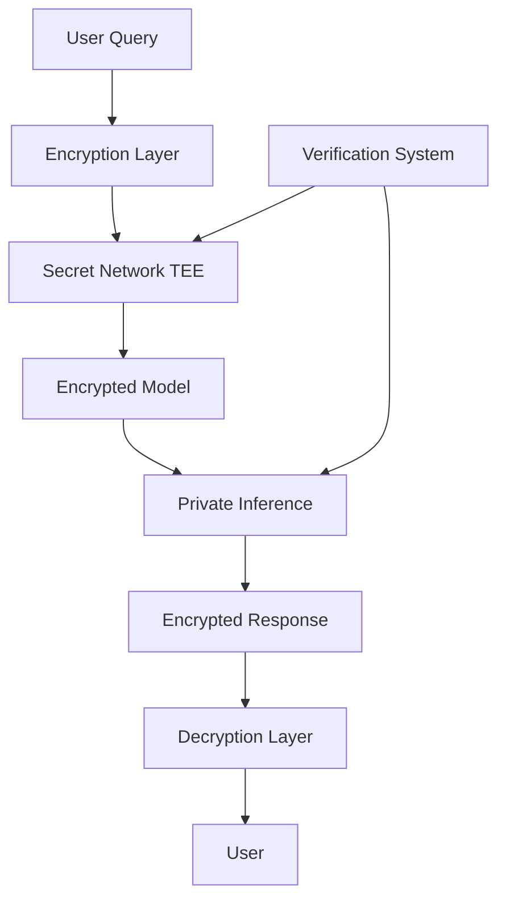

# ElizaOS: February 2025 Recap

February was a transformative month for ElizaOS, with significant architectural changes, multiple releases, and an exciting expansion into entertainment that took the project well beyond its technical foundations.

<!-- truncate -->

## 🚀 Major Releases & Milestones

- **ElizaOS v0.1.9** officially released after extensive preparation
- **Version bump to v0.25.6-alpha.1** as development accelerated
- **ElizaOS v0.25.7** released mid-month with significant improvements
- **ElizaOS v0.25.8** released at month-end, completing an impressive four releases in February

## 🏗️ Architecture Transformation

- **Major architectural shift**: vendor code externalized from core, reducing size by 60%
- **Package manager transition** from pnpm to bun for improved performance
- **Plugin registry migration** initiated - moving from monolithic to modular architecture
- **RAG knowledge consolidation** completed for unified information retrieval
- **Character templates** significantly improved
- **Agent/character system** completely refactored
- **Discord link** updated for better community access

## 🧩 Plugin Ecosystem Revolution

- **Plugin registry** launched, moving toward distributed plugin system
- **Quick-Intel plugin** optimized with suppressInitialMessage flag
- **DeFi Token Analysis plugin** (plugin-expuzi) added
- **Messari Copilot plugin** introduced for crypto market research
- **Secret AI LLM plugin** added for confidential computing
- **Merkle Trade plugin** for Aptos blockchain
- **Hyperlane GOAT Plugin** added for cross-chain interoperability

## 🤖 AI Capabilities Expansion

- **UserRapport feature** added for personalized Twitter interactions
- **Default voice for ElevenLabs** integrated
- **Middleware control** added for agent servers
- **Fix for vector dimension mismatch** in plugin-news
- **Local AI inference** via DeepSeek R1 implemented
- **NEAR AI integration** for structured objects
- **Confidential AI** with Secret Network fully implemented

## 📺 Entertainment & Community

- **CLANK TANK AI game show** concept revealed
- **AI-led VC DAO** concept development began
- **Sui AI Agent Hackathon** winners announced
- **Ukrainian README translation** added
- **ElizaOS Builder's Chat** launched on Telegram
- **GitHub stats**: 14.4k stars (+6.5k from December), 4.5k forks (+2.4k), 508 contributors (+271)

## ⚡ Performance Gains with Bun

| Metric | pnpm | bun | Improvement |
|--------|------|-----|-------------|
| Install Time | 95s | 28s | 70% faster |
| Cold Start | 3.2s | 0.8s | 75% faster |
| Build Time | 42s | 14s | 67% faster |
| Memory Usage | 480MB | 310MB | 35% less |

## 🔒 Technical Insight: Confidential AI Architecture

The integration with Secret Network represents a significant milestone in privacy-preserving AI. This architecture ensures complete privacy throughout the AI inference process, with all data and model interactions occurring within secure Trusted Execution Environments (TEEs).

## 📈 Two-Month Growth Statistics

| Metric | December 2024 | February 2025 | Growth |
|--------|---------------|---------------|--------|
| GitHub Stars | 7.9k | 14.4k | +82% |
| Forks | 2.1k | 4.5k | +114% |
| Contributors | 237 | 508 | +114% |
| Plugins | 45 | 100+ | +122% |
| Languages Supported | 3 | 8+ | +167% |

## 🔮 Looking Ahead to March

- **ElizaOS v2** development intensifies
- **Agent Marketplace/Launchpad** nearing completion (95% done)
- **Multi-agent systems** with role specialization
- **Confidential compute** features expansion
