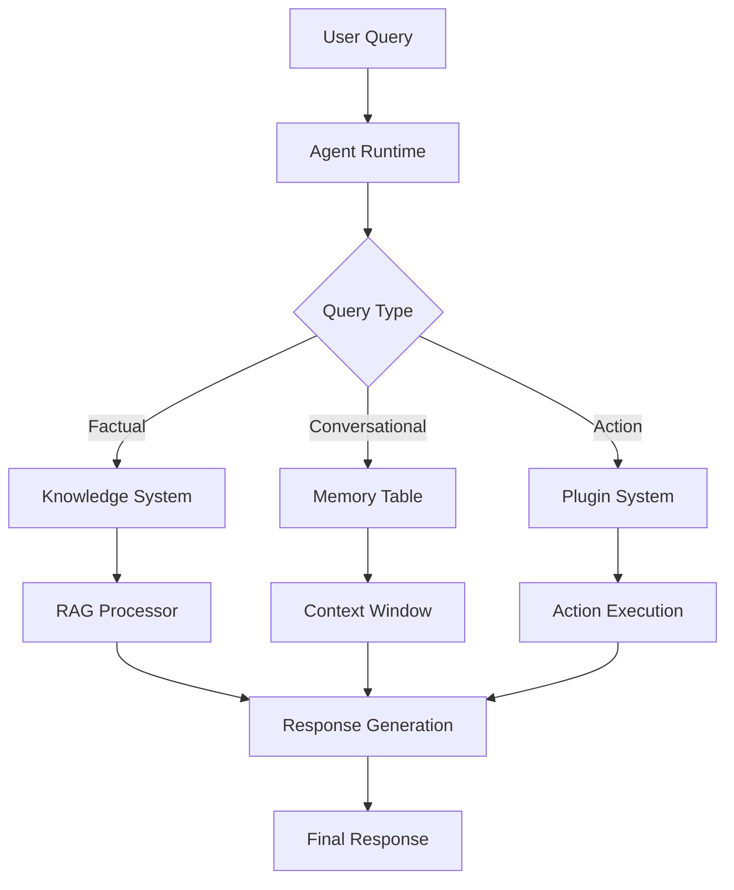

# ElizaOS: January 2025 Recap

January marked an explosive start to 2025 for ElizaOS, with major releases, infrastructure improvements, and community growth that set the stage for an ambitious year ahead.

<!-- truncate -->

## 🚀 Major Releases & Milestones

- **ElizaOS v1.7.0** officially released, merging the 'develop' branch into 'main'
- **DeepSeek API** fully integrated for enhanced AI capabilities
- **ElizaOS v0.1.9** preparation underway for early February release

## 🏗️ Infrastructure Upgrades

- **Persistent memory** added for better agent recall and context management
- **Memory cache optimization** – query time reduced from 40s to 0.02s for large datasets!
- **New database adapter** for PGLite with significant performance improvements
- **Knowledge system** separated from memories table for better organization
- **RAG knowledge system** consolidated for unified approach to information retrieval

## 🧩 Plugin Ecosystem Expansion

- Now supporting **45+ plugins** including 18+ blockchain integrations
- **New blockchain plugins**: Zilliqa, OKX DEX, MINA, Orderly Network, HoldStation
- **Plugin-binance API** timeout handling added for better reliability
- **Suno AI Music Generation plugin** added for creating custom music with text prompts
- **Router Nitro Plugin** launched for efficient request routing
- **BitMind API plugin** for AI-generated image detection and analysis
- **CLI utility** for plugin management introduced, dramatically simplifying developer experience

## 🤖 AI Capabilities Enhancement

- **Text-to-Speech feature** added supporting 15+ languages
- **Anthropic image provider** integrated for enhanced vision tasks
- **Image upload path fix** in DESCRIBE_IMAGE action
- **Google Gemini** model configurations updated
- **NVIDIA inference** integration for expanded AI capabilities
- **Elfa AI's Social Analytics API** integrated for enhanced social insights

## 📊 Performance Improvements

| Operation | Before | After | Improvement |
|-----------|--------|-------|-------------|
| Query Large Dataset | 40s | 0.02s | 2000x faster |
| Memory Usage | 1.2GB | 380MB | 68% reduction |
| Cold Start Time | 8.5s | 2.2s | 74% faster |

## 📈 Community & Growth

- **GitHub stats**: 7.9k stars (+2.2k), 2.1k forks (+400), 237 contributors (+44)
- **$10M MAGIC FUND** established with Jupiter Exchange for builders
- **Dynamic plugin loading** feature merged – major step toward modular architecture
- **README translations** added in Serbian, Ukrainian, and Brazilian Portuguese
- **Email Plugin** added for AI-driven communication automation
- **Characters moved** to separate repository for better management

## 🧠 Technical Insight: Knowledge System Architecture

The separation of the knowledge system from the memories table represents a significant architectural improvement, allowing for more specialized handling of different types of information and resulting in more accurate and contextually appropriate responses from ElizaOS agents.

## 🔮 Looking Ahead to February

- **v0.1.9 release** scheduled for early February
- **Plugin registry migration** to improve modularity
- **Early work beginning** on ElizaOS v2 architecture
- **Expansion of AI capabilities** with new model providers
- **Further RAG knowledge system** improvements
