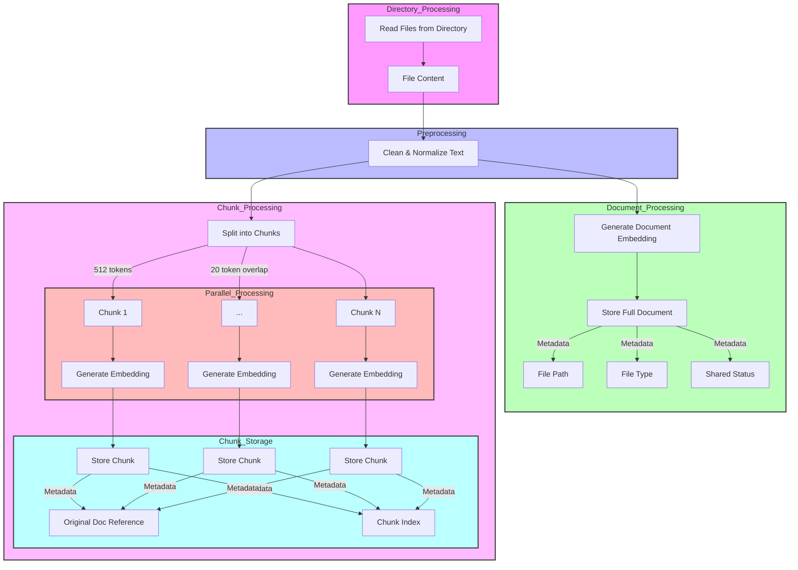
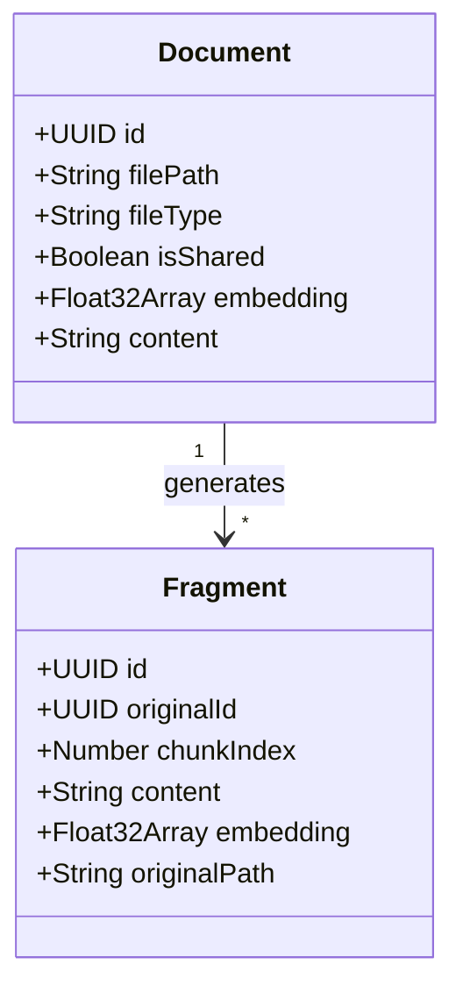
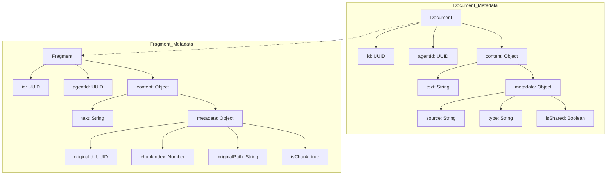

# RAG Knowledge Documentation

## Overview

The RAG (Retrieval-Augmented Generation) Knowledge feature is a powerful system that enables agents to process, store, and retrieve information from various document types (PDF, Markdown, and text files). This feature enhances the agent's ability to provide contextually relevant responses by leveraging stored knowledge during conversations.

## Directory Structure

```
characters/
└── knowledge/        # Root knowledge directory
    ├── shared/       # Shared knowledge accessible to all agents
    └── {agent-name}/ # Agent-specific knowledge directories
```

## Supported File Types

- PDF files (`.pdf`)
- Markdown files (`.md`)
- Text files (`.txt`)

## Setting Up RAG Knowledge

### 1. Directory Setup

1. Create a `characters/knowledge` directory in your project root if it doesn't exist
2. Create subdirectories for:
   - `shared/`: Documents accessible to all agents
   - `{agent-name}/`: Agent-specific documents (replace `{agent-name}` with your agent's name)

### 2. Configuration

Update your agent's character configuration file with the appropriate knowledge entries:

```json
{
    "knowledge": [
        {
            "directory": "characters/knowledge/shared",
            "shared": true
        },
        {
            "directory": "characters/knowledge/{agent-name}",
            "shared": false
        },
        {
            "path": "characters/knowledge/{agent-name}/specific-file.pdf",
            "shared": false
        }
    ]
}
```

## How It Works

1. **Document Processing**:
   - When documents are added to the knowledge directories, they are automatically processed
   - Documents are split into manageable chunks for better retrieval
   - Each chunk is embedded using the configured embedding model
   - The embeddings and metadata are stored in the database for efficient retrieval

2. **Knowledge Retrieval**:
   - During conversations, relevant knowledge is retrieved based on semantic similarity
   - The system uses a default similarity threshold of 0.85
   - By default, it retrieves the top 5 most relevant matches
   - Both shared and agent-specific knowledge are searched

## Best Practices

1. **Document Organization**:
   - Keep files organized in appropriate directories
   - Use descriptive filenames
   - Break large documents into logical smaller files
   - Include metadata and context in markdown files

2. **Content Management**:
   - Regularly review and update knowledge files
   - Remove outdated or irrelevant documents
   - Ensure documents are in the correct format
   - Verify file permissions are set correctly

3. **Performance Optimization**:
   - Keep individual documents focused on specific topics
   - Break down large documents into smaller, focused chunks
   - Use appropriate file formats for the content type
   - Regular maintenance of the knowledge base

## Troubleshooting

### Common Issues and Solutions

1. **Documents Not Being Retrieved**:
   - Verify the file is in a supported format (PDF, MD, TXT)
   - Check if the file is in the correct directory under `characters/knowledge`
   - Ensure the configuration file correctly references the knowledge directory
   - Verify file permissions

2. **Poor Quality Retrievals**:
   - Break down large documents into smaller, focused files
   - Ensure document content is clear and well-structured
   - Review and clean up any formatting issues in the source documents
   - Check if the query contains too many common words (stop words like "a", "the", "is" are filtered out)

3. **Performance Issues**:
   - Check the size of individual documents
   - Verify the total size of the knowledge base
   - Consider cleaning up unused or redundant documents
   - Monitor embedding processing time for large documents

## Technical Implementation

### Document Processing Flow

The RAG system processes documents through several stages to optimize both storage and retrieval:

1. **Directory Processing**
   - The system scans configured directories in `characters/knowledge/`
   - Files are processed based on their shared/private status and file type

2. **File Processing Pipeline**
   
   a. **Preprocessing**
   - Read the file content
   - Clean and normalize text through preprocessing
   
   b. **Main Document Processing**
   - Generate embeddings for the entire document
   - Store the complete document with:
     - Full text content
     - Document-level embeddings
     - Metadata (file path, type, shared status)
   
   c. **Chunk Processing**
   - Split the preprocessed content into chunks
     - Default chunk size: 512 tokens
     - Overlap between chunks: 20 tokens
   - Process chunks in parallel batches of 10 for efficiency
   - For each chunk:
     - Generate embeddings
     - Store with metadata linking back to the original document
     - Include chunk-specific metadata (chunk index, original document ID)

This multi-level approach enables:
- Broad document-level semantic search
- Fine-grained chunk-level retrieval for specific information
- Efficient parallel processing of large documents
- Maintenance of document context through metadata linking

### Knowledge Processing Flow

The following diagram illustrates how the RAG system processes documents:



Key Features:
1. **Parallel Processing**: Chunks are processed in batches of 10 for optimal performance
2. **Dual Storage**: Both full documents and chunks are stored with embeddings
3. **Metadata Linking**: Chunks maintain references to their source documents
4. **Overlapping Chunks**: 20-token overlap ensures context preservation
5. **Configurable Size**: Default chunk size of 512 tokens balances detail and performance

### Processing Parameters

- Chunk Size: 512 tokens
- Chunk Overlap: 20 tokens
- Processing Batch Size: 10 chunks
- Default Similarity Threshold: 0.85
- Default Match Count: 5 results

## Knowledge ID Relationships

The RAG system uses a hierarchical ID structure to maintain relationships between documents and their fragments:



#### ID Generation and Linking

1. **Document ID Generation**
   ```mermaid
   graph LR
       A[File Path] --> B[Hash Function]
       C[Is Shared?] --> B
       B --> D[Document UUID]
       style D fill:#f9f,stroke:#333,stroke-width:2px
   ```
   - Generated using `generateScopedId(path, isShared)`
   - Deterministic: same file path + shared status = same ID
   - Stored as `id` in the knowledge database

2. **Fragment ID Generation**
   ```mermaid
   graph LR
       A[Document UUID] --> B[Fragment ID]
       C[Chunk Index] --> B
       B --> D["fragmentId = `${documentId}-chunk-${index}`"]
       style D fill:#bbf,stroke:#333,stroke-width:2px
   ```
   - Based on parent document's UUID and chunk index
   - Format: `${documentId}-chunk-${index}`
   - Ensures unique identification while maintaining lineage

#### Metadata Structure



#### Key Points

1. **Document IDs**
   - Unique per file path and shared status
   - Used as reference point for all fragments
   - Stored in main knowledge table

2. **Fragment IDs**
   - Always linked to parent document
   - Include chunk index for ordering
   - Maintain complete lineage to source

3. **Querying Relationships**
   - Find all fragments: `SELECT * FROM knowledge WHERE originalId = {documentId}`
   - Get source document: `SELECT * FROM knowledge WHERE id = {fragment.originalId}`
   - List chunks in order: Sort by `chunkIndex`

4. **Metadata Preservation**
   - Documents store file-level metadata
   - Fragments maintain references to source
   - Both contain embeddings for search

This ID system enables:
- Efficient document-fragment relationship tracking
- Quick retrieval of related content
- Maintenance of document hierarchy
- Proper context preservation in search results

## API Reference

### Key Classes and Methods

#### RAGKnowledgeManager

The main class responsible for managing RAG knowledge. Here are the key methods:

##### `createKnowledge(item: RAGKnowledgeItem): Promise<void>`
Adds new knowledge to the database.
- Parameters:
  - `item`: A RAGKnowledgeItem containing:
    - `id`: UUID
    - `agentId`: UUID
    - `content`:
      - `text`: string
      - `metadata`: 
        - `source`: string
        - `type`: "pdf" | "md" | "txt"
        - `isShared`: boolean
    - `embedding`: Float32Array
    - `createdAt`: number

##### `getKnowledge(params): Promise<RAGKnowledgeItem[]>`
Retrieves knowledge based on query or ID.
- Parameters:
  - `query?`: string - Optional search query
  - `id?`: UUID - Optional specific knowledge ID
  - `conversationContext?`: string - Optional conversation context
  - `limit?`: number - Optional result limit
  - `agentId?`: UUID - Optional agent ID filter
- Returns: Array of matching RAGKnowledgeItem objects

##### `searchKnowledge(params): Promise<RAGKnowledgeItem[]>`
Performs semantic search with configurable parameters.
- Parameters:
  - `agentId`: UUID - Agent ID to search within
  - `embedding`: Float32Array | number[] - Vector to search against
  - `match_threshold?`: number - Similarity threshold (default: 0.85)
  - `match_count?`: number - Number of results (default: 5)
  - `searchText?`: string - Optional text to search for
- Returns: Array of matching RAGKnowledgeItem objects

##### `clearKnowledge(shared?: boolean): Promise<void>`
Clears knowledge entries.
- Parameters:
  - `shared?`: boolean - If true, clears shared knowledge as well
- Returns: Promise that resolves when operation completes

##### `processFile(file): Promise<void>`
Processes a new knowledge file.
- Parameters:
  - `file`:
    - `path`: string - File path
    - `content`: string - File contents
    - `type`: "pdf" | "md" | "txt" - File type
    - `isShared?`: boolean - Whether the knowledge is shared
- Returns: Promise that resolves when processing completes

##### `listAllKnowledge(agentId: UUID): Promise<RAGKnowledgeItem[]>`
Lists all knowledge entries for an agent without semantic search.
- Parameters:
  - `agentId`: UUID - Agent ID to list knowledge for
- Returns: Array of all RAGKnowledgeItem entries for the agent

##### `removeKnowledge(id: UUID): Promise<void>`
Removes a specific knowledge entry.
- Parameters:
  - `id`: UUID - ID of the knowledge to remove
- Returns: Promise that resolves when deletion completes

## Security Considerations

1. **Access Control**:
   - Use the `shared` flag appropriately to control document access
   - Keep sensitive information in agent-specific directories
   - Regularly audit knowledge access patterns

2. **Data Privacy**:
   - Do not store sensitive personal information in knowledge files
   - Review documents for potentially sensitive content before adding
   - Implement appropriate backup and recovery procedures

## Future Considerations

1. **Scalability**:
   - Monitor knowledge base size and performance
   - Plan for regular maintenance and cleanup
   - Consider implementing document versioning

2. **Integration**:
   - Document integration points with other systems
   - Plan for potential future file format support
   - Consider implementing knowledge base analytics

## Support and Resources

- Review the implementation in `packages/core/src/ragknowledge.ts`
- Check the issue tracker for known issues and solutions
- Contribute improvements and bug fixes through pull requests

