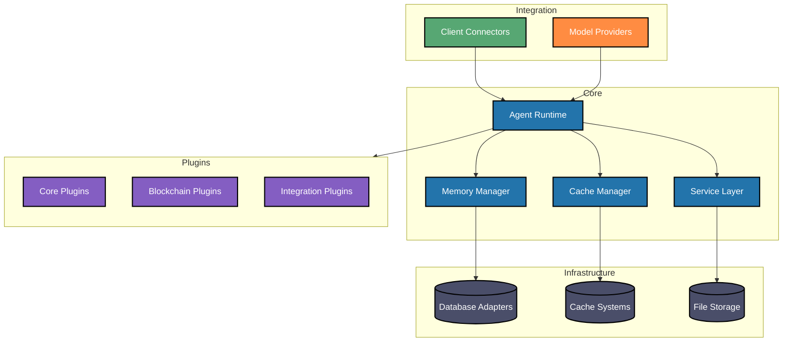

# Introduction to Eliza

_As seen powering [@DegenSpartanAI](https://x.com/degenspartanai) and [@aixvc_agent](https://x.com/aixvc_agent)_

## What is Eliza?

Eliza is a powerful multi-agent simulation framework designed to create, deploy, and manage autonomous AI agents. Built with TypeScript, it provides a flexible and extensible platform for developing intelligent agents that can interact across multiple platforms while maintaining consistent personalities and knowledge.

## Key Features

### Core Capabilities

- **Multi-Agent Architecture**: Deploy and manage multiple unique AI personalities simultaneously
- **Character System**: Create diverse agents using the [characterfile](https://github.com/lalalune/characterfile/) framework
- **Memory Management**: Advanced RAG (Retrieval Augmented Generation) system for long-term memory and context awareness
- **Platform Integration**: Seamless connectivity with Discord, Twitter, and other platforms

### Communication & Media

- **Multi-Platform Support**:

    - Full-featured Discord integration with voice channel support
    - Twitter/X bot capabilities
    - Telegram integration
    - Direct API access

- **Media Processing**:
    - PDF document reading and analysis
    - Link content extraction and summarization
    - Audio transcription
    - Video content processing
    - Image analysis and description
    - Conversation summarization

### AI & Technical Features

- **Flexible Model Support**:

    - Local inference with open-source models
    - Cloud-based inference through OpenAI
    - Default configuration with Nous Hermes Llama 3.1B
    - Integration with Claude for complex queries

- **Technical Foundation**:
    - 100% TypeScript implementation
    - Modular architecture
    - Extensible action system
    - Custom client support
    - Comprehensive API

## Use Cases

Eliza can be used to create:

1. **AI Assistants**

    - Customer support agents
    - Community moderators
    - Personal assistants

2. **Social Media Personas**

    - Automated content creators
    - Engagement bots
    - Brand representatives

3. **Knowledge Workers**

    - Research assistants
    - Content analysts
    - Document processors

4. **Interactive Characters**
    - Role-playing characters
    - Educational tutors
    - Entertainment bots

## Getting Started

Eliza is designed to be accessible while maintaining powerful capabilities:

- **Quick Start**: Begin with basic configuration and default character
- **Customization**: Extend functionality through custom actions and clients
- **Scaling**: Deploy multiple agents with different personalities
- **Integration**: Connect to various platforms and services

Check out our [Quickstart Guide](./quickstart.md) to begin your journey with Eliza.

## Architecture Overview

## Community and Support

Eliza is backed by an active community of developers and users:

- **Open Source**: Contribute to the project on [GitHub](https://github.com/elizaos/eliza)
- **Documentation**: Comprehensive guides and API references
- **Examples**: Ready-to-use character templates and implementations
- **Support**: Active community for troubleshooting and discussion

## Next Steps

- [Create Your First Agent](../quickstart)
- [Understand Core Concepts](../core/agents)
- [Explore Advanced Features](./guides/advanced.md)

Join us in building the future of autonomous AI agents with Eliza!
