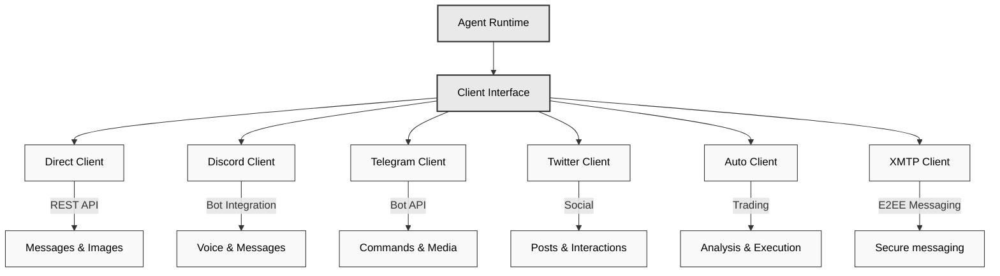

# XMTP Client package

Eliza's client packages enable integration with various platforms and services. Each client provides a standardized interface for sending and receiving messages, handling media, and interacting with platform-specific features.

## Architecture Overview



## Available Client

- XMTP (@elizaos/client-xmtp) - XMTP agent integration

## Installation

```bash
# XMTP

pnpm add @elizaos/client-xmtp
```

## XMTP Client

The XMTP client enables secure, decentralized, and encrypted messaging.

### Basic Setup

```tsx
import { XmtpClientInterface } from "@elizaos/client-xmtp";

// Initialize the XMTP client
const client = await XmtpClientInterface.start(runtime);

// Configuration in .env
WALLET_KEY= // the private key of the wallet
ENCRYPTION_KEY= // a second random 32 bytes encryption key for local db encryption
```

For more information about XMTP visit it's [agent examples repo](https://github.com/ephemeraHQ/xmtp-agent-examples)

## Why XMTP

- **End-to-end & compliant**: Data is encrypted in transit and at rest, meeting strict security and regulatory standards.
- **Open-source & trustless**: Built on top of the [MLS](https://messaginglayersecurity.rocks/) protocol, it replaces trust in centralized certificate authorities with cryptographic proofs.
- **Privacy & metadata protection**: Offers anonymous or pseudonymous usage with no tracking of sender routes, IPs, or device and message timestamps.
- **Decentralized**: Operates on a peer-to-peer network, eliminating single points of failure.
- **Multi-tenant**: Allows multi-agent multi-human confidential communication over MLS group chats.

> See [FAQ](https://docs.xmtp.org/intro/faq) for more detailed information.

## Web inbox

Interact with the XMTP protocol using [xmtp.chat](https://xmtp.chat) the official web inbox for developers using the latest version powered by MLS.
