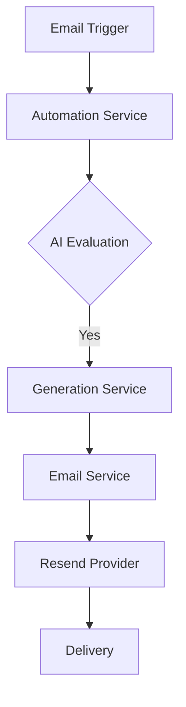

# @elizaos/plugin-email-automation

AI-powered email automation plugin for Eliza that intelligently detects email-worthy conversations and handles generation/delivery. This is not perfect and is simply a solid starting point, and I would encourage any and all contributions!

## Features

### 1. Intelligent Detection
- Partnership opportunity detection
- Technical discussion recognition
- Business proposal identification
- Follow-up requirement analysis

### 2. AI-Powered Generation
- Structured email formatting
- Context-aware content
- Professional tone maintenance
- Technical detail inclusion

## Configuration

### AI Email Automation Setup
```typescript
# Required
RESEND_API_KEY=           # Your Resend API key
DEFAULT_TO_EMAIL=         # Default recipient
DEFAULT_FROM_EMAIL=       # Default sender

# Optional Settings
EMAIL_AUTOMATION_ENABLED=true    # Enable AI detection. If this is enabled, the plugin will automatically detect email-worthy conversations and handle generation/delivery and only that.
EMAIL_EVALUATION_PROMPT=        # Custom detection criteria for shouldEmail
```

### Basic Usage
```typescript
import { emailAutomationPlugin } from '@elizaos/plugin-email-automation';

// Add to your Eliza configuration
{
    plugins: [emailAutomationPlugin],
    settings: {
        EMAIL_AUTOMATION_ENABLED: true,
        // ... other settings
    }
}
```

### Email Template Example
The plugin uses Handlebars for templating. Here's an example output:

```handlebars
{{!-- email-template.hbs --}}
<div class="email-container">
    <h1>{{subject}}</h1>

    <div class="background-section">
        {{background}}
    </div>

    <div class="key-points-section">
        <h2>Key Points</h2>
        <ul>
            {{#each keyPoints}}
                <li>{{this}}</li>
            {{/each}}
        </ul>
    </div>

    {{#if technicalDetails}}
    <div class="technical-section">
        <h2>Technical Details</h2>
        <ul>
            {{#each technicalDetails}}
                <li>{{this}}</li>
            {{/each}}
        </ul>
    </div>
    {{/if}}

    <div class="next-steps-section">
        <h2>Next Steps</h2>
        <ul>
            {{#each nextSteps}}
                <li>{{this}}</li>
            {{/each}}
        </ul>
    </div>

    <div class="footer">
        Powered by ElizaOS
    </div>
</div>

<style>
    .email-container {
        max-width: 600px;
        margin: 0 auto;
        font-family: Arial, sans-serif;
        line-height: 1.6;
    }
    h1, h2 { color: #333; }
    ul { padding-left: 20px; }
    .footer {
        margin-top: 30px;
        color: #666;
        font-size: 0.9em;
    }
</style>
```

This template produces professional emails like the example shown in the image above. You can customize the template by:
1. Creating your own `.hbs` file
2. Registering it with the template manager
3. Specifying your template when sending emails

## Development

```bash
# Installation
pnpm install

# Testing
pnpm test
pnpm test:watch
pnpm test:coverage

# Building
pnpm build
```

## Testing Coverage
- Unit tests for all services
- Integration tests for end-to-end flows
- Throttling and rate limiting tests
- Error handling scenarios
- Mock providers for testing

## Architecture


Architecture Overview:
- Resend Provider support (more to come)
- AI-powered email detection
- Context-aware content generation
- Professional template rendering

## Credits

This plugin integrates with and builds upon:

- [Resend](https://resend.com): Modern email API for developers
- [Handlebars](https://handlebarsjs.com): Templating engine for email formatting

For more information about Resend capabilities:
- [Resend Documentation](https://resend.com/docs)
- [Email API Reference](https://resend.com/docs/api-reference/introduction)
- [Developer Portal](https://resend.com/overview)

## License
This plugin is part of the Eliza project. See the main project repository for license information.