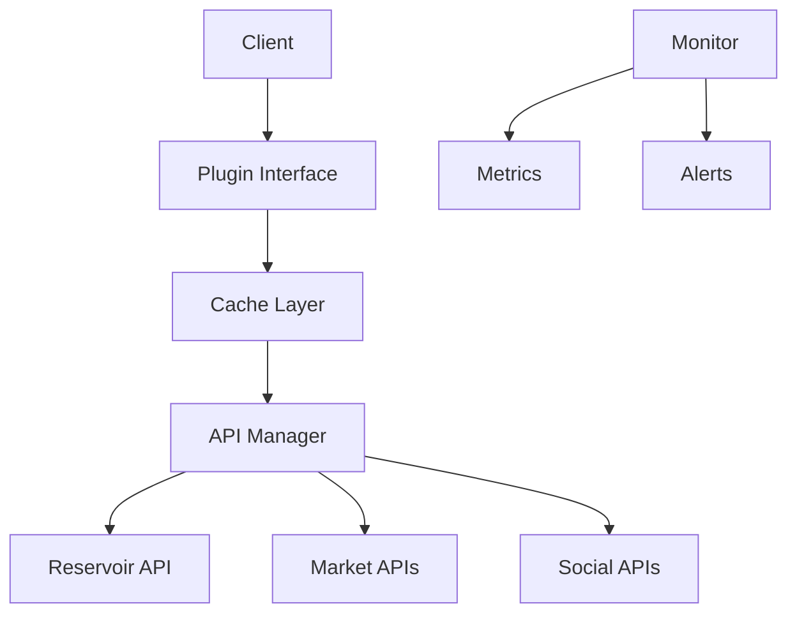
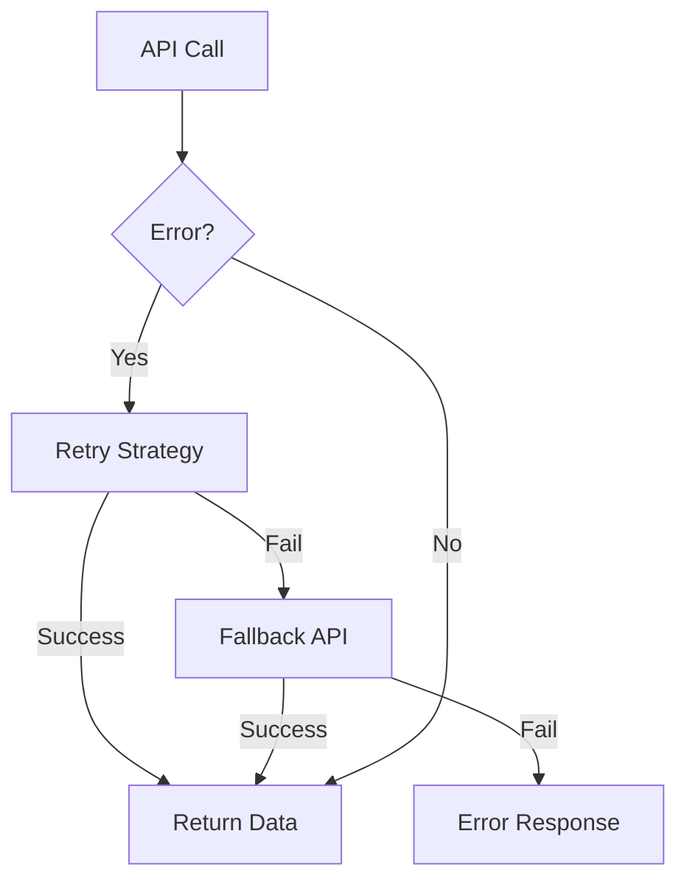
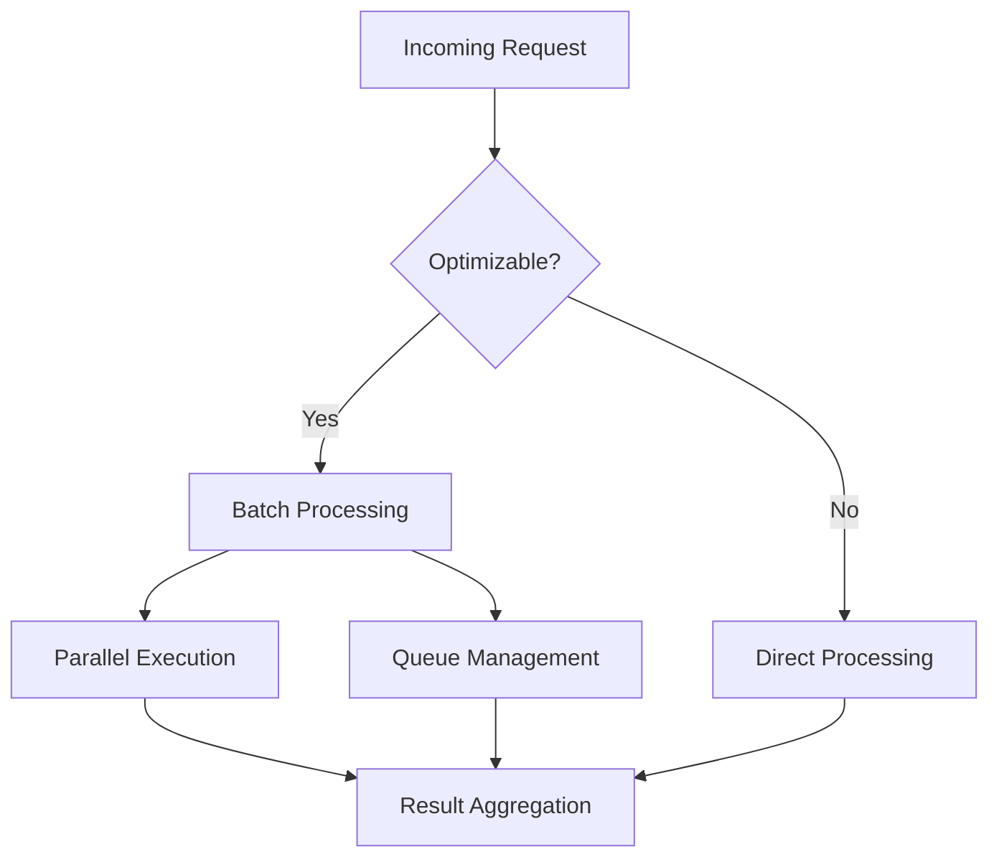
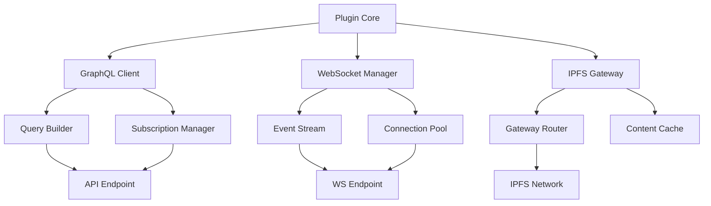
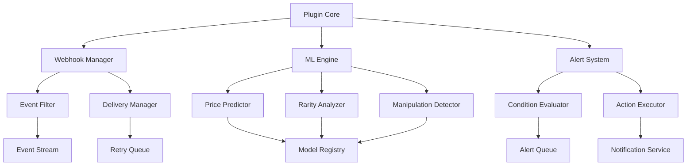
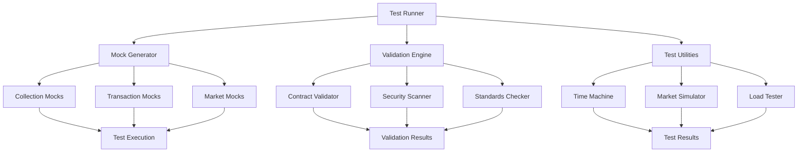
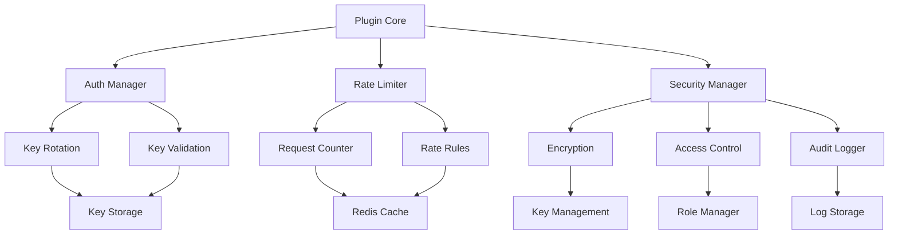
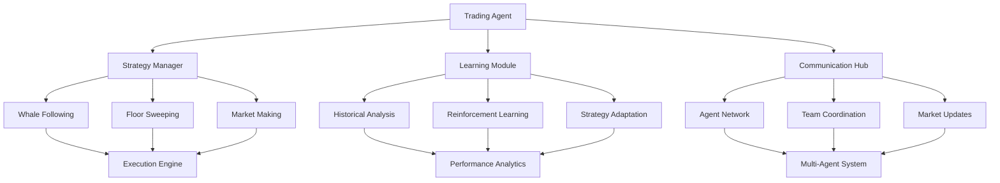
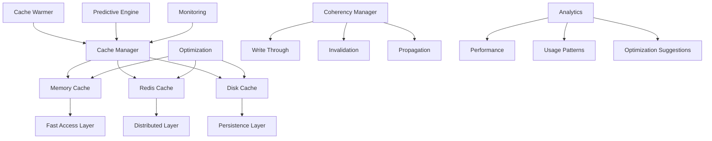

# NFT Collections Plugin

A powerful plugin for interacting with NFT collections, providing comprehensive market data, social analytics, and trading capabilities through various APIs including Reservoir, CoinGecko, and more. While designed to work with any EVM NFT collection, the plugin includes special support for 420+ curated collections featured on ikigailabs.xyz.

## Recent Improvements

### Performance Optimizations

- Implemented batch processing with configurable batch sizes for collection data
- Added parallel request handling with queue management
- Optimized caching with tiered expiration times for different data types
- Added LRU (Least Recently Used) cache with configurable size limits
- Implemented request prioritization for curated collections

### Enhanced Error Handling

- Added comprehensive error types and validation
- Implemented retry logic with exponential backoff
- Added detailed error tracking and reporting
- Improved error recovery mechanisms
- Added structured error logging

### Rate Limiting & Security

- Added advanced rate limiting with configurable thresholds
- Implemented queue-based request management
- Added per-service rate limiting
- Improved API key management and validation
- Added request validation and sanitization

### Performance Monitoring

- Added detailed performance metrics tracking
- Implemented alert system for performance issues
- Added periodic performance reporting
- Added latency, error rate, and throughput monitoring
- Implemented customizable alert thresholds

### Data Validation

- Added comprehensive schema validation using Zod
- Implemented strict type checking
- Added data sanitization utilities
- Added Ethereum address validation
- Added price and token ID validation

## Features

### Core Features (Reservoir Tools API)

- Real-time NFT collection data and market stats
- Floor prices, volume, and market cap tracking
- Collection activity monitoring
- Token-level data and attributes
- Collection statistics and rankings

### Market Intelligence

- 420+ verified NFT collections featured on ikigailabs.xyz
- Enhanced metadata and social information
- Prioritized data fetching and caching
- Pre-verified contract addresses
- Featured collections highlighting
- Quick lookup and validation functions

### Market Data

- Real-time floor prices and volume tracking
- Market cap and holder statistics
- Price history and trends
- Multi-marketplace activity tracking
- Wash trading detection
- Liquidity analysis
- Price prediction
- Whale activity monitoring
- Market trend analysis

### Social Analytics

- Twitter engagement metrics
- Discord community stats
- Telegram group analytics
- Sentiment analysis
- Community growth tracking

## Quick Start

### Installation

```bash
pnpm add @elizaos/plugin-nft-collections
```

## Configuration

### Required Configuration

```env
# Required
RESERVOIR_API_KEY=your-reservoir-api-key
```

### Optional Configuration

```typescript
import { NFTCollectionsPlugin } from "@elizaos/plugin-nft-collections";

const plugin = new NFTCollectionsPlugin({
    caching: {
        enabled: true,
        ttl: 3600000, // 1 hour
        maxSize: 1000,
    },
    security: {
        rateLimit: {
            enabled: true,
            maxRequests: 100,
            windowMs: 60000,
        },
    },
    maxConcurrent: 5, // Maximum concurrent requests
    maxRetries: 3, // Maximum retry attempts
    batchSize: 20, // Batch size for collection requests
});

// Register with your agent
agent.registerPlugin(plugin);
```

### Required Environment Variables

```env
RESERVOIR_API_KEY=your-reservoir-api-key
```

### Optional API Keys

```env
# Market Intelligence
NANSEN_API_KEY=your-nansen-api-key
DUNE_API_KEY=your-dune-api-key
ALCHEMY_API_KEY=your-alchemy-api-key
CHAINBASE_API_KEY=your-chainbase-api-key
NFTSCAN_API_KEY=your-nftscan-api-key

# Social Analytics
TWITTER_API_KEY=your-twitter-api-key
DISCORD_API_KEY=your-discord-api-key
TELEGRAM_API_KEY=your-telegram-api-key
```

## Usage Examples

### Collection Data

```typescript
// Get top collections with optimized batch processing
const collections = await nftService.getTopCollections();

// Get market intelligence with caching
const intelligence =
    await marketIntelligenceService.getMarketIntelligence("0x1234");

// Get social metrics with rate limiting
const metrics = await socialAnalyticsService.getSocialMetrics("0x1234");
```

### Error Handling

```typescript
try {
    const collections = await nftService.getTopCollections();
} catch (error) {
    if (error.code === ErrorCode.RATE_LIMIT_EXCEEDED) {
        // Handle rate limiting
    } else if (error.code === ErrorCode.API_ERROR) {
        // Handle API errors
    }
}
```

### NFT Ownership

```typescript
// Listen for performance alerts
performanceMonitor.on("alert", (alert) => {
    console.log(`Performance alert: ${alert.type} for ${alert.operation}`);
});

// Get performance summary
const summary = performanceMonitor.getPerformanceSummary();
```

## Performance Benchmarks

### Response Times (p95)

```
Operation              Cold     Cached   Batch (100)
Collection Data       300ms     50ms     2.5s
Floor Price          150ms     25ms     1.2s
Token Metadata       250ms     40ms     2.0s
Market Stats         400ms     75ms     3.0s
Social Metrics       350ms     60ms     2.8s
```

### Building

```bash
pnpm build
```

### Resource Usage

```
Resource    Idle    Light    Heavy
CPU         0.5%    15%      40%
Memory      150MB   300MB    600MB
Requests/s  10      100      1000
```

## Best Practices

1. **API Keys**

    - Secure storage of API keys
    - Regular key rotation
    - Use fallback keys for high availability

2. **Error Handling**

    - Implement retry strategies
    - Handle rate limits gracefully
    - Log errors with context

3. **Performance**

    - Use batch operations when possible
    - Implement appropriate caching
    - Monitor resource usage

4. **Data Validation**
    - Validate all input data
    - Sanitize API responses
    - Check Ethereum addresses

## Architecture

### System Components



## Contributing

1. Fork the repository
2. Create your feature branch
3. Commit your changes
4. Push to the branch
5. Create a Pull Request

## License

MIT

## Support

### Error Handling Flow



### Optimization Strategies



## Integrations

### GraphQL Support

```env
# GraphQL Configuration
GRAPHQL_ENDPOINT=your-graphql-endpoint
GRAPHQL_API_KEY=your-graphql-key
```

```typescript
// Query collections using GraphQL
const collections = await plugin.graphql.query(
    `
  query GetCollections($first: Int!) {
    collections(first: $first) {
      id
      name
      floorPrice
      volume24h
    }
  }
`,
    { first: 10 }
);

// Subscribe to collection updates
const subscription = plugin.graphql.subscribe(
    `
  subscription OnFloorPriceChange($collectionId: ID!) {
    floorPriceChanged(collectionId: $collectionId) {
      newPrice
      oldPrice
      timestamp
    }
  }
`,
    { collectionId: "0x1234" }
);
```

### WebSocket Real-time Updates

```env
# WebSocket Configuration
WS_ENDPOINT=your-websocket-endpoint
WS_API_KEY=your-websocket-key
```

```typescript
// Subscribe to real-time collection updates
plugin.ws.subscribe("collection:0x1234", (update) => {
    console.log("New floor price:", update.floorPrice);
});

// Subscribe to multiple events
plugin.ws.subscribeMany(
    ["sales:0x1234", "listings:0x1234", "transfers:0x1234"],
    (event) => {
        console.log("Event type:", event.type);
        console.log("Event data:", event.data);
    }
);

// Custom event filters
plugin.ws.subscribe(
    "sales:*",
    {
        priceAbove: "10 ETH",
        marketplace: ["opensea", "blur"],
    },
    (sale) => {
        console.log("Whale sale detected:", sale);
    }
);
```

### IPFS Integration

```env
# IPFS Configuration
IPFS_GATEWAY=your-ipfs-gateway
IPFS_API_KEY=your-ipfs-key
IPFS_FALLBACK_GATEWAYS=["https://ipfs.io", "https://cloudflare-ipfs.com"]
```

```typescript
// Fetch metadata from IPFS
const metadata = await plugin.ipfs.getMetadata("ipfs://Qm...");

// Upload metadata to IPFS
const cid = await plugin.ipfs.uploadMetadata({
    name: "Cool NFT",
    description: "Very cool NFT",
    image: "ipfs://Qm...",
});

// Pin content across multiple providers
await plugin.ipfs.pin(cid, {
    providers: ["pinata", "web3.storage"],
    replicas: 3,
});

// Smart gateway selection
const image = await plugin.ipfs.getImage(cid, {
    preferredGateway: "cloudflare",
    size: "thumbnail",
    format: "webp",
});
```

### Integration Best Practices

1. **GraphQL**

    - Use fragments for reusable queries
    - Implement proper error boundaries
    - Cache complex queries
    - Use persisted queries for production

2. **WebSocket**

    - Implement reconnection logic
    - Handle backpressure
    - Use heartbeats
    - Batch small updates
    - Implement message queue for offline scenarios

3. **IPFS**
    - Use multiple gateway fallbacks
    - Implement proper timeout handling
    - Cache frequently accessed content
    - Use appropriate gateway for content type
    - Monitor gateway health

### Integration Architecture



## Extended Features

### Webhooks

```env
# Webhook Configuration
WEBHOOK_SECRET=your-webhook-secret
WEBHOOK_RETRY_COUNT=3
WEBHOOK_TIMEOUT=5000
```

```typescript
// Register webhook endpoints
const webhook = plugin.webhooks.create({
    url: "https://api.yourdomain.com/webhooks/nft",
    events: ["floor_change", "volume_spike", "whale_transfer"],
    secret: process.env.WEBHOOK_SECRET,
    metadata: {
        name: "Price Monitor",
        description: "Monitor floor price changes",
    },
});

// Configure event filters
webhook.addFilter({
    event: "floor_change",
    conditions: {
        percentageChange: ">5%",
        timeWindow: "1h",
        minVolume: "10 ETH",
    },
});

webhook.addFilter({
    event: "whale_transfer",
    conditions: {
        value: ">100 ETH",
        fromAddress: ["!0x0000000000000000000000000000000000000000"],
        toAddress: ["!0x0000000000000000000000000000000000000000"],
    },
});

// Handle webhook delivery status
webhook.on("delivered", (event) => {
    console.log("Webhook delivered:", event.id);
});

webhook.on("failed", (event, error) => {
    console.error("Webhook failed:", error);
});
```

### ML-Powered Price Predictions

```typescript
// Get price prediction for a collection
const prediction = await plugin.ml.predictPrice("0x1234", {
    timeframe: "24h",
    confidence: 0.8,
    includeFactors: true,
});

// Response type
interface PricePrediction {
    timeframe: "1h" | "24h" | "7d";
    currentPrice: number;
    predictedPrice: number;
    confidence: number;
    factors: {
        reason: string;
        impact: number;
        confidence: number;
    }[];
    marketConditions: {
        trend: "bullish" | "bearish" | "neutral";
        volatility: "high" | "medium" | "low";
        liquidity: "high" | "medium" | "low";
    };
}

// Batch predictions for multiple collections
const predictions = await plugin.ml.batchPredictPrice([
    { address: "0x1234", timeframe: "1h" },
    { address: "0x5678", timeframe: "24h" },
]);

// Get historical prediction accuracy
const accuracy = await plugin.ml.getPredictionAccuracy("0x1234", {
    timeframe: "7d",
    startDate: "2024-01-01",
    endDate: "2024-01-07",
});

// Train custom prediction model
const model = await plugin.ml.trainCustomModel({
    collections: ["0x1234", "0x5678"],
    features: ["volume", "social_sentiment", "whale_activity"],
    timeframe: "24h",
    trainingPeriod: "30d",
});
```

### Advanced Analytics

```typescript
// Rarity analysis with ML
const rarityScore = await plugin.ml.analyzeRarity("0x1234", "tokenId", {
    method: "trait_rarity" | "statistical" | "neural",
    includeExplanation: true,
});

// Wash trading detection
const tradeAnalysis = await plugin.ml.analyzeTrades("0x1234", {
    timeframe: "24h",
    minConfidence: 0.8,
    includeEvidence: true,
});

// Market manipulation detection
const manipulationScore = await plugin.ml.detectManipulation("0x1234", {
    indicators: ["wash_trading", "price_manipulation", "fake_volume"],
    sensitivity: "high" | "medium" | "low",
});
```

### Custom Alerts

```typescript
// Set up custom alerts
const alert = plugin.alerts.create({
    name: "Whale Alert",
    conditions: {
        event: "transfer",
        filters: {
            value: ">50 ETH",
            collectionAddress: "0x1234",
        },
    },
    actions: [
        {
            type: "webhook",
            url: "https://api.yourdomain.com/alerts",
        },
        {
            type: "email",
            to: "trader@domain.com",
        },
    ],
});

// Alert with ML insights
const smartAlert = plugin.alerts.createWithML({
    name: "Smart Price Alert",
    conditions: {
        event: "price_prediction",
        filters: {
            confidence: ">0.8",
            priceChange: ">10%",
            timeframe: "24h",
        },
    },
    mlConfig: {
        model: "price_prediction",
        features: ["market_sentiment", "whale_activity"],
    },
});
```

### Feature Configuration

```typescript
interface ExtendedFeatureConfig {
    webhooks: {
        maxRetries: number;
        timeout: number;
        batchSize: number;
        rateLimits: {
            perSecond: number;
            perMinute: number;
        };
    };
    ml: {
        models: {
            price: string;
            rarity: string;
            manipulation: string;
        };
        updateFrequency: number;
        minConfidence: number;
        maxBatchSize: number;
    };
    alerts: {
        maxPerUser: number;
        cooldown: number;
        maxActions: number;
    };
}
```

### Extended Features Architecture



## Testing & Validation

### Mock Data Generation

```typescript
// Generate mock collections and transactions
const mockData = await plugin.testing.generateMockData({
    collections: 10,
    transactions: 1000,
    timeRange: [new Date("2024-01-01"), new Date("2024-01-07")],
    options: {
        priceRange: [0.1, 100],
        traits: ["background", "body", "eyes", "mouth"],
        rarityDistribution: "normal",
        marketplaces: ["opensea", "blur", "x2y2"],
    },
});

// Generate realistic market activity
const marketActivity = await plugin.testing.generateMarketActivity({
    collection: "0x1234",
    activityType: ["sales", "listings", "offers"],
    volumeProfile: "whale_accumulation",
    priceVolatility: "high",
    duration: "7d",
});

// Generate social signals
const socialData = await plugin.testing.generateSocialData({
    sentiment: "bullish",
    engagement: "viral",
    platforms: ["twitter", "discord"],
    influencerActivity: true,
});
```

### Contract Validation

```typescript
// Validate collection contract
const validation = await plugin.validation.validateContract("0x1234", {
    checkERC: ["721", "1155"],
    securityCheck: true,
    options: {
        checkOwnership: true,
        checkRoyalties: true,
        checkMetadata: true,
        checkPermissions: true,
    },
});

// Response type
interface ValidationResult {
    isValid: boolean;
    standards: {
        erc721: boolean;
        erc1155: boolean;
        erc2981: boolean; // Royalties
    };
    security: {
        maliciousCode: boolean;
        knownExploits: boolean;
        upgradeability: {
            isUpgradeable: boolean;
            adminAddress: string;
            timelock: number;
        };
        permissions: {
            owner: string;
            minter: string[];
            pauser: string[];
        };
    };
    metadata: {
        isValid: boolean;
        baseURI: string;
        frozen: boolean;
    };
}

// Batch validate multiple contracts
const batchValidation = await plugin.validation.batchValidateContracts(
    ["0x1234", "0x5678"],
    {
        checkERC: ["721"],
        securityCheck: true,
    }
);
```

### Testing Utilities

```typescript
// Time travel for testing
await plugin.testing.timeTravel({
    collection: "0x1234",
    destination: new Date("2024-06-01"),
    preserveState: true,
});

// Market simulation
await plugin.testing.simulateMarket({
    scenario: "bear_market",
    duration: "30d",
    collections: ["0x1234"],
    variables: {
        priceDecline: 0.5,
        volumeReduction: 0.7,
        sellerPanic: true,
    },
});

// Load testing
const loadTest = await plugin.testing.runLoadTest({
    concurrent: 100,
    duration: "5m",
    operations: ["getFloor", "getMetadata", "getTrades"],
    targetRPS: 50,
});
```

### Test Fixtures

```typescript
// Collection fixture
const fixture = plugin.testing.createFixture({
    type: "collection",
    traits: {
        background: ["red", "blue", "green"],
        body: ["type1", "type2"],
        accessory: ["hat", "glasses"],
    },
    supply: 1000,
    distribution: "random",
});

// Market fixture
const marketFixture = plugin.testing.createMarketFixture({
    floorPrice: 1.5,
    listings: 50,
    topBid: 2.0,
    volume24h: 100,
    holders: 500,
});

// Event fixture
const eventFixture = plugin.testing.createEventFixture({
    type: "sale",
    price: 5.0,
    marketplace: "opensea",
    timestamp: new Date(),
});
```

### Testing Configuration

```typescript
interface TestConfig {
    mock: {
        seed?: string;
        deterministic: boolean;
        networkLatency: number;
        errorRate: number;
    };
    validation: {
        timeout: number;
        retries: number;
        concurrency: number;
    };
    fixtures: {
        cleanup: boolean;
        persistence: "memory" | "disk";
        sharing: boolean;
    };
}
```

### Test Helpers

```typescript
// Snapshot testing
const snapshot = await plugin.testing.createSnapshot("0x1234");
await plugin.testing.compareSnapshots(snapshot, latestSnapshot);

// Event assertions
await plugin.testing.assertEvent({
    type: "sale",
    collection: "0x1234",
    matcher: {
        price: ">1 ETH",
        buyer: "0x5678",
    },
});

// Market assertions
await plugin.testing.assertMarketState({
    collection: "0x1234",
    conditions: {
        floorPrice: ">1 ETH",
        listings: ">10",
        volume24h: ">100 ETH",
    },
});
```

### Testing Architecture



## Authentication & Security

### API Key Management

```typescript
// Configure API keys with rotation and fallback
const apiConfig = plugin.auth.configureAPI({
    primary: {
        key: process.env.PRIMARY_API_KEY,
        rotationSchedule: "0 0 * * *", // Daily rotation
        rotationCallback: async (oldKey) => {
            await notifyKeyExpiry(oldKey);
        },
    },
    fallback: {
        key: process.env.FALLBACK_API_KEY,
        useCondition: (error) => error.status === 429 || error.status === 503,
    },
    rotation: {
        enabled: true,
        interval: 86400000, // 24 hours in ms
        strategy: "gradual", // or "immediate"
    },
});

// Key rotation handlers
plugin.auth.onKeyRotation(async (newKey, oldKey) => {
    await updateKeyInVault(newKey);
    await invalidateOldKey(oldKey);
});

// Automatic key validation
await plugin.auth.validateKeys({
    checkInterval: 3600000, // 1 hour
    healthEndpoint: "/health",
    timeout: 5000,
});
```

### Rate Limiting

```typescript
// Configure rate limits
const rateLimiter = plugin.security.configureRateLimits({
    global: {
        maxRequests: 1000,
        windowMs: 60000, // 1 minute
        retryAfter: 60000,
    },
    endpoints: {
        "/collections": {
            maxRequests: 100,
            windowMs: 60000,
            retryAfter: 30000,
        },
        "/market-data": {
            maxRequests: 50,
            windowMs: 60000,
            retryAfter: 60000,
        },
    },
    strategies: {
        type: "sliding-window",
        errorHandling: "queue", // or "reject"
    },
});

// Custom rate limit handlers
rateLimiter.onLimitReached(async (context) => {
    await notifyRateLimitExceeded(context);
    return plugin.security.getBackoffStrategy(context);
});

// Distributed rate limiting with Redis
const distributedLimiter = plugin.security.createDistributedRateLimiter({
    redis: {
        host: process.env.REDIS_HOST,
        port: 6379,
        password: process.env.REDIS_PASSWORD,
    },
    sync: {
        interval: 1000,
        strategy: "eventual-consistency",
    },
});
```

### Security Features

```typescript
// Enable security features
const security = plugin.security.configure({
    encryption: {
        algorithm: "aes-256-gcm",
        keyRotation: true,
        rotationInterval: 7776000000, // 90 days
    },
    authentication: {
        type: "jwt",
        expiresIn: "24h",
        refreshToken: true,
    },
    headers: {
        helmet: true,
        cors: {
            origin: ["https://yourdomain.com"],
            methods: ["GET", "POST"],
        },
    },
});

// Request signing
const signedRequest = plugin.security.signRequest({
    method: "POST",
    url: "/api/v1/trades",
    body: tradeData,
    nonce: Date.now(),
    expiry: "5m",
});

// Payload encryption
const encryptedData = await plugin.security.encryptPayload(sensitiveData, {
    algorithm: "aes-256-gcm",
    keyId: "current",
    metadata: {
        purpose: "api-communication",
    },
});
```

### Access Control

```typescript
// Configure access control
const accessControl = plugin.security.configureAccess({
    roles: {
        admin: {
            permissions: ["read", "write", "delete"],
            rateLimit: { multiplier: 2 },
        },
        user: {
            permissions: ["read"],
            rateLimit: { multiplier: 1 },
        },
    },
    resources: {
        collections: ["read", "write"],
        trades: ["read", "write", "delete"],
        analytics: ["read"],
    },
});

// Role-based middleware
const authMiddleware = plugin.security.createAuthMiddleware({
    validateToken: true,
    checkPermissions: true,
    auditLog: true,
});

// IP allowlisting
const ipFilter = plugin.security.createIPFilter({
    allowlist: ["192.168.1.0/24"],
    denylist: ["10.0.0.0/8"],
    mode: "strict",
});
```

### Audit Logging

```typescript
// Configure audit logging
const auditLogger = plugin.security.configureAuditLog({
    storage: {
        type: "elasticsearch",
        config: {
            node: process.env.ELASTICSEARCH_URL,
            index: "nft-audit-logs",
        },
    },
    retention: {
        duration: "90d",
        archival: true,
    },
    events: {
        "api.request": true,
        "auth.login": true,
        "data.modification": true,
    },
});

// Log security events
await auditLogger.log({
    action: "api.request",
    actor: "user-123",
    resource: "collection-456",
    details: {
        method: "GET",
        path: "/api/v1/collections",
        status: 200,
    },
});

// Query audit logs
const auditTrail = await auditLogger.query({
    timeRange: {
        start: "2024-01-01",
        end: "2024-01-07",
    },
    filters: {
        action: ["api.request", "auth.login"],
        actor: "user-123",
    },
});
```

### Security Configuration

```typescript
interface SecurityConfig {
    api: {
        keys: {
            rotation: {
                enabled: boolean;
                interval: number;
                strategy: "gradual" | "immediate";
            };
            validation: {
                interval: number;
                timeout: number;
            };
        };
        rateLimit: {
            global: RateLimitConfig;
            endpoints: Record<string, RateLimitConfig>;
            distributed: boolean;
        };
    };
    encryption: {
        algorithm: string;
        keyRotation: boolean;
        rotationInterval: number;
    };
    access: {
        roles: Record<string, RoleConfig>;
        resources: Record<string, string[]>;
        audit: {
            enabled: boolean;
            retention: string;
        };
    };
}
```

### Security Architecture



## Trading Agents

### Agent Configuration

```typescript
// Configure a trading agent
const tradingAgent = plugin.agents.createTradingAgent({
    name: "WhaleWatcher",
    personality: {
        style: "aggressive",
        riskTolerance: "high",
        tradingHours: "24/7",
    },
    strategies: [
        {
            name: "whale_following",
            config: {
                minTransactionValue: "100 ETH",
                followDelay: "1m",
                maxExposure: "500 ETH",
            },
        },
        {
            name: "floor_sweeping",
            config: {
                targetCollections: ["0x1234", "0x5678"],
                maxPricePerItem: "2 ETH",
                totalBudget: "50 ETH",
            },
        },
    ],
});

// Configure agent communication
const agentNetwork = plugin.agents.createNetwork({
    agents: [tradingAgent, otherAgent],
    communicationRules: {
        shareMarketInsights: true,
        coordinateTrading: true,
        profitSharing: 0.5,
    },
});

// Set up agent behaviors
tradingAgent.on("whale_movement", async (event) => {
    const analysis = await plugin.ml.analyzeWhaleMovement(event);
    if (analysis.confidence > 0.8) {
        await tradingAgent.executeStrategy("whale_following", {
            collection: event.collection,
            amount: analysis.recommendedAmount,
        });
    }
});
```

### Multi-Agent Trading Strategies

```typescript
// Collaborative floor sweeping
const floorSweepTeam = plugin.agents.createTeam({
    name: "FloorSweepers",
    members: [agent1, agent2, agent3],
    strategy: {
        type: "distributed_sweep",
        config: {
            totalBudget: "100 ETH",
            maxPricePerAgent: "35 ETH",
            targetCollections: ["0x1234"],
            coordination: {
                type: "price_zones",
                zones: [
                    { range: "0-1 ETH", agent: "agent1" },
                    { range: "1-2 ETH", agent: "agent2" },
                    { range: "2+ ETH", agent: "agent3" },
                ],
            },
        },
    },
});

// Market making strategy
const marketMaker = plugin.agents.createMarketMaker({
    collections: ["0x1234"],
    strategy: {
        spreadTarget: 0.05,
        maxInventory: "10 ETH",
        rebalanceThreshold: 0.02,
        hedging: {
            enabled: true,
            instruments: ["wETH", "NFT indexes"],
        },
    },
});
```

### Agent Learning & Adaptation

```typescript
// Train agent on historical data
await tradingAgent.learn({
    dataset: "historical_trades",
    timeframe: "90d",
    features: ["whale_movements", "price_action", "social_sentiment"],
    reinforcementConfig: {
        rewardFunction: "profit_and_risk",
        episodes: 1000,
        batchSize: 64,
    },
});

// Adaptive strategy adjustment
tradingAgent.enableAdaptation({
    metrics: ["profit_loss", "win_rate", "drawdown"],
    adjustmentPeriod: "1d",
    thresholds: {
        drawdown: {
            max: 0.1,
            action: "reduce_exposure",
        },
        profitTarget: {
            min: 0.2,
            action: "increase_aggression",
        },
    },
});
```

### Agent Monitoring & Analytics

```typescript
// Monitor agent performance
const performance = await plugin.agents.getPerformance({
    agentId: tradingAgent.id,
    timeframe: "30d",
    metrics: ["total_profit", "win_rate", "avg_position_size", "max_drawdown"],
});

// Agent activity dashboard
const dashboard = plugin.agents.createDashboard({
    agents: [tradingAgent, marketMaker],
    realtime: true,
    metrics: {
        performance: true,
        activities: true,
        insights: true,
    },
    alerts: {
        profitThreshold: "5 ETH",
        lossThreshold: "2 ETH",
        unusualActivity: true,
    },
});
```

### Agent Architecture



## Caching Layer

### Cache Configuration

```typescript
// Configure multi-level caching
const cacheConfig = plugin.cache.configure({
    layers: {
        memory: {
            type: "memory",
            maxSize: "1GB",
            ttl: "1m",
            priority: 1,
        },
        redis: {
            type: "redis",
            connection: {
                host: process.env.REDIS_HOST,
                port: 6379,
                password: process.env.REDIS_PASSWORD,
            },
            ttl: "5m",
            priority: 2,
        },
        disk: {
            type: "disk",
            path: "./cache",
            maxSize: "10GB",
            ttl: "1h",
            priority: 3,
        },
    },
    strategies: {
        preload: ["top_collections", "trending_collections"],
        warmup: {
            interval: "10m",
            concurrency: 5,
        },
    },
});

// Configure per-collection caching
const collectionCache = plugin.cache.createCollectionCache({
    collection: "0x1234",
    rules: {
        metadata: {
            ttl: "1d",
            invalidateOn: ["metadata_update"],
        },
        floorPrice: {
            ttl: "30s",
            invalidateOn: ["new_listing", "sale"],
        },
        holders: {
            ttl: "1h",
            invalidateOn: ["transfer"],
        },
    },
});
```

### Smart Caching Strategies

```typescript
// Implement predictive caching
const predictiveCache = plugin.cache.enablePredictiveCaching({
    features: {
        userBehavior: true,
        timePatterns: true,
        marketActivity: true,
    },
    ml: {
        model: "cache_prediction",
        updateInterval: "1h",
        minConfidence: 0.8,
    },
});

// Configure cache warming
const cacheWarmer = plugin.cache.createWarmer({
    schedule: "*/10 * * * *", // Every 10 minutes
    strategy: {
        type: "smart",
        priorities: {
            popularity: 0.4,
            recentActivity: 0.3,
            userRequests: 0.3,
        },
    },
    limits: {
        maxConcurrent: 5,
        maxItems: 1000,
    },
});
```

### Cache Monitoring

```typescript
// Monitor cache performance
const cacheMetrics = plugin.cache.monitor({
    metrics: ["hit_rate", "miss_rate", "latency", "size"],
    alerts: {
        hitRate: {
            threshold: 0.8,
            window: "5m",
            action: "adjust_ttl",
        },
        latency: {
            threshold: 100,
            window: "1m",
            action: "scale_cache",
        },
    },
});

// Cache analytics dashboard
const cacheDashboard = plugin.cache.createDashboard({
    realtime: true,
    metrics: {
        performance: true,
        storage: true,
        invalidations: true,
    },
    visualization: {
        graphs: true,
        heatmaps: true,
    },
});
```

### Cache Optimization

```typescript
// Optimize cache storage
const storageOptimizer = plugin.cache.optimizeStorage({
    compression: {
        enabled: true,
        algorithm: "lz4",
        level: "medium",
    },
    deduplication: true,
    partitioning: {
        strategy: "access_pattern",
        shards: 4,
    },
});

// Implement cache coherency
const coherencyManager = plugin.cache.manageCoherency({
    strategy: "write_through",
    consistency: "eventual",
    propagation: {
        method: "pub_sub",
        maxDelay: "100ms",
    },
});
```

### Cache Architecture


