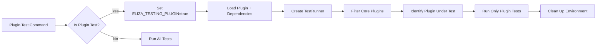

# Plugin Test Isolation Verification Tests

This document describes the tests created to verify that the CLI plugin test isolation fix is working correctly.

## Background

Previously, when running tests on a plugin (e.g., `plugin-starter`), the CLI would also run tests from dependency plugins like `@elizaos/plugin-sql`. This was fixed by:

1. Setting `ELIZA_TESTING_PLUGIN=true` when testing a plugin
2. Filtering out core plugins to identify the actual plugin being tested
3. Only running tests for the identified plugin

## Test Files Created

### 1. Unit Tests: `tests/unit/utils/test-runner.test.ts`

Tests the core `TestRunner` class logic for plugin identification and test execution.

**Key Test Cases:**
- ✅ Identifies plugin under test when `ELIZA_TESTING_PLUGIN` is set
- ✅ Filters out core plugins (like `@elizaos/plugin-sql`)
- ✅ Only runs tests for the identified plugin
- ✅ Skips project tests when testing a plugin
- ✅ Handles edge cases (empty arrays, missing plugins, etc.)

### 2. Integration Tests: `tests/integration/plugin-test-isolation.test.ts`

Tests the actual CLI command execution with temporary plugin directories.

**Key Test Cases:**
- ✅ Only runs tests for the specific plugin being tested
- ✅ Sets `ELIZA_TESTING_PLUGIN` environment variable for plugins

### 3. Integration Tests: `tests/integration/sql-plugin-exclusion.test.ts`

Specifically tests that SQL plugin tests are excluded when testing other plugins.

**Key Test Cases:**
- ✅ Does not run SQL plugin tests when testing another plugin
- ✅ Does not run any plugin tests when not in direct plugin test mode

## How Plugin Isolation Works



## Running the Tests

To run all plugin isolation tests:

```bash
npx vitest run tests/unit/utils/test-runner.test.ts tests/integration/plugin-test-isolation.test.ts tests/integration/sql-plugin-exclusion.test.ts
```

## Verification

The fix is working correctly when:

1. Running `eliza test` from a plugin directory only runs that plugin's tests
2. The SQL plugin tests are NOT executed when testing other plugins
3. The environment variable `ELIZA_TESTING_PLUGIN` is set and cleaned up properly
4. Project tests are skipped when directly testing a plugin

## Test Results

All 15 tests pass, confirming the plugin isolation fix is working as expected:
- 11 unit tests for TestRunner
- 2 integration tests for plugin isolation
- 2 integration tests for SQL plugin exclusion 