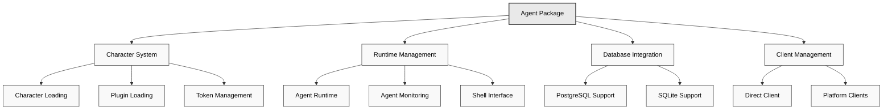

# 🤖 Agent Package

The Agent Package (`@elizaos/agent`) provides the high-level orchestration layer for Eliza, managing agent lifecycles, character loading, client initialization, and runtime coordination.

## Architecture Overview



## Key Responsibilities

The Agent Package (`@elizaos/agent`) serves as the orchestration layer for Eliza, handling:

- Character and plugin loading
- Runtime initialization and management
- Database adapter selection
- Client initialization and coordination
- Token and environment management

## Installation

```bash
bun add @elizaos/agent
```

## Quick Start

```typescript
import { startAgents, loadCharacters } from '@elizaos/agent';

// Load characters from files
const args = parseArguments();
const characters = await loadCharacters(args.characters || args.character);

// Start agent system
await startAgents();
```

## Core Features

### Character Loading

```typescript
export async function loadCharacters(charactersArg: string): Promise<Character[]> {
  const characterPaths = normalizeCharacterPaths(charactersArg);
  const loadedCharacters = [];

  for (const path of characterPaths) {
    try {
      const character = JSON.parse(fs.readFileSync(path, 'utf8'));

      // Load plugins if specified
      if (character.plugins) {
        character.plugins = await Promise.all(
          character.plugins.map(async (plugin) => {
            const importedPlugin = await import(plugin);
            return importedPlugin;
          })
        );
      }

      loadedCharacters.push(character);
    } catch (error) {
      console.error(`Error loading character from ${path}: ${error}`);
    }
  }

  // Fall back to default if none loaded
  return loadedCharacters.length > 0 ? loadedCharacters : [defaultCharacter];
}
```

### Agent Creation

```typescript
export async function createAgent(character: Character, db: IDatabaseAdapter, token: string) {
  // Ensure default plugins are included
  const plugins = [
    bootstrapPlugin,
    nodePlugin,
    character.settings.secrets.WALLET_PUBLIC_KEY ? solanaPlugin : null,
  ].filter(Boolean);

  // Add SQL plugin if not already included
  if (!plugins.some((p) => p.name === 'sql')) {
    plugins.push(sqlPlugin);
  }

  // Add local-ai plugin if no other AI provider is specified
  if (
    !plugins.some((p) => p.name === 'local-ai') &&
    !plugins.some((p) => p.name === 'openai') &&
    !plugins.some((p) => p.name === 'anthropic')
  ) {
    plugins.push(localAiPlugin);
  }

  return new AgentRuntime({
    databaseAdapter: db,
    token,
    modelProvider: character.modelProvider,
    character,
    plugins,
    providers: [],
    actions: [],
    services: [],
    managers: [],
  });
}
```
