# Automating Eliza's Documentation

Our previous post, "[Tools for Taming Information](/blog/taming-info)," highlighted the need for effective knowledge management in a dynamic project like Eliza. This follow-up explores the 'how': our CI/CD practices for automating documentation.

By treating docs as code, we boost consistency, accuracy, update speed, and reduce manual work for contributors, building a more robust and accessible knowledge base for everyone.


{/* truncate */}

## The Broader Information Ecosystem

Eliza thrive on information from diverse sources (GitHub, Discord, etc.). Efficiently capturing and processing this data is vital. The diagram below shows our information ecosystem, where data streams are collected, AI-enriched, and centralized in our [knowledge repository](https://github.com/elizaOS/knowledge). This post focuses on the "📚 docs/" portion and its automation.

The following diagram illustrates this broader flow, showing how various data streams are collected, processed, enriched (often with AI), and centralized into our [knowledge repository](https://github.com/elizaOS/knowledge). This repository then feeds various consumption layers, including AI agents, human users, and visual dashboards.

```mermaid
flowchart
    %% Data collection systems side by side

subgraph DataCollection["Data Collection Systems"]
subgraph ELIZA["elizaos.github.io (Contributor Analytics)"]
EG_INGEST["📥 Ingest GitHub Data
PRs, Issues, Comments"] --> EG_DB[("💾 SQLite DB +
Diffable Format")]
EG_PROCESS["⚙️ Process & Score
Contributions"]
EG_DB <--> EG_PROCESS
EG_PROCESS --> EG_EXPORT["📊 Export
JSON Files"]
EG_PROCESS <--> EG_SUMMARIZE["📝 Generate
AI Summaries"]
EG_SUMMARIZE --> EG_DEPLOY["🚀 Deploy to
GitHub Pages"]
EG_EXPORT --> EG_DEPLOY
end

    subgraph AI_News["ai-news (Data Collector/Miner)"]
        direction LR
        AI_EXTRACT["⛏️ Extract Raw Data

Discord, X, Github
Blockchain, Telegram"]
AI_STORE[("💾 Encrypted
SQLite DB")]
AI_ENRICH["🧠 AI Analysis
& Enrichment"]
AI_GENERATE["📝 Generate
AI Summaries"]
AI_DEPLOY["🚀 Deploy to
GitHub Pages"]
end

        %% Define connections explicitly
        AI_EXTRACT --> AI_STORE <--> AI_ENRICH --> AI_GENERATE --> AI_DEPLOY
        AI_GENERATE --> AI_STORE

    subgraph DailySilk["daily-silk (AI Twitter)"]
        direction LR
        TL["Twitter lists about AI"]
        LLM["LLM summarization"]
        TL --> LLM --> DS_FETCH["⛏️ Discord Fetch

Embedded Messages"] --> DS_JSON[("💾 JSON Files
YYYY-MM-DD")] --> DS_DEPLOY["🚀 Deploy to
GitHub Pages"]

    end


    end


    %% Knowledge Repository with properly contained sources
    subgraph KNOW["knowledge (Central Repository)"]

        subgraph KR_SOURCES["Data Sources"]
            DOCS["📚 docs/

ElizaOS Documentation

- Packages & Partners"]
  GITHUB["🐙 github/
  Stats, PRs, Issues, Commits"]
  AINEWS["📰 ai-news/
  ElizaOS & Hyperfy
  Summaries"]
  DS["📰 daily-silk/
  AI twitter news"]

              DOCS---GITHUB---AINEWS---DS
          end

          KR_MAP["🗺️ Context Map

  Structured JSON"]

          subgraph KR_OUTPUTS["Outputs"]
              KR_STRATEGIC["🧩 Strategic Context

  AI Council Insights"]
  KR_NOTES["📒 HackMD Notes
  Prompt-Generated
  Content"]
  end

          subgraph KR_PROMPTS["Prompt Templates"]
              COMMS["💬 comms/

  Communication"] --- DEV["💻 dev/
  Development"] --- STRATEGY["🎯 strategy/
  Strategic Planning"]
  end

          %% Internal connections within KNOW
          KR_SOURCES -->|"⏰ Generate Context

  Daily 5:00 UTC"| KR_MAP
  KR_MAP --> KR_OUTPUTS
  KR_PROMPTS -->|"Generate
  Content"| KR_NOTES
  end

      %% Consumption layer
      subgraph ConsumptionLayer["Consumption Layer"]
          RAG["🤖 RAG Systems

  AI Agents"] <-.-> USER["👤 Human
  Users"] <-.-> SHOW["🎬 AI Shows
  Visualizations"]
  end

      %% Connections between systems - simplified
      AI_DEPLOY -.->|"⏰ Sync Daily 4:00 UTC"| KNOW
      EG_DEPLOY -.->|"⏰ Sync Daily 4:00 UTC"| KNOW
      DS_DEPLOY -.->|"⏰ Sync Daily 4:00 UTC"| KNOW

      %% Main flow connection to consumption
      KR_OUTPUTS & KR_NOTES --> ConsumptionLayer

      %% Styling
      classDef process fill:#f7e8ff,stroke:#9966cc,stroke-width:1px,color:#333,font-weight:bold,border-radius:8px
      classDef storage fill:#ffe6e6,stroke:#ff6666,stroke-width:1px,color:#333,font-weight:bold,border-radius:16px
      classDef output fill:#e6ffe6,stroke:#66cc66,stroke-width:1px,color:#333,font-weight:bold,border-radius:8px
      classDef source fill:#fff9e6,stroke:#ffcc66,stroke-width:1px,color:#333,font-weight:bold,border-radius:8px

      class AI_EXTRACT,AI_ENRICH,AI_GENERATE,EG_INGEST,EG_EXPORT,EG_SUMMARIZE process
      class AI_STORE,EG_DB,DS_JSON storage
      class AI_DEPLOY,EG_DEPLOY,DS_DEPLOY,KR_MAP,KR_STRATEGIC,KR_NOTES output
      class DOCS,GITHUB,DS,AINEWS,SILK,ARCHIVE,COMMS,DEV,STRATEGY source

      %% Style subgraphs
      style AI_News fill:#f9f0ff,stroke:#9966cc,stroke-width:2px,color:#6600cc,font-weight:bold
      style ELIZA fill:#fff0e6,stroke:#ff9933,stroke-width:2px,color:#cc6600,font-weight:bold
      style KNOW fill:#e6fff0,stroke:#33cc99,stroke-width:2px,color:#006633,font-weight:bold
      style KR_SOURCES fill:#fff9e6,stroke:#ffcc66,stroke-width:2px,color:#997a00,font-weight:bold
      style KR_PROMPTS fill:#e6f7ff,stroke:#66ccff,stroke-width:2px,color:#006699,font-weight:bold
      style KR_OUTPUTS fill:#ffe6f7,stroke:#ff66cc,stroke-width:2px,color:#990066,font-weight:bold
      style ConsumptionLayer fill:#e6ffff,stroke:#66cccc,stroke-width:2px,color:#006666,font-weight:bold

```


<summary>View mermaid</summary>

<details>


</details>

While this diagram captures the full scope, this article will zoom in on the "📚 docs/" portion within the "KNOW (Central Repository)" and how our CI/CD pipelines automate its maintenance and enrichment.

Our documentation itself lives within the `packages/docs` directory and is built using [Docusaurus](https://docusaurus.io/), a static site generator optimized for creating clean, accessible documentation sites. Key configuration files like [`docusaurus.config.ts`](https://github.com/elizaOS/eliza/blob/v2-develop/packages/docs/docusaurus.config.ts) define the site's structure, plugins, themes, and navigation, including sidebars managed via [`sidebars.ts`](https://github.com/elizaOS/eliza/blob/v2-develop/packages/docs/sidebars.ts).

We manage several key types of content:
*   **Core Documentation**: Conceptual explanations, guides, and tutorials for ElizaOS.
*   **API Reference**: Automatically generated from our TypeScript code comments.
*   **REST API Docs**: Derived from OpenAPI specifications.
*   **Packages**: Documentation for individual adapters, clients, and plugins.
*   **Partners & Community**: Information related to our ecosystem partners and community initiatives.
*   **Blog & News**: Regular updates, articles, and aggregated news from the AI and ElizaOS space.

Static assets, such as images, diagrams, and important text files like [`llms.txt`](https://eliza.how/llms.txt) (a context file for AI models, found in `packages/docs/static/`), are also managed within this structure.

With this context in mind, let's delve into how automation helps us keep this diverse set of documentation current and accurate.

---

## Automating Content Generation & Updates: The Mechanics

Maintaining accurate and timely documentation requires robust automation. Here's a concise look at the key mechanisms we employ:

### News Aggregation & Syndication

Freshness in our [news section](https://eliza.how/news) is critical. The [`update-news.sh`](https://github.com/elizaOS/eliza/blob/v2-develop/packages/docs/scripts/update-news.sh) script, orchestrated by the [`update-news.yml`](https://github.com/elizaOS/eliza/blob/v2-develop/.github/workflows/update-news.yml) GitHub workflow, automates this.

*   **Process**: It fetches new Markdown articles daily from a predefined source (currently [AI News for elizaOS](https://m3-org.github.io/ai-news/elizaos/md)).
*   **Integration**: New news files are added to `packages/docs/news/` and the [`repomix.config.json`](https://github.com/elizaOS/eliza/blob/v2-develop/scripts/repomix.config.json) is updated. This ensures our AI context files (see below) also benefit from the latest news, enhancing the knowledge of our AI assistants.

### AI Context Files: [`llms.txt`](https://eliza.how/llms.txt) & [`llms-full.txt`](https://eliza.how/llms-full.txt)

These files are crucial for providing our AI systems (like documentation Q&A bots or RAG agents) with relevant, up-to-date context about ElizaOS. We use [Repomix](https://github.com/yamadashy/repomix), a powerful tool that packs your entire repository into a single, AI-friendly file, perfect for when you need to feed your codebase to Large Language Models (LLMs).

*   **Generation**: The [`llmstxt-generator.yml`](https://github.com/elizaOS/eliza/blob/v2-develop/.github/workflows/llmstxt-generator.yml) workflow uses `repomix`, configured by [`repomix.config.json`](https://github.com/elizaOS/eliza/blob/v2-develop/scripts/repomix.config.json) and [`repomix-full.config.json`](https://github.com/elizaOS/eliza/blob/v2-develop/scripts/repomix-full.config.json).
*   **Content**: `repomix` scans specified project files and documentation, compiling them into `packages/docs/static/llms.txt` (a general overview) and `packages/docs/static/llms-full.txt` (a more comprehensive technical deep-dive).
*   **Impact**: This ensures our AI can answer questions based on the latest code and documentation without manual re-training on every minor change.

### JSDoc & Typedoc

The [`jsdoc-automation.yml`](https://github.com/elizaOS/eliza/blob/v2-develop/.github/workflows/jsdoc-automation.yml) workflow leverages our [`autodoc`](https://github.com/elizaOS/eliza/blob/v2-develop/packages/autodoc/README.md) package to help maintain JSDoc comments in our TypeScript codebase. These comments are then processed by the [Docusaurus Typedoc Plugin](https://typedoc-plugin-markdown.org/plugins/docusaurus) (configured in [`docusaurus.config.ts`](https://github.com/elizaOS/eliza/blob/v2-develop/packages/docs/docusaurus.config.ts)) to generate the browsable API reference in [`/api`](https://eliza.how/api). This plugin integrates TypeDoc into the Docusaurus lifecycle, presetting relevant `typedoc-plugin-markdown` options and generating a configurable Docusaurus sidebar.

*   **OpenAPI for REST:** Our REST API documentation in [`/docs/rest`](https://github.com/elizaOS/eliza/tree/v2-develop/packages/docs/docs/rest) is generated from an OpenAPI specification file ([`packages/docs/src/openapi/eliza-v1.yaml`](https://github.com/elizaOS/eliza/blob/v2-develop/packages/docs/src/openapi/eliza-v1.yaml)) using `docusaurus-plugin-openapi-docs`. This ensures the API docs are always in sync with the defined contract.

### README Translations via AI

To broaden accessibility, the [`generate-readme-translations.yml`](https://github.com/elizaOS/eliza/blob/v2-develop/.github/workflows/generate-readme-translations.yml) workflow uses an AI model to translate our main project [README.md](https://github.com/elizaOS/eliza/blob/v2-develop/README.md) into multiple languages. These translations are then committed to the repository.

### Supporting Scripts

Several other scripts in [`packages/docs/scripts/`](https://github.com/elizaOS/eliza/blob/v2-develop/packages/docs/scripts/README.md) handle more specialized tasks:
*   [`update-partner-pages.js`](https://github.com/elizaOS/eliza/blob/v2-develop/packages/docs/scripts/update-partner-pages.js): This script automates the creation and maintenance of individual documentation pages for our partners, located under [`packages/docs/partners/`](https://github.com/elizaOS/eliza/tree/v2-develop/packages/docs/partners/). It reads partner data (name, description, logo, website, social links, etc.) from [`packages/docs/src/data/partners.tsx`](https://github.com/elizaOS/eliza/blob/v2-develop/packages/docs/src/data/partners.tsx). For each partner, it generates a standardized Markdown page, ensuring consistency and ease of updates by modifying a central data source.
*   [`summarize.sh`](https://github.com/elizaOS/eliza/blob/v2-develop/packages/docs/scripts/summarize.sh): A versatile command-line utility that leverages AI models via the OpenRouter API to summarize various file types, including text, JSON, and even MP3 audio (which it first transcribes using [`insanely-fast-whisper`](https://github.com/Vaibhavs10/insanely-fast-whisper)). This script can be used to quickly generate summaries of content. For instance, when new videos are uploaded (e.g., to YouTube), `summarize.sh` can be used to transcribe and summarize the content, forming the basis for new documentation pages. It offers options for custom prompts, model selection, and output file specification.
*   [`get-changelog.py`](https://github.com/elizaOS/eliza/blob/v2-develop/packages/docs/scripts/get-changelog.py): Helps in generating changelogs from repository history.

### Dynamic Package Showcase ([eliza.how/packages](https://eliza.how/packages))

Our package showcase is a key resource for discovering ElizaOS adapters, clients, and plugins. Its content is dynamically generated through an automated process:

*   **Registry Fetching**: The [`update-registry.js`](https://github.com/elizaOS/eliza/blob/v2-develop/packages/docs/scripts/update-registry.js) script periodically fetches the list of available packages from the central [ElizaOS Plugins Registry](https://raw.githubusercontent.com/elizaos-plugins/registry/refs/heads/main/index.json).
*   **Custom Data Merging**: This script enriches the registry data with custom descriptions and preview image paths defined in [`plugin-descriptions.json`](https://github.com/elizaOS/eliza/blob/v2-develop/packages/docs/src/data/plugin-descriptions.json). This file allows us to provide more curated information than what might be available directly from GitHub repository descriptions.
*   **Data Generation**: The processed data is then used to generate [`registry-users.tsx`](https://github.com/elizaOS/eliza/blob/v2-develop/packages/docs/src/data/registry-users.tsx), which exports a structured array of all packages.
*   **Display Logic**: [`users.tsx`](https://github.com/elizaOS/eliza/blob/v2-develop/packages/docs/src/data/users.tsx) consumes this array, defines tags, and handles sorting for the showcase.
*   **Rendering**: Finally, the React components in [`packages/docs/src/pages/showcase/`](https://github.com/elizaOS/eliza/tree/v2-develop/packages/docs/src/pages/showcase/) (primarily `index.tsx` and its sub-components) render the interactive showcase.
*   **AI-Assisted Summaries**: The [`plugin_summary_prompt.txt`](https://github.com/elizaOS/eliza/blob/v2-develop/packages/docs/scripts/plugin_summary_prompt.txt) can be used with `summarize.sh` to help generate or update descriptions within `plugin-descriptions.json`, further streamlining content maintenance for the showcase.

This automated pipeline ensures the package showcase remains comprehensive and up-to-date with minimal manual intervention.

These automated processes form the core of our "docs-as-code" philosophy, reducing toil and improving the quality and timeliness of our documentation.

---

## Automation Backbone: GitHub Actions

All this automation is powered by our CI/CD pipelines, defined using [GitHub Actions](https://github.com/features/actions). These workflows, located in our [`.github/workflows/`](https://github.com/elizaOS/eliza/blob/v2-develop/.github/workflows/README.md) directory, are the engine that keeps our documentation building, testing, and deploying smoothly.

Key workflows ensure documentation integrity and timely updates:

*   **Core CI Checks ([`ci.yaml`](https://github.com/elizaOS/eliza/blob/v2-develop/.github/workflows/ci.yaml), [`pr.yaml`](https://github.com/elizaOS/eliza/blob/v2-develop/.github/workflows/pr.yaml)):** On every push or pull request, these workflows run essential checks. For documentation, this includes linting Markdown files, checking for broken links, and ensuring the Docusaurus site builds successfully. This catches errors early, before they reach the live documentation.
*   **Automated Content Generation Triggers:** As detailed in the previous section, workflows like [`update-news.yml`](https://github.com/elizaOS/eliza/blob/v2-develop/.github/workflows/update-news.yml), [`llmstxt-generator.yml`](https://github.com/elizaOS/eliza/blob/v2-develop/.github/workflows/llmstxt-generator.yml), [`jsdoc-automation.yml`](https://github.com/elizaOS/eliza/blob/v2-develop/.github/workflows/jsdoc-automation.yml), and [`generate-readme-translations.yml`](https://github.com/elizaOS/eliza/blob/v2-develop/.github/workflows/generate-readme-translations.yml) are triggered on schedules or specific events (e.g., pushes to main branches) to automatically update relevant documentation sections or supporting files.
*   **Deployment:** The Docusaurus site is automatically deployed upon merges to the main branch using the command `USE_SSH=true bun run deploy`. This ensures that approved changes are reflected on the live documentation site ([eliza.how/docs](https://eliza.how/docs)) promptly.

This CI/CD setup not only automates repetitive tasks but also enforces quality standards, ensuring that our documentation remains a reliable resource.

---

## Living Documentation: Challenges, Learnings & Future Vision

Treating documentation as code and automating its lifecycle is a journey, not a destination. While our current setup significantly improves efficiency and consistency, we continuously learn and identify areas for enhancement.

### Current Challenges & Learnings

Our docs-as-code pipeline is robust, but we're always working to make it better. This means focusing on:

*   **Speed:** Making sure docs build quickly
*   **Quality:** Double-checking any content written by AI to ensure it's accurate and clear
*   **Teamwork for Tools:** Keeping all the different software parts and scripts working together smoothly, especially as we add new things

### Future Vision & Enhancements

Our goal is to make the documentation process even more seamless, intelligent, and contributor-friendly. We're exploring enhancements like:

*   **Smarter Triggers:** Targeting CI jobs to run only when relevant files change.
*   **Smarter Link Checks:** Moving beyond basic broken link detection to validating link relevance.
*   **Enhanced AI Assistance:** Using AI to identify outdated docs or suggest improvements based on search queries.
*   **Automated Video Documentation:** Using `summarize.sh` to transcribe, summarize, and draft PRs for new video content, plus automating `VideoGallery` updates.
*   **Automated Plugin Descriptions:** Using CI and `summarize.sh` to propose updates to `plugin-descriptions.json` when new plugins or README changes are detected.
*   **Faster Feedback Loops:** Optimizing workflows for quicker contributor feedback on PRs.
*   **AI-Driven Content Strategy:** Using site analytics to guide AI in suggesting or outlining new documentation.

We're always refining these processes. Your contributions and feedback via GitHub or Discord are invaluable in helping us build an even better documentation experience, we're listening!
```
