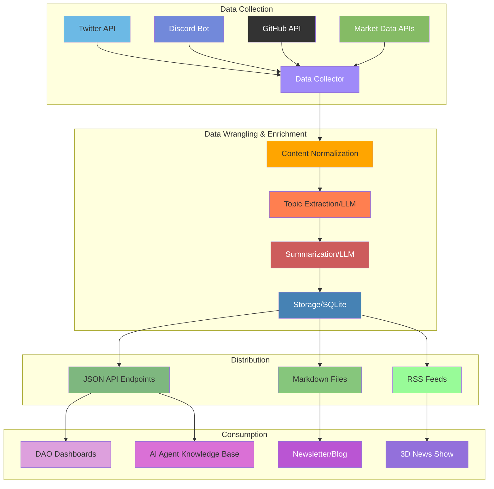

# Taming the Information Wilderness

How we're using AI tools to tame information chaos across GitHub, Discord, and beyond and meet users where they are. These approaches can offer blueprint ideas for eliza agents to streamline project communication and knowledge sharing.

{/* truncate */}

## Challenges

[The Great Online Game](https://www.notboring.co/p/the-great-online-game) is played across many different apps and chat rooms. One of the biggest challenges facing players is locating critical information like who does what or updates scattered when it's across Discord channels, GitHub repositories, forums, threads, etc. No human, regardless of how dedicated, can keep track of everything.

https://xkcd.com/1810/

Even when information is theoretically "public," people are generally too lazy to fetch it. That and stakeholders may prefer different information formats:

- Developers dig into GitHub
- Community vibes on Discord
- Casual followers scroll Twitter
- Visual learners watch videos

Instead of forcing everyone onto one highway early on, a better strategy would be to build bridges between lanes to allow information to flow more freely. AI agents are the vehicles for that information, they carry the ability to meet people where they are to deliver important insights while preserving context.

### Goals

- Reduce overhead on managing comms / community questions
- Keep people informed across different platforms
- Accelerate onboarding for new contributors

---

### Case Study: AI News System

This [discord summarizer](https://github.com/elizaOS/discord-summarizer) was the first prototype. For ElizaOS we're now using [this AI News tool](https://github.com/bozp-pzob/ai-news) to aggregate sources from across the ecosystem. The system works in four key stages:

1. **Collection**: APIs pull data from multiple sources including Twitter, Discord, GitHub, and market data platforms.
2. **Wrangling**: LLMs normalize, summarize, and tag topics to create a unified knowledge base from disparate sources.
3. **Distribution**: The system produces standardized outputs in multiple formats (JSON, Markdown, RSS) to suit different consumption needs.
4. **Consumption**: Users can access tailored products like dashboards, newsletters, or even 3D news shows.

You can see the results from this tool here, which updates daily via GitHub actions:
- https://m3-org.github.io/ai-news/
- https://eliza.how/news

  <iframe
    src="https://www.youtube.com/embed/fIGoyaEd0Hw"
    title="YouTube video player"
    allow="accelerometer; autoplay; clipboard-write; encrypted-media; gyroscope; picture-in-picture"
    allowFullScreen
  />

---

## Case Study: AI Assistants

Idk about you, but I hate seeing questions left hanging in tech support channels, especially when the answer can easily be found in the docs. It's a perfect opportunity to [eat our own dogfood](https://en.wikipedia.org/wiki/Eating_your_own_dog_food), experience and fix pain points firsthand,  and showcase a powerful use case of AI agents to other devs.

While we're analyzing tech support channels, we can identify gaps in docs based on common community questions which can then be addressed systematically. This may involve checking if any github issues or pull requests already address a question, and if not, then to help create an issue for it. Herein lies a powerful feedback loop:

- Aggregate & Analyze: Extract questions and answers, who is helping who (and if succesful), identify pain points, gather sentiment
- Clean & Enhance Data, Update docs, create bug reports
- RAG Knowledge: AI Agents giving automated responses to FAQ

You can now use [AI news](https://github.com/bozp-pzob/ai-news) to generate a summary, who helped who, FAQ, and action items analysis of a source for whatever time period you want - even historically!

We retroactively reward people who provided good answers to questions (we're using tip.cc) over a time period. Later people can reuse their tips when helping or asking for help from other people.

**Main Lesson: Treat the docs as first-class citizen of your project.**

Eliza AI agent assistants helping devs with common questions about elizaOS greatly benefit from good docs to provide more current and accurate information, which speeds up onboarding and lets developers stay focused on higher impact activities.

> Read [this guide](https://www.kapa.ai/blog/optimizing-technical-documentation-for-llms) on how to optimize technical docs for LLMs. Adding FAQ with answers in the docs enhances optimizes them for LLM use cases.

## Get Involved

In the future I want people to be able to install Eliza and be greeted by an agent that can help you setup, configure settings, create plugins, deploy, etc. For now I think our assistants need to be supervised until we're confident enough in their responses. I think we can speed things up by having the agent admit what they don't know the answer vs hallucinating, and to guide devs to the main community support channels when they're having difficulty.

If you want to collaborate with us, here's a few ideas:

- Answer people's questions in the coders / tech support channels on discord, it will get noticed :)
- Help with docs: go through pages, verify information with code, test the steps, create issues and PRs with fixes
- Collaborate with us on the [AI news aggregator](https://github.com/bozp-pzob/ai-news)
    - Generate new show ideas using the [output files](https://m3-org.github.io/ai-news/) from AI-news
    - Write a script that takes a week of daily logs and turns it into a newsletter or news show program
- Ingest docs into your Eliza agent as knowledge to onboard them then tinker with the character file to takee on a role in the DAO
    - Perhaps it can act as a scribe that summarizes chats
    - Lore keeper, community moderation, or social media marketer

### Links
- https://github.com/bozp-pzob/ai-news (aggregator tool)
    - https://m3-org.github.io/ai-news/ (data for elizaOS ecosystem)
- https://github.com/elizaOS/knowledge (for eliza RAG knowledge)
- https://www.kapa.ai/blog/optimizing-technical-documentation-for-llms
