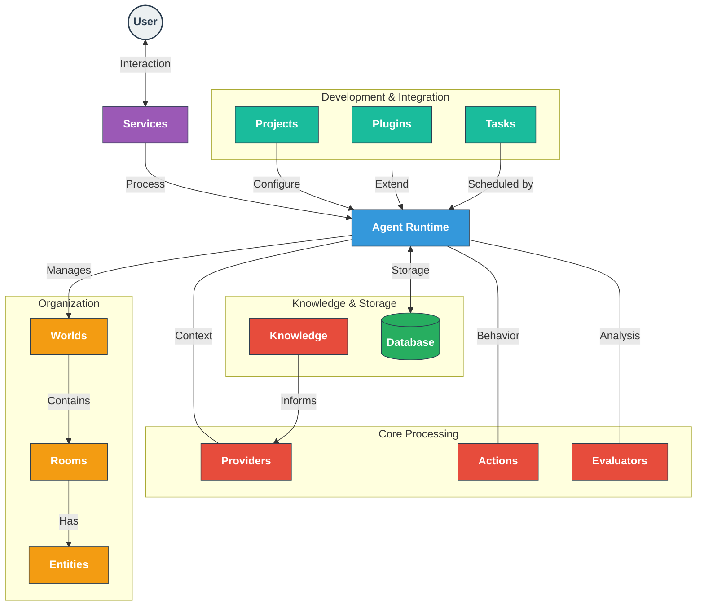

# ElizaOS V2: What's New

The newest version of [eliza](https://github.com/elizaOS/eliza) represents significant upgrades from the previous version, offering a leaner, more flexible architecture for cross-platform agent interaction. This short guide highlights the key differences between V1 and V2.

[](/blog/v1-v2.jpg)
{/* truncate */}
Source: https://www.youtube.com/watch?v=yUjScwAZsQo

### V2 Impact

- **Cross-Platform Presence**: Your agent can jump from Twitter, continue via SMS, and place orders with businesses—all while maintaining conversation context.
- **Unified Blockchain Management**: One wallet to rule all chains—no more chain-switching headaches.
- **Autonomous Workflows**: Agents that handle multi-step processes independently—researching data, analyzing results, generating reports, and scheduling follow-ups without constant oversight.
- **Evolving Intelligence**: Database-driven characters that can start minimal and grow through interactions with your crowd.
- **Enhanced Security**: Native TEE integration provides verifiable security guarantees for sensitive operations while maintaining privacy.

---

## Core Architecture Redesign

| V1 Limitation                                                         | V2 Solution                                                                           |
| --------------------------------------------------------------------- | ------------------------------------------------------------------------------------- |
| **Bloated Core**: Codebase overloaded with packages from rapid growth | **Package Registry**: Submit plugins independently; lean codebase, no approval delays |
| **Fragmented Messaging**: Platform-specific I/O pipelines             | **Unified Messaging**: Agents process inputs and output anywhere, seamlessly          |
| **Wallet Overlap**: Multi-chain wallet conflicts                      | **Unified Inventory**: One wallet with chain-agnostic actions                         |
| **Rigid State**: Hardcoded goals and features                         | **Modular State**: Extensible, optional components for tailored agents                |
| **Basic Action Chaining**: No multi-step foresight                    | **Strategic Planning**: Agents map out complex, sequenced workflows                   |
| **Package Manager Speed**: Lengthy installations and cold starts      | **Bun Integration**: Faster installs, reduced build times                             |

---

## Technical Implementation Changes



### From Clients to Services

V2 swaps Clients for Services, standardizing platform integration while centralizing message routing—agents now think once, act anywhere (Discord, Twitter, SMS, even phone calls).

### Smarter Character Evolution

V2 swaps static files for dynamic personas—agents learn from your crowd in real-time while still being able to be imported / exported as JSON files (see [docs](/docs/core/project)).

### Enhanced Development Experience

New CLI and plugin manager slashes setup time. Instead of cloning the github repo, changing to the correct branch, rebuilding, etc, it's just one command to create a new project:

```bash
npm create eliza@beta
```

<details>
    <summary>See CLI commands</summary>
    
```bash
Usage: elizaos [options] [command]

Options:
-V, --version output the version number
-h, --help display help for command

Commands:
create [options] [name] Initialize a new project or plugin
project Manage an ElizaOS project
plugin Manage ElizaOS plugins, including publishing
agent manage ElizaOS agents
tee Manage TEE deployments
start [options] Start the Eliza agent with configurable plugins and services
update [options] Update ElizaOS packages to the latest versions
test [options] Run tests for Eliza agent plugins
env Manage environment variables and secrets
dev [options] Start the project or plugin in development mode and rebuild on
file changes
publish [options] Publish a plugin or project to the registry
help [command] display help for command

````
</details>

Explore the plugin repository https://github.com/elizaos-plugins/ or from the [docs showcase](/packages).

### Memory and Task Management
Vector embeddings power richer memory; tasks now handle schedules and multi-step logic.

```typescript
await runtime.createTask({ ... });
````

---

## Timeline

- **March 2025**: Research beta now live.
- **April 2025**: Public rollout.

### Should You Upgrade?

V2 is mostly backward compatible for gradual migration. Existing projects can phase in V2 features; new ones should start with V2 for full benefits. V1 still works, but V2's modularity and planning unlock next-level autonomy. See [quickstart](/docs/quickstart) to get started.
