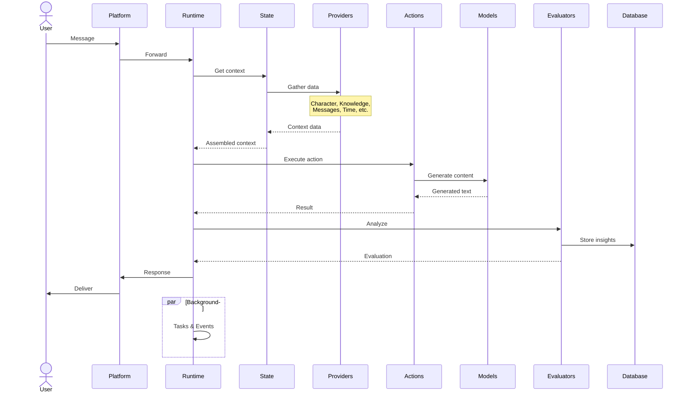

# 🤖 Agent Runtime

The `AgentRuntime` is the core runtime environment for Eliza agents. It handles message processing, state management, plugin integration, and interaction with external services. You can think of it as the brains that provide the high-level orchestration layer for Eliza agents.



The runtime follows this general flow:

1. **Initial Reception**: The user sends a message which is received by the Platform Services
2. **Context Building**:

   - The Runtime Core requests context from the State Composition system
   - State gathers data from various Providers (Character, Knowledge, Recent Messages, etc.)
   - The complete context is returned to the Runtime

3. **Action Processing**:

   - The Runtime determines applicable actions and selects the optimal one
   - The selected action may request content generation from Models
   - The action result is returned to the Runtime

4. **Learning & Persistence**:

   - The conversation is analyzed by Evaluators for insights and facts
   - Knowledge updates are sent to the Memory System
   - All relevant data is persisted to the Database

5. **Response Delivery**:
   - The final response is sent back to the user through Platform Services

---

## Overview

The [AgentRuntime](/api/classes/AgentRuntime) class is the primary implementation of the [IAgentRuntime](/api/interfaces/IAgentRuntime) interface, which manages the agent's core functions, including:

| Component             | Description                                                                                                                                                                             | API Reference                                                    | Related Files                                                                                                                                                                                                                                                                                                                                                                                                                                                                                                                                                                                                  |
| --------------------- | --------------------------------------------------------------------------------------------------------------------------------------------------------------------------------------- | ---------------------------------------------------------------- | -------------------------------------------------------------------------------------------------------------------------------------------------------------------------------------------------------------------------------------------------------------------------------------------------------------------------------------------------------------------------------------------------------------------------------------------------------------------------------------------------------------------------------------------------------------------------------------------------------------- |
| **Services**          | Supports multiple communication platforms and specialized functionalities for seamless interaction.                                                                                     | [Services API](/api/interfaces/IAgentRuntime/#services)          | [`service.ts`](https://github.com/elizaOS/eliza/tree/develop/packages/core/src/service.ts), [`Discord`](https://github.com/elizaos-plugins/plugin-discord), [`Telegram`](https://github.com/elizaos-plugins/plugin-telegram), [`Twitter`](https://github.com/elizaos-plugins/plugin-twitter), [`Farcaster`](https://github.com/elizaos-plugins/plugin-farcaster), [`Lens`](https://github.com/elizaos-plugins/plugin-lens), [`Slack`](https://github.com/elizaos-plugins/plugin-slack), [`Auto`](https://github.com/elizaos-plugins/plugin-auto), [`GitHub`](https://github.com/elizaos-plugins/plugin-github) |
| **State**             | Maintains context for coherent cross-platform interactions, updates dynamically. Also tracks goals, knowledge, and recent interactions                                                  | [State API](/api/interfaces/State)                               | [`state.ts`](https://github.com/elizaos/runtime/state.ts)                                                                                                                                                                                                                                                                                                                                                                                                                                                                                                                                                      |
| **Plugins**           | Dynamic extensions of agent functionalities using custom actions, evaluators, providers, and adapters                                                                                   | [Plugins API](/api/type-aliases/Plugin/)                         | [`plugins.ts`](https://github.com/elizaos/runtime/plugins.ts), [actions](../actions), [evaluators](../evaluators), [providers](../providers)                                                                                                                                                                                                                                                                                                                                                                                                                                                                   |
| **Services**          | Connects with external services for `IMAGE_DESCRIPTION`, `TRANSCRIPTION`, `TEXT_GENERATION`, `SPEECH_GENERATION`, `VIDEO`, `PDF`, `BROWSER`, `WEB_SEARCH`, `EMAIL_AUTOMATION`, and more | [Services API](/api/interfaces/IAgentRuntime/#services)          | [`services.ts`](https://github.com/elizaos/runtime/services.ts)                                                                                                                                                                                                                                                                                                                                                                                                                                                                                                                                                |
| **Memory Systems**    | Creates, retrieves, and embeds memories and manages conversation history.                                                                                                               | [Memory API](/api/interfaces/IMemoryManager)                     | [`memory.ts`](https://github.com/elizaos/runtime/memory.ts)                                                                                                                                                                                                                                                                                                                                                                                                                                                                                                                                                    |
| **Database Adapters** | Persistent storage and retrieval for memories and knowledge                                                                                                                             | [databaseAdapter](api/interfaces/IAgentRuntime/#databaseAdapter) | [`MongoDB`](https://github.com/elizaos-plugins/adapter-mongodb), [`PostgreSQL`](https://github.com/elizaos-plugins/adapter-postgres), [`SQLite`](https://github.com/elizaos-plugins/adapter-sqlite), [`Supabase`](https://github.com/elizaos-plugins/adapter-supabase), [`PGLite`](https://github.com/elizaos-plugins/adapter-sqlite), [`Qdrant`](https://github.com/elizaos-plugins/adapter-qdrant), [`SQL.js`](https://github.com/elizaos-plugins/adapter-sqljs)                                                                                                                                             |
| **Cache Management**  | Provides flexible storage and retrieval via various caching methods.                                                                                                                    | [Cache API](/api/interfaces/ICacheManager)                       | [`cache.ts`](https://github.com/elizaos/runtime/cache.ts)                                                                                                                                                                                                                                                                                                                                                                                                                                                                                                                                                      |

<details>
<summary>Advanced: IAgentRuntime Interface</summary>
```typescript
interface IAgentRuntime {
    // Core identification
    agentId: UUID;
    
    // Configuration
    character: Character;                          // Personality and behavior settings
    
    // Components
    plugins: Plugin[];                             // Additional capabilities
    services: Map<ServiceTypeName, Service>;       // Platform connections and functionality
    providers: Provider[];                         // Real-time data sources
    actions: Action[];                             // Available behaviors
    evaluators: Evaluator[];                       // Analysis & learning
    routes: Route[];                               // API endpoints
    
    // Memory Management
    getMemories(...): Promise<Memory[]>;           // Retrieve conversation history
    createMemory(...): Promise<UUID>;              // Store new memories
    searchMemories(...): Promise<Memory[]>;        // Semantic search
    
    // State Composition
    composeState(...): Promise<State>;             // Gather data from providers
    
    // Plugin Management
    registerPlugin(...): Promise<void>;            // Register plugins
    
    // Service Management
    getService<T>(...): T | null;                  // Access services
    registerService(...): Promise<void>;           // Register services
    
    // Model Integration
    useModel<T, R>(...): Promise<R>;               // Use AI models
    
    // Additional Utilities
    getSetting(...): any;                          // Access settings
    setSetting(...): void;                         // Configure settings
    getCache<T>(...): Promise<T | undefined>;      // Access cached data
    setCache<T>(...): Promise<boolean>;            // Store cached data
}
```

Source: [/api/interfaces/IAgentRuntime/](/api/interfaces/IAgentRuntime/)

</details>

---

### **Key Methods**

- **`initialize()`**: Sets up the agent's runtime environment, including services, plugins, and knowledge processing.
- **`processActions()`**: Executes actions based on message content and state.
- **`evaluate()`**: Assesses messages and state using registered evaluators.
- **`composeState()`**: Constructs the agent's state object for response generation.
- **`registerService()`**: Adds a service to the runtime.
- **`getService()`**: Retrieves a registered service by type.
- **`useModel()`**: Utilizes AI models with typesafe parameters and results.
- **`ensureRoomExists()` / `ensureConnection()`**: Ensures the existence of communication channels and connections.

## Service System

Services provide specialized functionality with standardized interfaces that can be accessed cross-platform:

```typescript
// Speech Generation
const speechService = runtime.getService<ISpeechService>('speech_generation');
const audioStream = await speechService.process(text);

// PDF Processing
const pdfService = runtime.getService<IPdfService>('pdf');
const textContent = await pdfService.convertPdfToText(pdfBuffer);

// Discord Integration
const discordService = runtime.getService<IDiscordService>('discord');
await discordService.sendMessage(channelId, content);
```

---

## State Management

The runtime maintains comprehensive state through the State interface:

```typescript
interface State {
  // Core state data
  values: {
    [key: string]: any;
  };
  data: {
    [key: string]: any;
  };
  text: string;
}

// State composition example
async function manageState() {
  // Initial state composition with all regular providers
  const state = await runtime.composeState(message);

  // State with specific providers only
  const filteredState = await runtime.composeState(message, ['timeProvider', 'recentMessages']);

  // Include private or dynamic providers
  const enhancedState = await runtime.composeState(message, null, [
    'weatherProvider',
    'portfolioProvider',
  ]);
}
```

---

## Plugin System

Plugins extend agent functionality through a modular interface. The runtime supports various types of plugins including services, adapters, actions, and more:

```typescript
interface Plugin {
  name: string;
  description: string;
  init?: (config: Record<string, string>, runtime: IAgentRuntime) => Promise<void>;

  // Components
  services?: (typeof Service)[]; // Communication platforms and external integrations
  actions?: Action[]; // Custom behaviors
  providers?: Provider[]; // Data providers
  evaluators?: Evaluator[]; // Response assessment
  adapters?: Adapter[]; // Database/cache adapters
  routes?: Route[]; // API endpoints
  tests?: TestSuite[]; // Testing utilities
}
```

Plugins can be configured through [characterfile](./characterfile) settings:

```json
{
  "name": "MyAgent",
  "plugins": ["@elizaos/plugin-solana", "@elizaos/plugin-twitter"],
  "settings": {
    "twitter": {
      "shouldRespondToMentions": true
    },
    "solana": {
      "enableAutoTrading": false
    }
  }
}
```

For detailed information about plugin development and usage, see the [ElizaOS Registry](https://github.com/elizaos-plugins/registry).

---

## Running Multiple Agents

To run multiple agents:

```bash
bun start --characters="characters/agent1.json,characters/agent2.json"
```

Or use environment variables:

```
REMOTE_CHARACTER_URLS=https://example.com/characters.json
```

---

## FAQ

### What's the difference between an agent and a character?

A character defines personality and knowledge, while an agent provides the runtime environment and capabilities to bring that character to life.

### How do I choose the right database adapter?

Choose based on your needs:

- MongoDB: For scalable, document-based storage
- PostgreSQL: For relational data with complex queries
- SQLite: For simple, file-based storage
- Qdrant: For vector search capabilities

### How do I implement custom plugins?

Create a plugin that follows the plugin interface and register it with the runtime. See the plugin documentation for detailed examples.

### Do agents share memory across platforms?

By default, agents maintain separate memory contexts for different platforms to avoid mixing conversations. Use the memory management system and database adapters to persist and retrieve state information.

### How do I handle multiple authentication methods?

Use the character configuration to specify different authentication methods for different services. The runtime will handle the appropriate authentication flow.

### How do I manage environment variables?

Use a combination of:

- `.env` files for local development
- Character-specific settings for per-agent configuration
- Environment variables for production deployment

### Can agents communicate with each other?

Yes, through the message system and shared memory spaces when configured appropriately.
