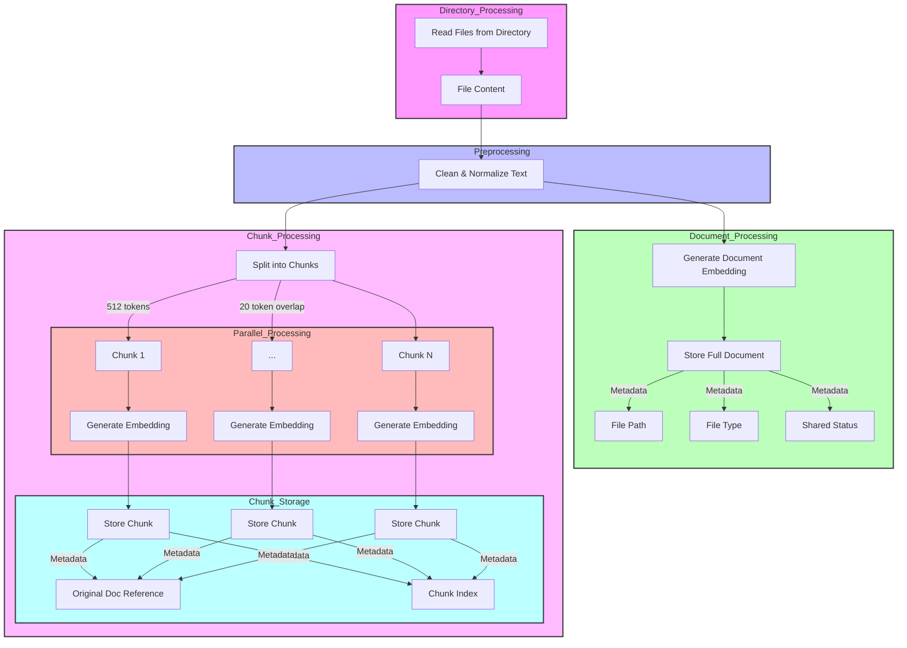
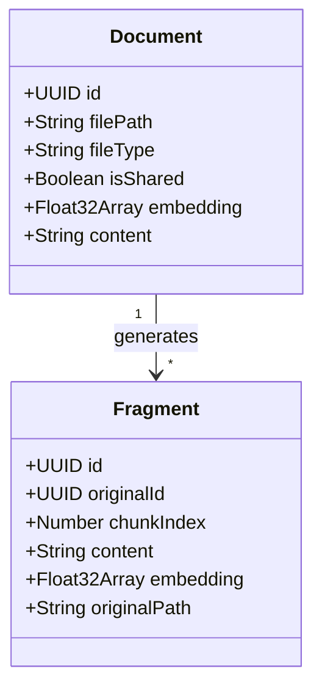

# Knowledge Management

## Overview

The Knowledge Management system in ElizaOS is a powerful Retrieval-Augmented Generation (RAG) feature that enables agents to process, store, and retrieve information from various sources. This allows agents to provide contextually relevant responses by leveraging stored knowledge during conversations.

## Adding Knowledge to Agents

ElizaOS provides multiple ways to add knowledge to your agents, both during initialization and at runtime.

### Adding Knowledge During Runtime Creation

#### 1. Via Character Definition

The simplest approach is to define knowledge directly in your character configuration:

```typescript
const character: Character = {
  name: 'My Agent',
  // Other character properties...
  knowledge: [
    // Direct string knowledge
    'Important fact: ElizaOS supports multiple knowledge formats',

    // File references
    { path: 'knowledge/documentation.md', shared: false },

    // Directory references
    { directory: 'knowledge/guides', shared: true },
  ],
};
```

The knowledge array supports three formats:

- String literals for direct knowledge
- File objects pointing to specific files
- Directory objects for entire folders of content

#### 2. Programmatically Before Runtime Initialization

You can dynamically load knowledge before creating your runtime:

```typescript
// Load knowledge from files or other sources
const knowledge = [];

// Example: Recursively load documentation files
function loadDocumentation(directoryPath) {
  const files = getFilesRecursively(directoryPath, ['.md']);
  return files.map((filePath) => {
    const relativePath = path.relative(basePath, filePath);
    const content = fs.readFileSync(filePath, 'utf-8');
    return `Path: ${relativePath}\n\n${content}`;
  });
}

// Load documentation
const docKnowledge = loadDocumentation('./docs');
knowledge.push(...docKnowledge);

// Then include in your character definition
const character: Character = {
  // Other character properties...
  knowledge: knowledge,
};
```

### Adding Knowledge After Runtime Creation

#### 1. Using the `addKnowledge` Method

Add knowledge programmatically after the runtime is initialized:

```typescript
// Import needed utilities
import { createUniqueUuid } from '@elizaos/core';

// Create a knowledge item
const knowledgeItem = {
  id: createUniqueUuid(runtime, 'unique-knowledge-identifier'),
  content: {
    text: 'Important information the agent should know...',
  },
};

// Add to runtime with default chunking settings
await runtime.addKnowledge(knowledgeItem);

// Or with custom chunking settings
await runtime.addKnowledge(knowledgeItem, {
  targetTokens: 1500, // Target chunk size (default: 3000)
  overlap: 100, // Overlap between chunks (default: 200)
  modelContextSize: 8192, // Context size of your model (default: 4096)
});
```

#### 2. Processing Files at Runtime

You can dynamically process files at runtime:

```typescript
// For PDF files, use the PDF service
const pdfService = runtime.getService<IPdfService>('pdf');
if (pdfService) {
  const pdfBuffer = fs.readFileSync('./knowledge/document.pdf');
  const textContent = await pdfService.convertPdfToText(pdfBuffer);

  const knowledgeItem = {
    id: createUniqueUuid(runtime, 'document.pdf'),
    content: { text: textContent },
  };

  await runtime.addKnowledge(knowledgeItem);
}
```

## Directory Structure

ElizaOS expects knowledge files to be organized in the following structure:

```
knowledge/          # Root knowledge directory
├── shared/         # Shared knowledge accessible to all agents
└── {agent-name}/   # Agent-specific knowledge directories
```

## Supported File Types

- PDF files (`.pdf`)
- Markdown files (`.md`)
- Text files (`.txt`)

## Knowledge Modes

ElizaOS supports two knowledge modes:

### Classic Mode (Default)

- Direct string knowledge added to character's context
- No chunking or semantic search
- Enabled by default (`settings.ragKnowledge: false`)
- Only processes string knowledge entries
- Simpler but less sophisticated

### RAG Mode

- Advanced knowledge processing with semantic search
- Chunks content and uses embeddings
- Must be explicitly enabled (`settings.ragKnowledge: true`)
- Supports three knowledge types:
  1. Direct string knowledge
  2. Single file references: `{ "path": "path/to/file.md", "shared": false }`
  3. Directory references: `{ "directory": "knowledge/dir", "shared": false }`
- Supported file types: .md, .txt, .pdf
- Optional `shared` flag for knowledge reuse across characters

To enable RAG mode, add this to your character settings:

```typescript
const character: Character = {
  // Other character properties...
  settings: {
    ragKnowledge: true,
  },
};
```

## How Knowledge Processing Works

### Document Processing Flow

The RAG system processes documents through several stages:

1. **Directory Processing**

   - The system scans configured directories in `knowledge/`
   - Files are processed based on their shared/private status and file type

2. **File Processing Pipeline**

   - **Preprocessing**: Reading, cleaning, and normalizing text
   - **Document-level Processing**: Generating embeddings for the entire document
   - **Chunk Processing**: Splitting content into manageable chunks and generating embeddings for each

3. **Retrieval Process**
   - When a user message is received, its embedding is generated
   - This embedding is compared to stored knowledge embeddings
   - The most semantically similar chunks are retrieved
   - Retrieved knowledge is incorporated into the agent's context

This multi-level approach enables:

- Broad document-level semantic search
- Fine-grained chunk-level retrieval for specific information
- Efficient parallel processing of large documents
- Maintenance of document context through metadata linking

### Knowledge Processing Flow Diagram



### Processing Parameters

- **Chunk Size**: 512 tokens (default, configurable when adding knowledge)
- **Chunk Overlap**: 20 tokens (default, configurable)
- **Processing Batch Size**: 10 chunks processed concurrently
- **Default Similarity Threshold**: 0.85 for retrieval
- **Default Match Count**: 5 results returned

## Best Practices for Knowledge Management

### Content Organization

1. **Document Structure**

   - Use clear section headings and hierarchical organization
   - Break large documents into logical smaller files
   - Include metadata and context in markdown files
   - Structure information from general to specific

2. **File Management**

   - Use descriptive filenames that reflect content
   - Group related files in subdirectories
   - Keep paths short and meaningful
   - Avoid special characters in filenames

3. **Knowledge Optimization**
   - Keep individual documents focused on specific topics
   - For very detailed information, use smaller chunks (200-300 tokens) by setting `targetTokens`
   - Balance the total number of knowledge items for performance
   - Prefer markdown (.md) files for best processing results

### Processing Large Knowledge Bases

When adding many knowledge items at once, consider implementing a semaphore pattern:

```typescript
import { Semaphore } from '@elizaos/core';

// Create semaphore to limit concurrent processing
const semaphore = new Semaphore(10);

// Process items with controlled concurrency
await Promise.all(
  items.map(async (item) => {
    await semaphore.acquire();
    try {
      await runtime.addKnowledge(item);
    } finally {
      semaphore.release();
    }
  })
);
```

### Knowledge ID Management

When adding knowledge programmatically, use consistent ID generation:

```typescript
import { createUniqueUuid } from '@elizaos/core';
const knowledgeId = createUniqueUuid(runtime, 'my-content');
```

This ensures deterministic IDs that remain stable across sessions.

## Troubleshooting

### Common Issues and Solutions

1. **Knowledge Not Being Retrieved**:

   - Verify the file is in a supported format (PDF, MD, TXT)
   - Check if embeddings were properly generated
   - Ensure similarity threshold isn't too high (default: 0.85)
   - Test retrieval with more specific queries
   - Verify RAG mode is enabled if using file/directory references

2. **Poor Quality Retrievals**:

   - Break down large documents into smaller, focused files
   - Ensure document content is clear and well-structured
   - Review the chunking size and overlap settings
   - Check if the query contains too many common words

3. **Performance Issues**:

   - Monitor the total number of knowledge items
   - Consider reducing the match count for faster retrieval
   - Check embedding processing time for large documents
   - Use shared knowledge efficiently across agents

4. **File Processing Errors**:
   - Verify file permissions
   - Check if paths are correctly structured
   - Ensure PDF files are readable and not password-protected
   - Validate that text encoding is UTF-8

## Technical Implementation Details

### Knowledge ID Relationships

The RAG system uses a hierarchical ID structure to maintain relationships:



#### ID Generation and Linking

Documents IDs are generated using `createUniqueUuid(runtime, path, isShared)`, making them deterministic. Fragment IDs follow the format `${documentId}-chunk-${index}` to maintain the relationship to their source document.

## API Reference

### Key Methods

#### `runtime.addKnowledge(item: KnowledgeItem, options?): Promise<void>`

Adds new knowledge to the agent.

- Parameters:
  - `item`: A knowledge item containing:
    - `id`: UUID
    - `content`: Object with `text` property
  - `options`: Optional processing configuration:
    - `targetTokens`: Number (default: 3000)
    - `overlap`: Number (default: 200)
    - `modelContextSize`: Number (default: 4096)

#### `runtime.getKnowledge(message: Memory): Promise<KnowledgeItem[]>`

Retrieves knowledge based on a message's content.

- Parameters:
  - `message`: Memory object containing user message
- Returns: Array of matching KnowledgeItem objects

### Knowledge Item Definition

```typescript
interface KnowledgeItem {
  id: UUID;
  content: {
    text: string;
    // Optional additional metadata
    [key: string]: any;
  };
}
```

## Security Considerations

1. **Access Control**:

   - Use the `shared` flag appropriately to control document access
   - Keep sensitive information in agent-specific directories
   - Regularly audit knowledge access patterns

2. **Data Privacy**:
   - Do not store sensitive personal information in knowledge files
   - Review documents for potentially sensitive content before adding
   - Implement appropriate backup and recovery procedures

## Future Considerations

1. **Scalability**:

   - Monitor knowledge base size and performance
   - Plan for regular maintenance and cleanup
   - Consider implementing document versioning

2. **Integration**:
   - Document integration points with other systems
   - Plan for potential future file format support
   - Consider implementing knowledge base analytics

## Support and Resources

- Review the implementation in `packages/core/src/ragknowledge.ts`
- Check the issue tracker for known issues and solutions
- Contribute improvements and bug fixes through pull requests
