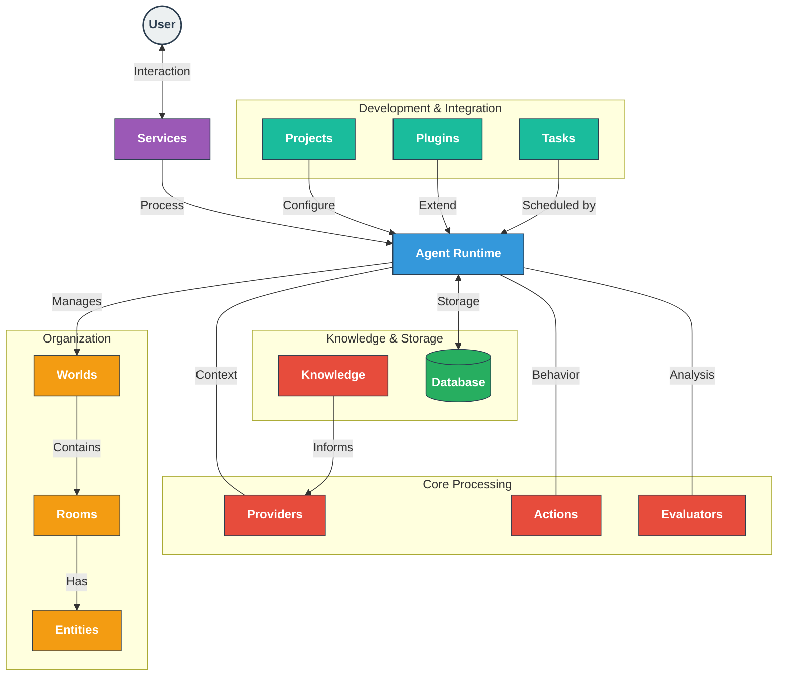

# ElizaOS Documentation

Welcome to ElizaOS - a comprehensive framework for building AI agents with persistent personalities across multiple platforms. ElizaOS provides the architecture, tools, and systems needed to create sophisticated agents that maintain consistent behavior, learn from interactions, and seamlessly integrate with a variety of services.

## System Architecture

ElizaOS uses a modular architecture that separates concerns while providing a cohesive framework for AI agent development:

### How ElizaOS Works

When a user message is received:

1. **Service Reception**: Platform service (Discord, Telegram, etc.) receives the message
2. **Runtime Processing**: Agent runtime coordinates the response generation
3. **Context Building**: Providers supply relevant context (time, recent messages, knowledge)
4. **Action Selection**: The agent evaluates and selects appropriate actions
5. **Response Generation**: The chosen action generates a response
6. **Learning & Reflection**: Evaluators analyze the conversation for insights and learning
7. **Memory Storage**: New information is stored in the database
8. **Response Delivery**: The response is sent back through the service

This creates a continuous cycle of interaction, reflection, and improvement that allows agents to maintain consistent personalities while adapting to new information.

## Core Components

  

    

      

        

          
        
      
        

          <h3>🤖 Agent Runtime</h3>
          
The central system that orchestrates agent behavior, processes messages, manages state, and coordinates all other components.

        

        

          <a className="button button--primary button--block" href="/docs/core/agents">Agent Runtime</a>
        

      

    

    
    

      

        

          
        
      
        

          <h3>📚 Services</h3>
          
Platform-specific integrations that enable agents to communicate across Discord, Twitter, Telegram, and other channels.

        

        

          <a className="button button--primary button--block" href="/docs/core/services">Services</a>
        

      

    

    
    

      

        

          
        
      
        

          <h3>💾 Database</h3>
          
Persistent storage for memories, entity data, relationships, and configuration using vector search capabilities.

        

        

          <a className="button button--primary button--block" href="/docs/core/database">Database</a>
        

      

    

  

## Intelligence & Behavior

  

    

      

        

          
        
      
        

          <h3>⚡ Actions</h3>
          
Executable capabilities that define how agents respond to messages and interact with external systems.

        

        

          <a className="button button--primary button--block" href="/docs/core/actions">Actions</a>
        

      

    

    
    

      

        

          
        
      
        

          <h3>🔌 Providers</h3>
          
Data sources that supply contextual information to inform agent decision-making in real-time.

        

        

          <a className="button button--primary button--block" href="/docs/core/providers">Providers</a>
        

      

    

    
    

      

        

          
        
      
        

          <h3>📊 Evaluators</h3>
          
Analytical systems that process conversations to extract insights, learn facts, and improve future responses.

        

        

          <a className="button button--primary button--block" href="/docs/core/evaluators">Evaluators</a>
        

      

    

    
    

      

        

          
        
      
        

          <h3>🧠 Knowledge</h3>
          
RAG system for document processing, semantic search, and context-aware memory retrieval.

        

        

          <a className="button button--primary button--block" href="/docs/core/knowledge">Knowledge</a>
        

      

    

  

## Structure & Organization

  

    

      

        

          
        
      
        

          <h3>🌐 Worlds</h3>
          
Collection spaces that organize entities and rooms into coherent environments (like a Discord server).

        

        

          <a className="button button--primary button--block" href="/docs/core/worlds">Worlds</a>
        

      

    

    
    

      

        

          
        
      
        

          <h3>💬 Rooms</h3>
          
Conversation spaces where entities interact through messages (channels, DMs, threads).

        

        

          <a className="button button--primary button--block" href="/docs/core/rooms">Rooms</a>
        

      

    

    
    

      

        

          
        
      
        

          <h3>👤 Entities</h3>
          
Representation of users, agents, and other participants using a flexible entity-component architecture.

        

        

          <a className="button button--primary button--block" href="/docs/core/entities">Entities</a>
        

      

    

  

## Development & Integration

  

    

      

        

          
        
      
        

          <h3>🧩 Plugins</h3>
          
Modular extensions that add new capabilities, integrations, and behaviors to agents.

        

        

          <a className="button button--primary button--block" href="/docs/core/plugins">Plugins</a>
        

      

    

    
    

      

        

          
        
      
        

          <h3>📝 Projects</h3>
          
Organizational structure for defining and deploying one or more agents with their configuration.

        

        

          <a className="button button--primary button--block" href="/docs/core/project">Projects</a>
        

      

    

    
    

      

        

          
        
      
        

          <h3>📋 Tasks</h3>
          
System for managing deferred, scheduled, and repeating operations across conversations.

        

        

          <a className="button button--primary button--block" href="/docs/core/tasks">Tasks</a>
        

      

    

  

---

## Key Concepts

### Action-Provider-Evaluator Cycle

The core of the ElizaOS system operates as a continuous cycle:

1. **Providers** gather context before response generation
2. **Actions** determine what the agent can do and are executed to generate responses
3. **Evaluators** analyze conversations after responses to extract insights
4. These insights become part of the agent's memory
5. Future **Providers** access this memory to inform new responses

This creates a virtuous cycle where agents continuously learn and improve from interactions.

### Entity-Component Architecture

ElizaOS uses an entity-component architecture for flexible data modeling:

- **Entities** are base objects with unique IDs (users, agents, etc.)
- **Components** are pieces of data attached to entities (profiles, settings, etc.)
- This approach allows for dynamic composition without complex inheritance hierarchies

### Memory System

The memory system in ElizaOS provides:

- **Vector-based semantic search** for finding relevant memories
- **Multi-level memory types** (messages, facts, knowledge)
- **Temporal awareness** through timestamped memories
- **Cross-platform continuity** while maintaining appropriate context boundaries

## Getting Started

If you're new to ElizaOS, we recommend this learning path:

1. Start with this overview to understand the system architecture
2. Explore the [Agent Runtime](/docs/core/agents) to understand the core system
3. Learn about [Projects](/docs/core/project) to set up your development environment
4. Understand how [Actions](/docs/core/actions) and [Providers](/docs/core/providers) work together
5. Explore [Services](/docs/core/services) to connect with external platforms
6. Dive into [Plugins](/docs/core/plugins) to extend functionality

## FAQ

<b>What's the difference between Actions, Evaluators, and Providers?</b>

**Actions** define what an agent can do and are executed during response generation. **Evaluators** analyze conversations after they happen to extract insights and improve future responses. **Providers** supply contextual information before the agent decides how to respond.

<b>How does ElizaOS handle cross-platform conversation context?</b>

ElizaOS maintains separate conversation contexts for different platforms by default, but shares entity relationships and learned facts across platforms. This ensures agents maintain a consistent understanding of users while respecting platform-specific conversation boundaries.

<b>How does the memory system work?</b>

Memory is organized into different types (messages, facts, knowledge) and stored with vector embeddings for semantic search. This allows agents to retrieve relevant memories based on context rather than just recency, creating more natural conversations.

<b>What's the relationship between Worlds, Rooms, and Entities?</b>

Worlds are container spaces (like a Discord server) that can have multiple Rooms (channels, DMs). Entities (users, agents) participate in Rooms within Worlds. This hierarchical structure mirrors real-world platforms while providing a consistent abstraction.

<b>How extensible is ElizaOS?</b>

ElizaOS is highly extensible through its plugin system. You can create custom actions, providers, evaluators, services, and more to extend functionality. The architecture is designed to be modular and composable at every level.

## Additional Resources

- [API Reference](/api) - Detailed API documentation for developers
- [GitHub Repository](https://github.com/elizaos/eliza) - Source code and contributions
- [Package Showcase](/packages) - Explore available plugins and extensions
