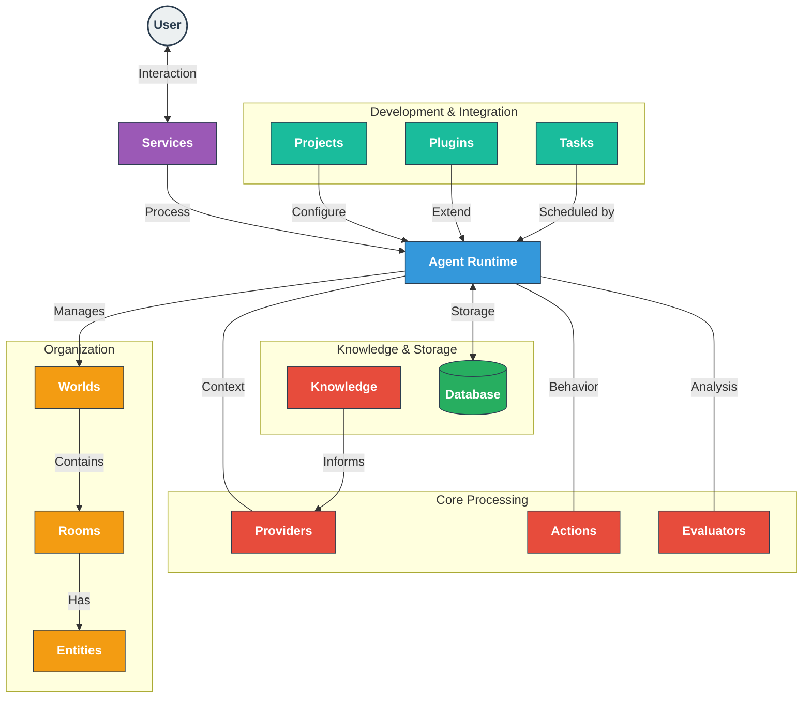

# ElizaOS Documentation

Welcome to ElizaOS - a comprehensive framework for building AI agents with persistent personalities across multiple platforms. ElizaOS provides the architecture, tools, and systems needed to create sophisticated agents that maintain consistent behavior, learn from interactions, and seamlessly integrate with a variety of services.

> **New to ElizaOS?** Check out [What's new in ElizaOS V2](https://eliza.how/blog/v1-v2) to understand how it compares to previous versions.

## System Architecture

ElizaOS uses a modular architecture that separates concerns while providing a cohesive framework for AI agent development:

### How ElizaOS Works

When a user message is received:

1. **Service Reception**: Platform service (Discord, Telegram, etc.) receives the message
2. **Runtime Processing**: Agent runtime coordinates the response generation
3. **Context Building**: Providers supply relevant context (time, recent messages, knowledge)
4. **Action Selection**: The agent evaluates and selects appropriate actions
5. **Response Generation**: The chosen action generates a response
6. **Learning & Reflection**: Evaluators analyze the conversation for insights and learning
7. **Memory Storage**: New information is stored in the database
8. **Response Delivery**: The response is sent back through the service

This creates a continuous cycle of interaction, reflection, and improvement that allows agents to maintain consistent personalities while adapting to new information.

### Core Components

|                                                         |                                                                           |                                                                         |
| ------------------------------------------------------------------------------------------------------------------- | ------------------------------------------------------------------------------------------------------------------------------ | ---------------------------------------------------------------------------------------------------------------------------- |
| **[🤖 Agent Runtime](/docs/core/agents)** — Orchestrates agent behavior, manages state, and coordinates components. | **[📚 Services](/docs/core/services)** — Enables agents to communicate across Discord, Twitter, Telegram, and other platforms. | **[💾 Database](/docs/core/database)** — Stores memories, entity data, relationships, and configuration using vector search. |

---

### Intelligence & Behavior

|                                                               |                                             |                                                            |                                            |
| --------------------------------------------------------------------------------------------------------------- | --------------------------------------------------------------------------------------------------- | --------------------------------------------------------------------------------------------------------------------- | -------------------------------------------------------------------------------------------------- |
| **[⚡ Actions](/docs/core/actions)** — Executable capabilities for agents to respond and interact with systems. | **[🔌 Providers](/docs/core/providers)** — Supplies context to inform agent decisions in real time. | **[📊 Evaluators](/docs/core/evaluators)** — Analyzes conversations to extract insights and improve future responses. | **[🧠 Knowledge](/docs/core/knowledge)** — RAG system for document processing and semantic memory. |

---

### Structure & Organization

|                                        |                                       |                                     |
| ------------------------------------------------------------------------------------- | --------------------------------------------------------------------------------- | ---------------------------------------------------------------------------------------- |
| **[🌐 Worlds](/docs/core/worlds)** — Organizes environments like servers or projects. | **[💬 Rooms](/docs/core/rooms)** — Spaces for conversation, like channels or DMs. | **[👤 Entities](/docs/core/entities)** — Represents users, bots, and other participants. |

---

### Development & Integration

|                                    |                                      |                                   |
| ------------------------------------------------------------------------------------ | --------------------------------------------------------------------------------------- | ----------------------------------------------------------------------------- |
| **[🧩 Plugins](/docs/core/plugins)** — Modular extensions that add new capabilities. | **[📝 Projects](/docs/core/project)** — Defines and deploys agents with configurations. | **[📋 Tasks](/docs/core/tasks)** — Manages scheduled and deferred operations. |

---

## Key Concepts

### Action-Provider-Evaluator Cycle

The core of the ElizaOS system operates as a continuous cycle:

1. **Providers** gather context before response generation
2. **Actions** determine what the agent can do and are executed to generate responses
3. **Evaluators** analyze conversations after responses to extract insights
4. These insights become part of the agent's memory
5. Future **Providers** access this memory to inform new responses

This creates a virtuous cycle where agents continuously learn and improve from interactions.

### Entity-Component Architecture

ElizaOS uses an entity-component architecture for flexible data modeling:

- **Entities** are base objects with unique IDs (users, agents, etc.)
- **Components** are pieces of data attached to entities (profiles, settings, etc.)
- This approach allows for dynamic composition without complex inheritance hierarchies

### Memory System

The memory system in ElizaOS provides:

- **Vector-based semantic search** for finding relevant memories
- **Multi-level memory types** (messages, facts, knowledge)
- **Temporal awareness** through timestamped memories
- **Cross-platform continuity** while maintaining appropriate context boundaries

## Getting Started

If you're new to ElizaOS, we recommend this learning path:

1. Start with this overview to understand the system architecture
2. Explore the [Agent Runtime](/docs/core/agents) to understand the core system
3. Learn about [Projects](/docs/core/project) to set up your development environment
4. Understand how [Actions](/docs/core/actions) and [Providers](/docs/core/providers) work together
5. Explore [Services](/docs/core/services) to connect with external platforms
6. Dive into [Plugins](/docs/core/plugins) to extend functionality

## FAQ

**What's the difference between Actions, Evaluators, and Providers?**

Actions define what an agent can do and are executed during response generation. Evaluators analyze conversations after they happen to extract insights and improve future responses. Providers supply contextual information before the agent decides how to respond.

**How does ElizaOS handle cross-platform conversation context?**

ElizaOS maintains separate conversation contexts for different platforms by default, but shares entity relationships and learned facts across platforms. This ensures agents maintain a consistent understanding of users while respecting platform-specific conversation boundaries.

**How does the memory system work?**

Memory is organized into different types (messages, facts, knowledge) and stored with vector embeddings for semantic search. This allows agents to retrieve relevant memories based on context rather than just recency, creating more natural conversations.

**What's the relationship between Worlds, Rooms, and Entities?**

Worlds are container spaces (like a Discord server) that can have multiple Rooms (channels, DMs). Entities (users, agents) participate in Rooms within Worlds. This hierarchical structure mirrors real-world platforms while providing a consistent abstraction.

**How extensible is ElizaOS?**

ElizaOS is highly extensible through its plugin system. You can create custom actions, providers, evaluators, services, and more to extend functionality. The architecture is designed to be modular and composable at every level.

## Additional Resources

- [API Reference](/api) - Detailed API documentation for developers
- [GitHub Repository](https://github.com/elizaos/eliza) - Source code and contributions
- [Package Showcase](/packages) - Explore available plugins and extensions
