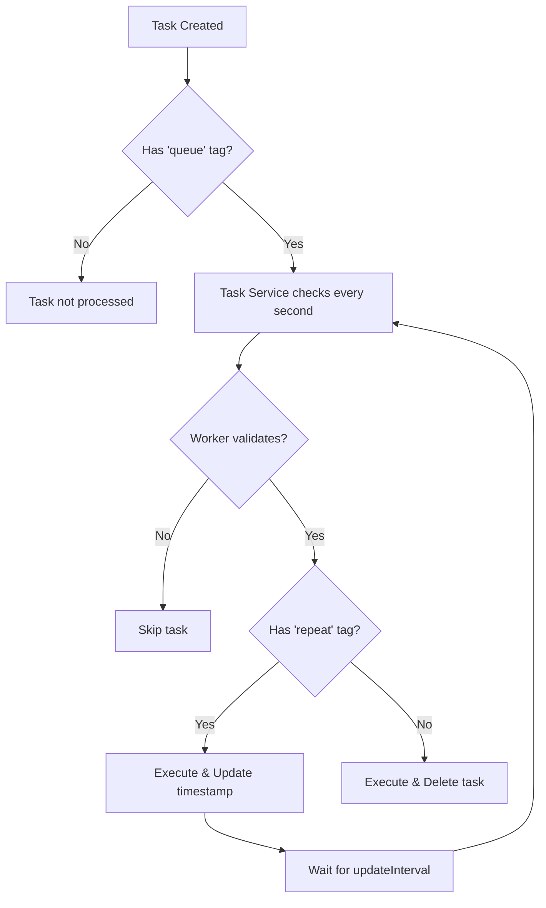

# Tasks

Tasks in ElizaOS provide a powerful way to manage deferred, scheduled, and interactive operations. The Task system allows agents to queue work for later execution, repeat actions at defined intervals, await user input, and implement complex workflows across multiple interactions.

## Task Structure

A task in ElizaOS has the following properties:

```typescript
interface Task {
  id?: UUID; // Unique identifier (auto-generated if not provided)
  name: string; // Name of the task (must match a registered task worker)
  description: string; // Human-readable description of the task
  roomId?: UUID; // Optional room association (for room-specific tasks)
  worldId?: UUID; // Optional world association (for world-specific tasks)
  entityId?: UUID; // Optional entity association
  tags: string[]; // Tags for categorizing and filtering tasks
  updatedAt?: number; // Timestamp when the task was last updated
  metadata?: {
    // Optional additional configuration
    updateInterval?: number; // For repeating tasks: milliseconds between executions
    options?: {
      // For choice tasks: options for user selection
      name: string;
      description: string;
    }[];
    [key: string]: unknown; // Additional custom metadata
  };
}
```

## Task Service

The Task Service (provided by `@elizaos/plugin-bootstrap`) automatically manages task execution:

```typescript
export class TaskService extends Service {
  static serviceType = ServiceType.TASK;
  private readonly TICK_INTERVAL = 1000; // Checks every second

  // Automatically processes tasks with 'queue' tag
}
```

The service:

- Runs continuously, checking for tasks every second
- Automatically processes tasks with the `queue` tag
- Handles both one-time and recurring task execution
- Validates tasks before execution using the worker's validate function

## Task Workers

Task workers define the actual logic that executes when a task runs. Each task worker is registered with the runtime and is identified by name.

```typescript
interface TaskWorker {
  name: string; // Matches the name in the Task
  execute: (
    runtime: IAgentRuntime,
    options: { [key: string]: unknown }, // Options passed during execution
    task: Task // The task being executed
  ) => Promise<void>;
  validate?: (
    // Optional validation before execution
    runtime: IAgentRuntime,
    message: Memory,
    state: State
  ) => Promise<boolean>;
}
```

## Creating and Managing Tasks

### Registering a Task Worker

Before creating tasks, you must register a worker to handle the execution:

```typescript
runtime.registerTaskWorker({
  name: 'SEND_REMINDER',
  validate: async (runtime, message, state) => {
    // Optional validation logic
    return true;
  },
  execute: async (runtime, options, task) => {
    // Task execution logic
    const { roomId } = task;
    const { reminder, userId } = options;

    await runtime.createMemory(
      {
        entityId: runtime.agentId,
        roomId,
        content: {
          text: `Reminder for <@${userId}>: ${reminder}`,
        },
      },
      'messages'
    );

    // Delete one-time tasks after execution (handled automatically if no 'repeat' tag)
  },
});
```

### Creating a One-time Task

Create a task that will execute once. **Important**: Include the `queue` tag for automatic processing:

```typescript
await runtime.createTask({
  name: 'SEND_REMINDER',
  description: 'Send a reminder message to the user',
  roomId: currentRoomId,
  worldId: currentWorldId, // Required field
  tags: ['queue', 'reminder'], // 'queue' tag required for processing
  metadata: {
    userId: message.entityId,
    reminder: 'Submit your weekly report',
  },
});
```

### Creating a Recurring Task

Create a task that repeats at regular intervals. Include both `queue` and `repeat` tags:

```typescript
await runtime.createTask({
  name: 'DAILY_REPORT',
  description: 'Generate and post the daily report',
  roomId: announcementChannelId,
  worldId: serverWorldId, // Required field
  tags: ['queue', 'repeat', 'daily'], // 'queue' and 'repeat' tags required
  metadata: {
    updateInterval: 86400000, // 24 hours in milliseconds
    updatedAt: Date.now(), // When the task was last executed
  },
});
```

### Creating a Task Awaiting User Choice

Create a task that presents options and waits for user input using the `AWAITING_CHOICE` tag:

```typescript
await runtime.createTask({
  name: 'CONFIRM_ACTION',
  description: 'Confirm the requested action',
  roomId: message.roomId,
  worldId: message.worldId, // Required field
  tags: ['AWAITING_CHOICE'], // Special tag for choice tasks
  metadata: {
    options: [
      { name: 'confirm', description: 'Proceed with the action' },
      { name: 'cancel', description: 'Cancel the action' },
    ],
    action: 'DELETE_FILES',
    files: ['document1.txt', 'document2.txt'],
  },
});
```

### Managing Tasks

Retrieve, update, and delete tasks as needed:

```typescript
// Get tasks by specific criteria
const reminderTasks = await runtime.getTasks({
  roomId: currentRoomId,
  tags: ['reminder'],
});

// Get tasks by name
const reportTasks = await runtime.getTasksByName('DAILY_REPORT');

// Get a specific task
const task = await runtime.getTask(taskId);

// Update a task (metadata is replaced, not merged)
await runtime.updateTask(taskId, {
  description: 'Updated description',
  metadata: {
    ...task.metadata,
    priority: 'high',
  },
});

// Delete a task
await runtime.deleteTask(taskId);
```

## Task Processing

### Automatic Processing with Task Service

The Task Service automatically processes tasks based on their tags:

1. **Queue Tag**: Tasks must have the `queue` tag to be processed by the Task Service
2. **Repeat Tag**: Tasks with the `repeat` tag are kept after execution and re-executed based on their `updateInterval`
3. **No Repeat Tag**: Tasks without the `repeat` tag are automatically deleted after execution

### Recurring Task Logic

For recurring tasks:

- The task must have both `queue` and `repeat` tags
- The `updateInterval` in metadata defines the delay between executions
- The `updatedAt` field tracks when the task was last executed
- Tasks with `immediate` tag execute on first check regardless of interval

### Choice Tasks with AWAITING_CHOICE

Tasks tagged with `AWAITING_CHOICE` work with the bootstrap plugin's choice system:

1. **Choice Provider**: Displays available tasks with options to users
2. **CHOOSE_OPTION Action**: Processes user selections
3. **User Permissions**: Only OWNER and ADMIN roles can select options

Example flow:

```typescript
// 1. Create a choice task
await runtime.createTask({
  name: 'DEPLOYMENT_CHOICE',
  description: 'Choose deployment environment',
  roomId: message.roomId,
  worldId: message.worldId,
  tags: ['AWAITING_CHOICE'],
  metadata: {
    options: [
      { name: 'production', description: 'Deploy to production' },
      { name: 'staging', description: 'Deploy to staging' },
      { name: 'cancel', description: 'Cancel deployment' },
    ],
  },
});

// 2. User sees options via choice provider
// "Please select from: production, staging, cancel"

// 3. User responds with choice
// "production"

// 4. CHOOSE_OPTION action executes the task worker with selected option
runtime.registerTaskWorker({
  name: 'DEPLOYMENT_CHOICE',
  execute: async (runtime, options, task) => {
    if (options.option === 'production') {
      // Deploy to production
    } else if (options.option === 'staging') {
      // Deploy to staging
    }
    // Task is automatically deleted after execution
  },
});
```

## Common Task Patterns

### Immediate Execution Tasks

For tasks that should run as soon as the Task Service checks:

```typescript
await runtime.createTask({
  name: 'IMMEDIATE_ACTION',
  description: 'Execute immediately',
  roomId: message.roomId,
  worldId: message.worldId,
  tags: ['queue', 'immediate'], // 'immediate' tag for first-run execution
  metadata: {
    // Task data
  },
});
```

### Conditional Recurring Tasks

Tasks that repeat but may stop based on conditions:

```typescript
runtime.registerTaskWorker({
  name: 'MONITOR_STATUS',
  validate: async (runtime, message, state) => {
    // Only execute if monitoring is still needed
    const status = await checkSystemStatus();
    return status !== 'completed';
  },
  execute: async (runtime, options, task) => {
    const status = await checkSystemStatus();

    if (status === 'completed') {
      // Remove the repeat tag to stop recurrence
      await runtime.updateTask(task.id, {
        tags: task.tags.filter((tag) => tag !== 'repeat'),
      });
    }

    // Report status
    await runtime.createMemory(
      {
        entityId: runtime.agentId,
        roomId: task.roomId,
        content: { text: `Status: ${status}` },
      },
      'messages'
    );
  },
});
```

### Multi-step Workflows

Implement workflows that progress through stages:

```typescript
runtime.registerTaskWorker({
  name: 'WORKFLOW_STEP',
  execute: async (runtime, options, task) => {
    const currentStep = task.metadata?.step || 1;

    switch (currentStep) {
      case 1:
        // Execute step 1
        await executeStep1();

        // Update task to next step
        await runtime.updateTask(task.id, {
          metadata: {
            ...task.metadata,
            step: 2,
          },
        });
        break;

      case 2:
        // Execute step 2
        await executeStep2();

        // Create choice task for user confirmation
        await runtime.createTask({
          name: 'CONFIRM_COMPLETION',
          description: 'Confirm workflow completion',
          roomId: task.roomId,
          worldId: task.worldId,
          tags: ['AWAITING_CHOICE'],
          metadata: {
            options: [
              { name: 'complete', description: 'Mark as complete' },
              { name: 'restart', description: 'Start over' },
            ],
            workflowTaskId: task.id,
          },
        });
        break;
    }
  },
});
```

## Best Practices

1. **Always include required tags**:

   - `queue` for automatic processing
   - `repeat` for recurring tasks
   - `AWAITING_CHOICE` for user selection tasks

2. **Set worldId**: The `worldId` field is required when creating tasks

3. **Clean up one-time tasks**: Tasks without `repeat` tag are automatically deleted after execution

4. **Use validation wisely**: The `validate` function can prevent task execution based on current conditions

5. **Handle errors gracefully**: Wrap task execution in try-catch blocks to prevent task worker failures

6. **Metadata management**: When updating tasks, remember that metadata is replaced, not merged

7. **Use appropriate intervals**: For recurring tasks, choose intervals that balance timeliness with resource usage

8. **Secure choice tasks**: Only users with OWNER or ADMIN roles can select options for AWAITING_CHOICE tasks

9. **Short task IDs**: When displaying tasks to users, use shortened UUIDs (first 8 characters) for readability

10. **Task worker naming**: Use clear, descriptive names in UPPER_SNAKE_CASE for task workers

## Task Execution Flow



## Limitations

- Tasks are checked every second by the Task Service
- Task metadata is limited to JSON-serializable data
- Tasks require a registered worker with matching name
- Only one Task Service instance should run per agent
- Task execution is not guaranteed to be exactly on time (depends on check interval and system load)
