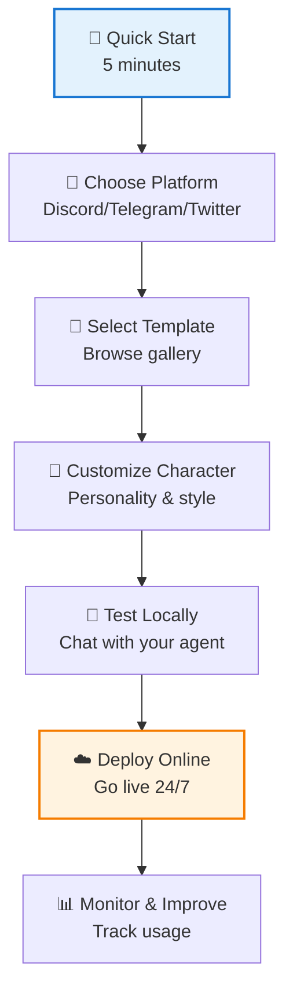

## 🚀 Welcome to the Simple Track

Welcome to the easiest way to get started with ElizaOS! This track is designed for creators, business users, and anyone who wants to deploy AI agents without writing code.

## What You'll Learn

In this simple track, you'll discover how to:

- **Deploy your first AI agent** in just 5 minutes
- **Use ready-made templates** for common use cases
- **Set up on popular platforms** like Discord, Telegram, and Twitter
- **Create custom agent personalities** with our visual tools
- **Monitor and manage** your agents through simple interfaces
- **Estimate costs** and manage API usage effectively
- **Troubleshoot** common issues with clear solutions
- **Add plugins** to extend functionality without coding

## Who This Track Is For

This track is perfect if you:

- 🎯 Want results quickly without technical complexity
- 📱 Need to deploy agents on social platforms
- 🎨 Prefer visual tools over code editors
- 💡 Have great ideas but limited programming experience
- ⚡ Value simplicity and ease of use
- 🤝 Want to engage communities with AI assistants
- 📊 Need to understand costs before committing

## What You Won't Need

- ❌ Programming experience
- ❌ Command line knowledge
- ❌ Complex configurations
- ❌ Technical background
- ❌ DevOps skills
- ❌ Database management

## 🗺️ Your Learning Path

## 📚 Track Contents

### 1. [Getting Started](/docs/simple/getting-started/quick-start) ⏱️ 5 minutes

Your first agent up and running - no setup headaches!

### 2. Platform Templates ⏱️ 15 minutes each

Check out our ready-to-use templates for different platforms:

- [Discord Agent](/docs/simple/templates/discord-agent) - Perfect for communities
- [Telegram Agent](/docs/simple/templates/telegram-agent) - Great for mobile users
- [Twitter Agent](/docs/simple/templates/twitter-agent) - Build your social presence

### 3. [Character Creation](/docs/simple/guides/character-creation) ⏱️ 30 minutes

Design engaging personalities that users love

### 4. [Template Collection](/docs/simple/templates/quick-start) ⏱️ Browse anytime

Pre-built agents ready to customize:

- 🎮 Discord Gaming Assistant
- 📱 Telegram Study Buddy
- 🐦 Twitter News Bot
- 🤖 Multi-Platform Assistant
- And more!

### 5. Deployment & Management

- [Plugin Requirements](/docs/simple/guides/plugin-requirements) - Critical plugin information
- [Deployment Guides](/docs/simple/guides/deployment-railway) - Host your agent online
- [Cost Overview](/docs/simple/faq#how-much-does-it-cost) - Understand pricing
- [Plugin Documentation](/packages) - Browse available plugins
- [FAQ](/docs/simple/faq) - Common questions and troubleshooting

## 🆘 Getting Help

- **[FAQ Section](/docs/simple/faq)** - Quick answers to common questions
- **[Community Discord](https://discord.gg/elizaos)** - Get help from other users
- **[GitHub Issues](https://github.com/elizaOS/eliza/issues)** - Report bugs or get help
- **[Twitter/X](https://twitter.com/elizaos)** - Follow for updates

## 🎯 Success Tips

1. **Start with a template** - Don't build from scratch
2. **Test locally first** - Make sure everything works
3. **Join the community** - Learn from others' experiences
4. **Start small** - Add features as you learn
5. **Have fun!** - Experiment and be creative

## Your Journey Starts Here

Ready to create your first AI agent? Let's begin with our [5-Minute Quick Start](/docs/simple/getting-started/quick-start) guide.

---

**Next Steps:**

- [⚡ Start Your 5-Minute Setup](/docs/simple/getting-started/quick-start)
- [📚 Browse Templates First](/docs/simple/templates/quick-start)

No credit card required • Free tier available • Cancel anytime
