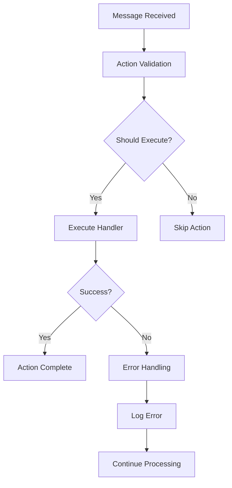

# Actions API Reference

Actions define what your ElizaOS agent can do - from posting tweets to responding to messages. This comprehensive guide covers the Actions API implementation, patterns, and best practices.

## Core Action Interface

Every action in ElizaOS implements the `Action` interface:

```typescript
interface Action {
  name: string;
  similes: string[];
  description: string;
  validate: (runtime: IAgentRuntime, message: Memory) => Promise<boolean>;
  handler: (
    runtime: IAgentRuntime,
    message: Memory,
    state: State,
    options: { [key: string]: unknown },
    callback?: HandlerCallback
  ) => Promise<boolean>;
  examples: ActionExample[][];
}
```

### Action Properties

| Property      | Type                | Description                                        |
| ------------- | ------------------- | -------------------------------------------------- |
| `name`        | `string`            | Unique identifier for the action                   |
| `similes`     | `string[]`          | Alternative names/triggers for the action          |
| `description` | `string`            | Human-readable description of what the action does |
| `validate`    | `function`          | Determines if the action should be triggered       |
| `handler`     | `function`          | Executes the action's functionality                |
| `examples`    | `ActionExample[][]` | Training examples for AI decision-making           |

## Action Lifecycle



## Creating Custom Actions

### Basic Action Template

```typescript
import { Action, IAgentRuntime, Memory, State, HandlerCallback } from '@elizaos/core';

export const myCustomAction: Action = {
  name: 'MY_CUSTOM_ACTION',
  similes: ['custom', 'my_action', 'do_something'],
  description: 'Performs a custom operation when triggered',

  validate: async (runtime: IAgentRuntime, message: Memory): Promise<boolean> => {
    // Validation logic - return true if action should execute
    const messageText = message.content.text.toLowerCase();

    // Check if message contains trigger words
    const triggerWords = ['help', 'assist', 'custom'];
    return triggerWords.some((word) => messageText.includes(word));
  },

  handler: async (
    runtime: IAgentRuntime,
    message: Memory,
    state: State,
    options: { [key: string]: unknown },
    callback?: HandlerCallback
  ): Promise<boolean> => {
    try {
      // Your action logic here
      const response = await performCustomOperation(runtime, message, state);

      // Send response if callback provided
      if (callback) {
        await callback({
          text: response,
          action: 'MY_CUSTOM_ACTION',
        });
      }

      return true; // Action executed successfully
    } catch (error) {
      console.error('Custom action failed:', error);
      return false; // Action failed
    }
  },

  examples: [
    [
      {
        user: '{{user1}}',
        content: { text: 'Can you help me with something custom?' },
      },
      {
        user: '{{user2}}',
        content: { text: "I'll help you with that custom request!" },
        action: 'MY_CUSTOM_ACTION',
      },
    ],
  ],
};

async function performCustomOperation(
  runtime: IAgentRuntime,
  message: Memory,
  state: State
): Promise<string> {
  // Implement your custom logic
  return 'Custom operation completed successfully!';
}
```

### Advanced Action Patterns

#### State-Aware Actions

Actions can maintain and modify agent state:

```typescript
export const statefulAction: Action = {
  name: 'STATEFUL_ACTION',
  // ... other properties

  handler: async (runtime, message, state, options, callback) => {
    // Read from state
    const currentCount = state.get('actionCount') || 0;

    // Modify state
    state.set('actionCount', currentCount + 1);
    state.set('lastActionTime', Date.now());

    // Use state in logic
    const response = `This action has been called ${currentCount + 1} times`;

    if (callback) {
      await callback({ text: response });
    }

    return true;
  },
};
```

#### Context-Aware Actions

Actions can access conversation context and user history:

```typescript
export const contextAwareAction: Action = {
  name: 'CONTEXT_AWARE_ACTION',
  // ... other properties

  handler: async (runtime, message, state, options, callback) => {
    // Get conversation history
    const recentMessages = await runtime.messageManager.getMemories({
      roomId: message.roomId,
      count: 10,
      unique: false,
    });

    // Analyze context
    const context = analyzeConversationContext(recentMessages);

    // Get user profile
    const userProfile = await runtime.databaseAdapter.getParticipantUserState(
      message.roomId,
      message.userId
    );

    // Generate contextual response
    const response = generateContextualResponse(context, userProfile, message);

    if (callback) {
      await callback({ text: response });
    }

    return true;
  },
};
```

#### Service Integration Actions

Actions can interact with external services:

```typescript
export const serviceAction: Action = {
  name: 'SERVICE_ACTION',
  // ... other properties

  handler: async (runtime, message, state, options, callback) => {
    // Get service instance
    const twitterService = runtime.getService('twitter');
    const webSearchService = runtime.getService('webSearch');

    // Use services
    if (twitterService) {
      const tweets = await twitterService.getTimeline();
      // Process tweets...
    }

    if (webSearchService) {
      const searchResults = await webSearchService.search(message.content.text);
      // Process search results...
    }

    return true;
  },
};
```

## Built-in Actions

### Core Communication Actions

#### CONTINUE Action

Continues conversations naturally when no other action is triggered.

```typescript
// Usage in character file
{
  "actions": ["CONTINUE"]
}
```

#### ELABORATE Action

Provides detailed explanations when users ask for more information.

#### ANSWER Action

Provides direct answers to questions.

#### ASK_FOLLOWUP Action

Asks follow-up questions to keep conversations engaging.

### Platform-Specific Actions

#### Twitter Actions

- **TWEET**: Post new tweets
- **REPLY**: Reply to mentions and conversations
- **QUOTE_TWEET**: Quote tweet with commentary
- **RETWEET**: Retweet content

#### Discord Actions

- **SEND_MESSAGE**: Send messages to Discord channels
- **REACT**: Add reactions to messages
- **CREATE_THREAD**: Create discussion threads

#### Telegram Actions

- **SEND_TELEGRAM_MESSAGE**: Send messages via Telegram
- **SEND_PHOTO**: Send images
- **SEND_DOCUMENT**: Send files

### Utility Actions

#### SEARCH Action

Performs web searches and returns relevant information.

#### SUMMARIZE Action

Creates summaries of long content or conversations.

#### TRANSLATE Action

Translates text between languages.

## Action Registration

### In Plugins

```typescript
import { Plugin } from '@elizaos/core';
import { myCustomAction } from './actions/myCustomAction';

export const myPlugin: Plugin = {
  name: 'my-plugin',
  description: 'Plugin with custom actions',
  actions: [myCustomAction], // Register actions here
  providers: [],
  evaluators: [],
  services: [],
};
```

### In Character Files

```json
{
  "name": "MyAgent",
  "actions": ["CONTINUE", "MY_CUSTOM_ACTION", "TWEET", "REPLY"]
}
```

## Action Validation Patterns

### Message Content Validation

```typescript
validate: async (runtime, message) => {
  const text = message.content.text.toLowerCase();

  // Check for specific keywords
  if (text.includes('help') || text.includes('assist')) {
    return true;
  }

  // Check message length
  if (text.length > 100) {
    return false; // Skip for long messages
  }

  // Check user permissions
  const userRole = await getUserRole(runtime, message.userId);
  if (userRole !== 'admin') {
    return false;
  }

  return true;
};
```

### Context-Based Validation

```typescript
validate: async (runtime, message) => {
  // Check conversation context
  const recentMessages = await runtime.messageManager.getMemories({
    roomId: message.roomId,
    count: 5,
  });

  // Only trigger if no recent actions of this type
  const recentActions = recentMessages.filter((m) => m.content.action === 'MY_CUSTOM_ACTION');

  return recentActions.length === 0;
};
```

### Time-Based Validation

```typescript
validate: async (runtime, message) => {
  const lastActionTime = runtime.getSetting('lastCustomActionTime');
  const now = Date.now();
  const cooldownPeriod = 5 * 60 * 1000; // 5 minutes

  // Only allow action if cooldown period has passed
  return !lastActionTime || now - lastActionTime > cooldownPeriod;
};
```

## Error Handling and Debugging

### Error Handling Best Practices

```typescript
handler: async (runtime, message, state, options, callback) => {
  try {
    // Main action logic
    const result = await performAction();

    if (callback) {
      await callback({ text: result });
    }

    return true;
  } catch (error) {
    // Log error with context
    runtime.logger.error('Action failed', {
      action: 'MY_CUSTOM_ACTION',
      messageId: message.id,
      userId: message.userId,
      error: error.message,
      stack: error.stack,
    });

    // Graceful failure - don't break the agent
    if (callback) {
      await callback({
        text: 'I encountered an error while processing your request. Please try again later.',
      });
    }

    return false;
  }
};
```

### Debug Logging

```typescript
handler: async (runtime, message, state, options, callback) => {
  // Debug logging
  runtime.logger.debug('Action starting', {
    action: 'MY_CUSTOM_ACTION',
    messageText: message.content.text,
    userId: message.userId,
    roomId: message.roomId,
  });

  const startTime = Date.now();

  try {
    const result = await performAction();

    runtime.logger.debug('Action completed', {
      action: 'MY_CUSTOM_ACTION',
      duration: Date.now() - startTime,
      success: true,
    });

    return true;
  } catch (error) {
    runtime.logger.debug('Action failed', {
      action: 'MY_CUSTOM_ACTION',
      duration: Date.now() - startTime,
      error: error.message,
    });

    return false;
  }
};
```

## Performance Optimization

### Async Operations

```typescript
handler: async (runtime, message, state, options, callback) => {
  // Perform multiple operations concurrently
  const [userData, externalData, contextData] = await Promise.all([
    getUserData(message.userId),
    fetchExternalData(message.content.text),
    getContextData(message.roomId),
  ]);

  // Process combined data
  const response = processData(userData, externalData, contextData);

  if (callback) {
    await callback({ text: response });
  }

  return true;
};
```

### Caching

```typescript
// Cache expensive operations
const cache = new Map();

handler: async (runtime, message, state, options, callback) => {
  const cacheKey = `action_${message.content.text}`;

  // Check cache first
  let result = cache.get(cacheKey);

  if (!result) {
    // Perform expensive operation
    result = await expensiveOperation(message.content.text);

    // Cache result with TTL
    cache.set(cacheKey, result);
    setTimeout(() => cache.delete(cacheKey), 5 * 60 * 1000); // 5 minutes
  }

  if (callback) {
    await callback({ text: result });
  }

  return true;
};
```

## Testing Actions

### Unit Testing

```typescript
import { describe, it, expect, beforeEach } from 'bun:test';
import { myCustomAction } from '../actions/myCustomAction';
import { createMockRuntime, createMockMessage } from '../test/mocks';

describe('MyCustomAction', () => {
  let runtime;
  let message;

  beforeEach(() => {
    runtime = createMockRuntime();
    message = createMockMessage({ text: 'help me please' });
  });

  it('should validate correctly for help messages', async () => {
    const isValid = await myCustomAction.validate(runtime, message);
    expect(isValid).toBe(true);
  });

  it('should not validate for irrelevant messages', async () => {
    message.content.text = 'random text';
    const isValid = await myCustomAction.validate(runtime, message);
    expect(isValid).toBe(false);
  });

  it('should execute handler successfully', async () => {
    const callback = jest.fn();
    const result = await myCustomAction.handler(runtime, message, new Map(), {}, callback);

    expect(result).toBe(true);
    expect(callback).toHaveBeenCalledWith({
      text: expect.stringContaining('Custom operation completed'),
    });
  });
});
```

### Integration Testing

```typescript
describe('Action Integration', () => {
  it('should work with real agent runtime', async () => {
    const agent = await createTestAgent({
      actions: [myCustomAction],
    });

    const response = await agent.processMessage({
      text: 'help me with something custom',
      userId: 'test-user',
      roomId: 'test-room',
    });

    expect(response).toBeDefined();
    expect(response.text).toContain('Custom operation completed');
  });
});
```

## Advanced Topics

### Action Chaining

Actions can trigger other actions:

```typescript
handler: async (runtime, message, state, options, callback) => {
  // Perform primary action
  const primaryResult = await performPrimaryAction();

  // Trigger secondary action based on result
  if (primaryResult.shouldTriggerSecondary) {
    const secondaryAction = runtime.getAction('SECONDARY_ACTION');
    if (secondaryAction) {
      await secondaryAction.handler(runtime, message, state, options);
    }
  }

  return true;
};
```

### Conditional Actions

Actions that behave differently based on context:

```typescript
handler: async (runtime, message, state, options, callback) => {
  const context = await analyzeContext(runtime, message);

  let response;
  switch (context.type) {
    case 'greeting':
      response = await handleGreeting(context);
      break;
    case 'question':
      response = await handleQuestion(context);
      break;
    case 'request':
      response = await handleRequest(context);
      break;
    default:
      response = await handleDefault(context);
  }

  if (callback) {
    await callback({ text: response });
  }

  return true;
};
```

### Action Middleware

Implement middleware patterns for cross-cutting concerns:

```typescript
const withLogging = (action: Action): Action => ({
  ...action,
  handler: async (runtime, message, state, options, callback) => {
    console.log(`Executing action: ${action.name}`);
    const result = await action.handler(runtime, message, state, options, callback);
    console.log(`Action ${action.name} completed: ${result}`);
    return result;
  },
});

const withRateLimiting = (action: Action, limit: number): Action => ({
  ...action,
  validate: async (runtime, message) => {
    const isValid = await action.validate(runtime, message);
    if (!isValid) return false;

    // Check rate limit
    const key = `ratelimit_${action.name}_${message.userId}`;
    const count = (await runtime.cache.get(key)) || 0;
    if (count >= limit) return false;

    await runtime.cache.set(key, count + 1, { ttl: 60000 }); // 1 minute TTL
    return true;
  },
});

// Usage
export const enhancedAction = withLogging(withRateLimiting(myCustomAction, 5));
```

## Best Practices

### Action Design

- Keep actions focused on a single responsibility
- Use clear, descriptive names
- Provide comprehensive validation
- Handle errors gracefully
- Include detailed examples for AI training

### Performance

- Cache expensive computations
- Use async/await for I/O operations
- Implement timeouts for external calls
- Consider rate limiting for resource-intensive actions

### Testing

- Test both validation and handler logic
- Mock external dependencies
- Test error conditions
- Verify state changes

### Documentation

- Document action purpose and behavior
- Provide usage examples
- Document configuration options
- Include troubleshooting guides

This comprehensive guide covers all aspects of the Actions API in ElizaOS. Actions are the foundation of agent behavior, so understanding how to create, validate, and optimize them is crucial for building effective AI agents.
