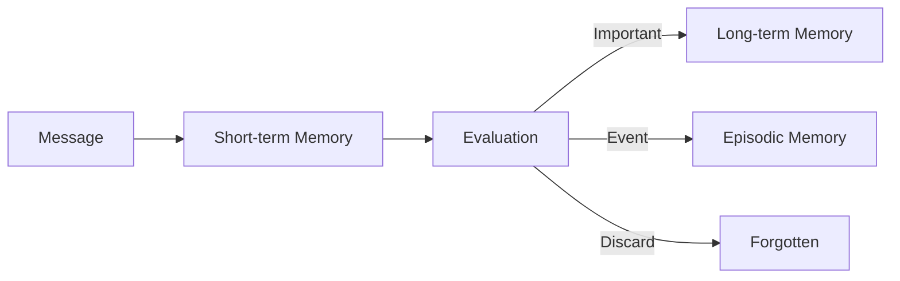
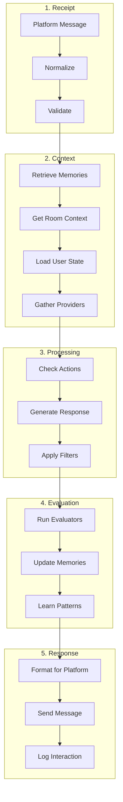
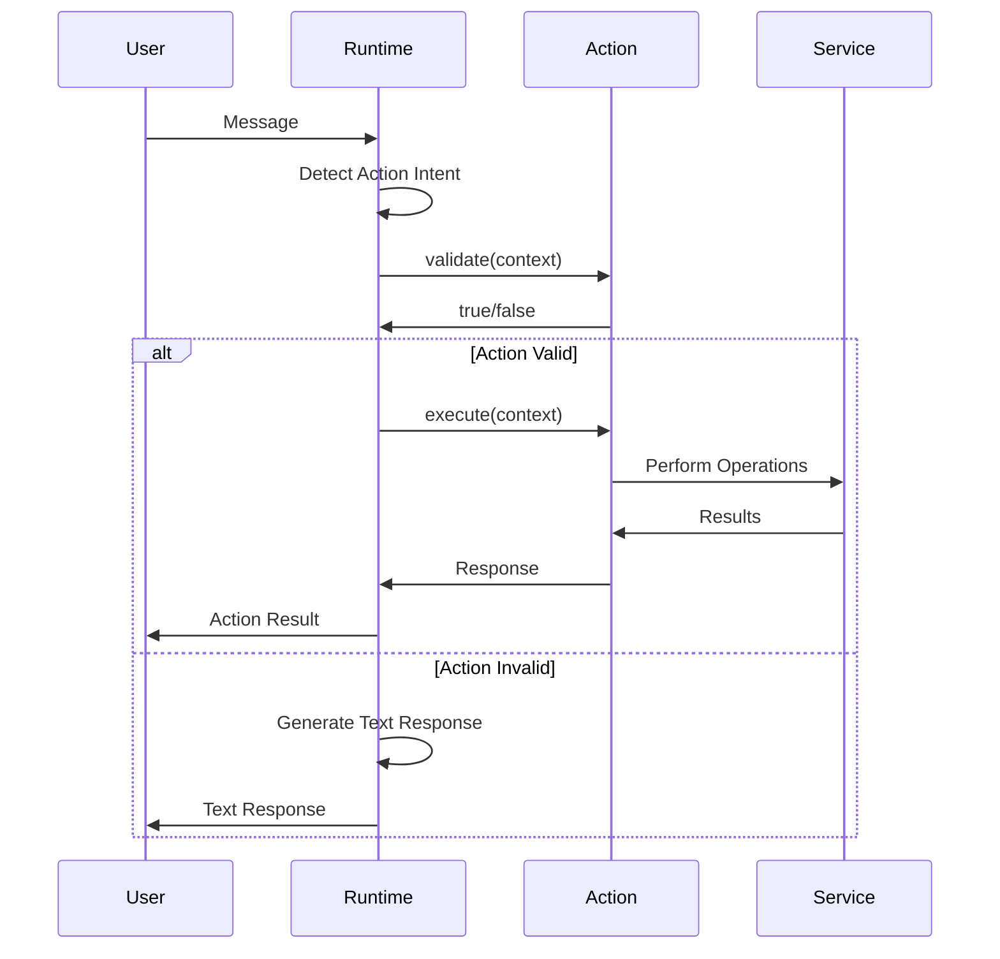
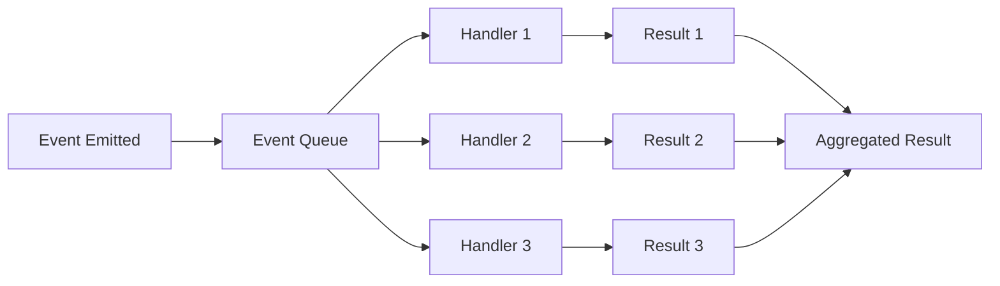

# Core Concepts

This document provides an in-depth exploration of ElizaOS's fundamental concepts and architectural decisions.

## 🧠 Agent-Centric Architecture

### The Agent Model

In ElizaOS, everything revolves around the concept of an **Agent** - an autonomous AI entity with:
- **Identity**: Unique personality and behavioral traits
- **Memory**: Persistent knowledge and conversation history
- **Goals**: Objectives and intentions
- **Capabilities**: Actions it can perform via plugins

```typescript
interface Agent {
    id: UUID;
    character: Character;
    runtime: AgentRuntime;
    memory: IMemoryManager;
    state: State;
}
```

### Character Definition

Characters define an agent's personality and behavior:

```typescript
interface Character {
    // Identity
    name: string;
    bio: string[];
    description: string;
    
    // Personality
    style: {
        all: string[];
        chat: string[];
        post: string[];
    };
    
    // Behavior
    topics: string[];
    adjectives: string[];
    
    // Examples
    messageExamples: [string, string][];
    postExamples: string[];
    
    // Configuration
    modelProvider: ModelProvider;
    settings: {
        model: string;
        temperature?: number;
        maxTokens?: number;
    };
}
```

## 🗺️ Room/World Abstraction

### Understanding Rooms

ElizaOS abstracts all communication channels into "Rooms":
- **Discord Channel** → Room
- **Twitter DM Thread** → Room  
- **Telegram Chat** → Room
- **Direct Web Chat** → Room

This abstraction enables platform-agnostic agent behavior.

```typescript
interface Room {
    id: UUID;                    // Internal ElizaOS ID
    platformId: string;          // Platform-specific ID
    type: 'discord' | 'twitter' | 'telegram' | 'direct';
    name?: string;
    description?: string;
    members: UUID[];             // User IDs in this room
    metadata: Map<string, any>;  // Platform-specific data
}
```

### UUID Swizzling

ElizaOS uses deterministic UUID generation to maintain consistency:

```typescript
// Each agent sees the same room with a different UUID
const roomUUID = generateDeterministicUUID(agentId, platformRoomId);

// This ensures:
// 1. Agent memories are isolated
// 2. Cross-agent communication is possible
// 3. Platform IDs remain stable
```

## 💾 Memory Architecture

### Memory Types

ElizaOS implements a sophisticated memory system inspired by human cognition:

#### 1. Short-term Memory (Working Memory)
- Recent messages (last 10-20)
- Current conversation context
- Temporary facts

```typescript
interface ShortTermMemory {
    messages: Message[];
    context: string;
    temporaryFacts: Map<string, any>;
    ttl: number; // Time to live
}
```

#### 2. Long-term Memory (Persistent Storage)
- Important facts and relationships
- Learned patterns
- User preferences

```typescript
interface LongTermMemory {
    facts: Fact[];
    relationships: Relationship[];
    preferences: UserPreference[];
    embedding?: number[]; // For similarity search
}
```

#### 3. Episodic Memory (Event Storage)
- Specific conversation events
- Outcomes of actions
- Temporal sequences

```typescript
interface EpisodicMemory {
    event: string;
    participants: UUID[];
    timestamp: Date;
    outcome?: string;
    emotionalValence?: number;
}
```

### Memory Formation



### Memory Retrieval

Memory retrieval uses multiple strategies:

1. **Recency**: Recent messages have higher weight
2. **Relevance**: Embedding similarity search
3. **Importance**: Manually marked important memories
4. **Frequency**: Often-accessed memories

```typescript
async function retrieveMemories(query: string, count: number): Promise<Memory[]> {
    const embedding = await createEmbedding(query);
    
    const memories = await Promise.all([
        getRecentMemories(count / 3),
        searchByEmbedding(embedding, count / 3),
        getImportantMemories(count / 3)
    ]);
    
    return deduplicate(memories.flat())
        .sort((a, b) => calculateRelevance(b, query) - calculateRelevance(a, query))
        .slice(0, count);
}
```

## 🔄 Message Processing Pipeline

### Pipeline Stages



### Context Assembly

Context is assembled from multiple sources:

```typescript
interface Context {
    // Message context
    messages: Message[];
    currentMessage: Message;
    
    // Memory context
    shortTermMemory: Memory[];
    relevantMemories: Memory[];
    
    // State context
    user: User;
    room: Room;
    agent: Agent;
    
    // Provider context
    time: string;
    platformInfo: any;
    customProviders: Map<string, string>;
    
    // Execution context
    runtime: AgentRuntime;
    services: Map<string, IService>;
}
```

## 🎯 Action System

### Action Lifecycle

Actions are discrete behaviors agents can perform:



### Action Examples

```typescript
const followAction: Action = {
    name: "FOLLOW_USER",
    description: "Follow a user on the platform",
    examples: [
        ["user", "Follow @alice"],
        ["agent", "I'll follow @alice for you!"],
        ["user", "Can you follow bob?"],
        ["agent", "Following bob now!"]
    ],
    
    validate: async (context: Context) => {
        // Check if platform supports following
        const transport = context.runtime.getService<ITransportService>("transport");
        return transport.supportsFeature("follow");
    },
    
    execute: async (context: Context) => {
        const username = extractUsername(context.currentMessage.content);
        const transport = context.runtime.getService<ITransportService>("transport");
        
        await transport.follow(username);
        
        return {
            content: `Successfully followed ${username}!`,
            action: "FOLLOW_USER",
            data: { username }
        };
    }
};
```

## 🔌 Plugin System

### Plugin Architecture

Plugins extend agent capabilities through a standardized interface:

```typescript
interface Plugin {
    name: string;
    description: string;
    version: string;
    
    // Components
    actions?: Action[];
    providers?: Provider[];
    evaluators?: Evaluator[];
    tasks?: Task[];
    services?: IService[];
    
    // Lifecycle
    initialize?: (runtime: AgentRuntime) => Promise<void>;
    shutdown?: () => Promise<void>;
}
```

### Plugin Loading Order

Plugin loading follows a deterministic order:

1. **Core Plugins**: Database, essential services
2. **AI Providers**: Text generation, embeddings
3. **Platform Adapters**: Discord, Twitter, etc.
4. **Feature Plugins**: Custom capabilities
5. **Bootstrap**: Default handlers (loaded last)

```typescript
const pluginOrder = [
    '@elizaos/plugin-sql',           // Core database
    '@elizaos/plugin-openai',        // AI provider
    '@elizaos/plugin-discord',       // Platform
    '@elizaos/custom-plugin',        // Custom features
    '@elizaos/plugin-bootstrap'      // Defaults
];
```

## 🌊 State Management

### State Hierarchy

State in ElizaOS follows a hierarchical model:

```
Global State
  └── Agent State
      └── Room State
          └── Conversation State
              └── Message State
```

### State Persistence

State is persisted at different levels:

- **In-Memory**: Current conversation state
- **Cache**: Recent interactions
- **Database**: Long-term state
- **Disk**: Configuration and characters

```typescript
class StateManager {
    // Layered state storage
    private memoryState: Map<string, any>;
    private cacheState: ICacheService;
    private dbState: IDatabaseService;
    
    async getState(key: string): Promise<any> {
        // Check layers in order
        return this.memoryState.get(key) 
            || await this.cacheState.get(key)
            || await this.dbState.get(key);
    }
    
    async setState(key: string, value: any, ttl?: number): Promise<void> {
        // Write to appropriate layer
        this.memoryState.set(key, value);
        
        if (ttl) {
            await this.cacheState.set(key, value, ttl);
        } else {
            await this.dbState.set(key, value);
        }
    }
}
```

## 🔐 Security Model

### Permission System

ElizaOS implements a capability-based security model:

```typescript
interface Permission {
    resource: string;    // What resource
    action: string;      // What action
    constraint?: any;    // Additional constraints
}

// Example permissions
const permissions = [
    { resource: "memory", action: "read", constraint: { own: true } },
    { resource: "twitter", action: "post", constraint: { rateLimit: 10 } },
    { resource: "admin", action: "*" }
];
```

### Sandboxing

Plugins run in sandboxed environments:

1. **Resource Isolation**: Limited access to system resources
2. **API Restrictions**: Only approved APIs available
3. **Memory Limits**: Bounded memory usage
4. **Time Limits**: Execution timeouts

## 📊 Event System

### Event-Driven Architecture

ElizaOS uses events for loose coupling:

```typescript
// Core events
runtime.on('message:received', handler);
runtime.on('message:sent', handler);
runtime.on('memory:created', handler);
runtime.on('goal:completed', handler);
runtime.on('error:occurred', handler);

// Plugin events
runtime.on('plugin:loaded', handler);
runtime.on('action:executed', handler);
runtime.on('provider:called', handler);
```

### Event Flow



## 🎓 Learning System

### Continuous Learning

Agents learn through evaluators:

```typescript
interface LearningCycle {
    // Observe
    observation: Message | Action;
    
    // Evaluate
    evaluation: {
        success: boolean;
        feedback: string;
        score: number;
    };
    
    // Update
    updates: {
        memories: Memory[];
        weights: Map<string, number>;
        patterns: Pattern[];
    };
}
```

### Pattern Recognition

Agents recognize and learn patterns:

```typescript
interface Pattern {
    trigger: string;      // What triggers this pattern
    response: string;     // How to respond
    confidence: number;   // How confident in this pattern
    frequency: number;    // How often it occurs
    lastSeen: Date;      // When last observed
}
```

## 🚀 Next Steps

Now that you understand the core concepts:

1. [Explore State Management](./state-management.md)
2. [Learn Plugin Development](../development/plugin-development.md)
3. [Understand the API](../api-reference/core-api.md)
4. [Review Best Practices](../advanced/best-practices.md)