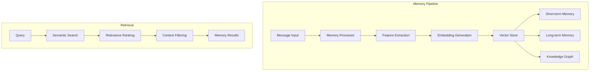

# Memory System

The ElizaOS memory system provides agents with sophisticated memory capabilities, enabling context-aware conversations and long-term relationship building.

## Overview

The memory system in ElizaOS is designed to:

- Store and retrieve conversation history
- Build knowledge graphs from interactions
- Enable semantic search across memories
- Support different memory types and importance levels
- Scale efficiently with vector embeddings

## Architecture



## Memory Types

### 1. Short-term Memory

Short-term memory stores recent conversation context:

```typescript
interface ShortTermMemory {
  messages: Message[]; // Recent messages
  context: ConversationContext; // Current context
  maxSize: number; // Typically 10-50 messages
  ttl: number; // Time to live
}

// Implementation
class ShortTermMemoryManager {
  private memories = new Map<string, Message[]>();

  addMessage(conversationId: string, message: Message): void {
    const messages = this.memories.get(conversationId) || [];
    messages.push(message);

    // Keep only recent messages
    if (messages.length > this.maxSize) {
      messages.shift();
    }

    this.memories.set(conversationId, messages);
  }

  getRecentContext(conversationId: string): Message[] {
    return this.memories.get(conversationId) || [];
  }
}
```

### 2. Long-term Memory

Long-term memory persists important information:

```typescript
interface LongTermMemory {
  id: string;
  content: string;
  embedding: number[]; // Vector embedding
  metadata: {
    userId: string;
    timestamp: Date;
    importance: number; // 0-1 score
    topics: string[];
    entities: string[];
    sentiment: number;
  };
}

// Storage implementation
class LongTermMemoryStore {
  async store(memory: Memory): Promise<void> {
    // Generate embedding
    const embedding = await this.generateEmbedding(memory.content);

    // Store in vector database
    await this.vectorDB.upsert({
      id: memory.id,
      vector: embedding,
      metadata: memory.metadata,
    });

    // Store in relational database for structured queries
    await this.db.memories.create({
      data: memory,
    });
  }
}
```

### 3. Episodic Memory

Episodic memories capture significant events:

```typescript
interface EpisodicMemory {
  id: string;
  event: string;
  participants: string[];
  location?: string;
  timestamp: Date;
  emotionalValence: number;
  significance: number;
  relatedMemories: string[];
}

// Event detection
class EpisodeDetector {
  async detectEpisode(messages: Message[]): Promise<EpisodicMemory | null> {
    // Analyze message sequence for significant events
    const features = await this.extractFeatures(messages);

    if (features.significance > this.threshold) {
      return {
        id: generateId(),
        event: features.eventSummary,
        participants: features.entities.filter((e) => e.type === 'person'),
        timestamp: new Date(),
        emotionalValence: features.sentiment,
        significance: features.significance,
        relatedMemories: await this.findRelated(features),
      };
    }

    return null;
  }
}
```

### 4. Semantic Memory

Semantic memory stores facts and knowledge:

```typescript
interface SemanticMemory {
  concept: string;
  relations: Relation[];
  properties: Property[];
  confidence: number;
  sources: string[]; // Memory IDs that support this fact
}

interface Relation {
  type: string; // "is-a", "has", "located-in", etc.
  target: string;
  confidence: number;
}

// Knowledge graph builder
class KnowledgeGraphBuilder {
  async extractKnowledge(memory: Memory): Promise<SemanticMemory[]> {
    const facts = [];

    // Extract entities and relations
    const extraction = await this.nlp.extract(memory.content);

    for (const triple of extraction.triples) {
      facts.push({
        concept: triple.subject,
        relations: [
          {
            type: triple.predicate,
            target: triple.object,
            confidence: triple.confidence,
          },
        ],
        properties: triple.properties,
        confidence: triple.confidence,
        sources: [memory.id],
      });
    }

    return facts;
  }
}
```

## Memory Processing Pipeline

### 1. Ingestion

```typescript
class MemoryIngestion {
  async process(message: Message): Promise<void> {
    // 1. Preprocess
    const processed = await this.preprocess(message);

    // 2. Extract features
    const features = await this.extractFeatures(processed);

    // 3. Generate embeddings
    const embedding = await this.generateEmbedding(processed);

    // 4. Calculate importance
    const importance = await this.calculateImportance(features);

    // 5. Store memory
    await this.store({
      content: processed,
      embedding,
      features,
      importance,
      metadata: {
        userId: message.userId,
        timestamp: new Date(),
        roomId: message.roomId,
      },
    });
  }
}
```

### 2. Feature Extraction

```typescript
interface MemoryFeatures {
  entities: Entity[];
  topics: string[];
  sentiment: number;
  emotions: Emotion[];
  intentions: string[];
  keyPhrases: string[];
}

class FeatureExtractor {
  async extract(text: string): Promise<MemoryFeatures> {
    const [entities, topics, sentiment, emotions] = await Promise.all([
      this.extractEntities(text),
      this.extractTopics(text),
      this.analyzeSentiment(text),
      this.detectEmotions(text),
    ]);

    return {
      entities,
      topics,
      sentiment,
      emotions,
      intentions: await this.classifyIntentions(text),
      keyPhrases: await this.extractKeyPhrases(text),
    };
  }
}
```

### 3. Importance Scoring

```typescript
class ImportanceScorer {
  async calculate(memory: Memory, features: MemoryFeatures): Promise<number> {
    const weights = {
      emotional: 0.3,
      novelty: 0.2,
      personal: 0.2,
      factual: 0.15,
      recency: 0.15,
    };

    const scores = {
      emotional: this.emotionalScore(features.emotions),
      novelty: await this.noveltyScore(memory, features),
      personal: this.personalRelevance(features.entities),
      factual: this.factualImportance(features),
      recency: this.recencyScore(memory.timestamp),
    };

    // Weighted sum
    return Object.entries(scores).reduce((total, [key, score]) => total + score * weights[key], 0);
  }
}
```

## Memory Retrieval

### 1. Semantic Search

```typescript
class MemoryRetrieval {
  async search(query: string, options: SearchOptions): Promise<Memory[]> {
    // Generate query embedding
    const queryEmbedding = await this.generateEmbedding(query);

    // Vector similarity search
    const similar = await this.vectorDB.search({
      vector: queryEmbedding,
      topK: options.limit || 10,
      filter: this.buildFilter(options),
    });

    // Re-rank by relevance
    const reranked = await this.rerank(query, similar);

    // Apply context filtering
    return this.filterByContext(reranked, options.context);
  }

  private buildFilter(options: SearchOptions): any {
    const filter = {};

    if (options.userId) {
      filter['metadata.userId'] = options.userId;
    }

    if (options.timeRange) {
      filter['metadata.timestamp'] = {
        $gte: options.timeRange.start,
        $lte: options.timeRange.end,
      };
    }

    if (options.minImportance) {
      filter['metadata.importance'] = {
        $gte: options.minImportance,
      };
    }

    return filter;
  }
}
```

### 2. Context-Aware Retrieval

```typescript
class ContextualRetrieval {
  async retrieve(context: ConversationContext, limit: number = 5): Promise<Memory[]> {
    // Multi-stage retrieval
    const stages = [
      // Recent context
      this.getRecentMemories(context.conversationId, 5),

      // Topically related
      this.getTopicalMemories(context.topics, 10),

      // Entity-based
      this.getEntityMemories(context.entities, 10),

      // Emotionally similar
      this.getEmotionalMemories(context.emotionalState, 5),
    ];

    const results = await Promise.all(stages);

    // Merge and deduplicate
    const merged = this.mergeResults(results.flat());

    // Score by relevance
    const scored = await this.scoreRelevance(merged, context);

    // Return top memories
    return scored.slice(0, limit);
  }
}
```

### 3. Memory Consolidation

```typescript
class MemoryConsolidation {
  async consolidate(): Promise<void> {
    // Find similar memories
    const clusters = await this.clusterMemories();

    for (const cluster of clusters) {
      // Skip if too small
      if (cluster.size < this.minClusterSize) continue;

      // Generate summary
      const summary = await this.summarizeCluster(cluster);

      // Create consolidated memory
      const consolidated = {
        type: 'consolidated',
        content: summary,
        sources: cluster.memories.map((m) => m.id),
        importance: Math.max(...cluster.memories.map((m) => m.importance)),
        timestamp: new Date(),
      };

      // Store consolidated memory
      await this.store(consolidated);

      // Optionally archive original memories
      if (this.archiveOriginals) {
        await this.archive(cluster.memories);
      }
    }
  }
}
```

## Vector Embeddings

### 1. Embedding Generation

```typescript
class EmbeddingGenerator {
  async generate(text: string): Promise<number[]> {
    // Preprocess text
    const processed = this.preprocess(text);

    // Generate embedding using model
    const embedding = await this.model.embed(processed);

    // Normalize
    return this.normalize(embedding);
  }

  private preprocess(text: string): string {
    // Remove unnecessary whitespace
    let processed = text.trim().replace(/\s+/g, ' ');

    // Truncate if too long
    if (processed.length > this.maxLength) {
      processed = this.truncateSmartly(processed);
    }

    return processed;
  }

  private normalize(embedding: number[]): number[] {
    const magnitude = Math.sqrt(embedding.reduce((sum, val) => sum + val * val, 0));

    return embedding.map((val) => val / magnitude);
  }
}
```

### 2. Similarity Calculation

```typescript
class SimilarityCalculator {
  cosineSimilarity(a: number[], b: number[]): number {
    let dotProduct = 0;
    let normA = 0;
    let normB = 0;

    for (let i = 0; i < a.length; i++) {
      dotProduct += a[i] * b[i];
      normA += a[i] * a[i];
      normB += b[i] * b[i];
    }

    return dotProduct / (Math.sqrt(normA) * Math.sqrt(normB));
  }

  async findSimilar(
    embedding: number[],
    candidates: Memory[],
    threshold: number = 0.7
  ): Promise<SimilarMemory[]> {
    const similarities = [];

    for (const candidate of candidates) {
      const similarity = this.cosineSimilarity(embedding, candidate.embedding);

      if (similarity >= threshold) {
        similarities.push({
          memory: candidate,
          similarity,
        });
      }
    }

    return similarities.sort((a, b) => b.similarity - a.similarity);
  }
}
```

## Memory Management

### 1. Storage Optimization

```typescript
class MemoryOptimizer {
  async optimize(): Promise<void> {
    // Remove duplicates
    await this.deduplicateMemories();

    // Compress old memories
    await this.compressOldMemories();

    // Update importance scores
    await this.recalculateImportance();

    // Prune low-value memories
    await this.pruneLowValueMemories();
  }

  private async deduplicateMemories(): Promise<void> {
    const memories = await this.getAllMemories();
    const seen = new Set<string>();
    const duplicates = [];

    for (const memory of memories) {
      const hash = this.hashMemory(memory);

      if (seen.has(hash)) {
        duplicates.push(memory.id);
      } else {
        seen.add(hash);
      }
    }

    await this.removeMemories(duplicates);
  }
}
```

### 2. Memory Decay

```typescript
class MemoryDecay {
  async applyDecay(): Promise<void> {
    const memories = await this.getDecayableMemories();

    for (const memory of memories) {
      // Calculate decay based on time and access
      const decayFactor = this.calculateDecay(
        memory.timestamp,
        memory.lastAccessed,
        memory.accessCount
      );

      // Update importance
      memory.importance *= decayFactor;

      // Remove if below threshold
      if (memory.importance < this.removalThreshold) {
        await this.removeMemory(memory.id);
      } else {
        await this.updateMemory(memory);
      }
    }
  }

  private calculateDecay(created: Date, lastAccessed: Date, accessCount: number): number {
    const age = Date.now() - created.getTime();
    const recency = Date.now() - lastAccessed.getTime();

    // Forgetting curve
    const timeFactor = Math.exp(-age / this.halfLife);

    // Access bonus
    const accessFactor = Math.log(accessCount + 1) / 10;

    // Recency bonus
    const recencyFactor = Math.exp(-recency / this.recencyWeight);

    return Math.min(1, timeFactor + accessFactor + recencyFactor);
  }
}
```

## Integration with Agent Runtime

### 1. Memory Middleware

```typescript
class MemoryMiddleware {
  async process(
    message: Message,
    context: Context,
    next: () => Promise<Response>
  ): Promise<Response> {
    // Load relevant memories
    const memories = await this.memoryManager.retrieve(context);

    // Enhance context with memories
    context.memories = memories;
    context.memoryContext = this.buildMemoryContext(memories);

    // Process message
    const response = await next();

    // Store new memory
    await this.memoryManager.store({
      message,
      response,
      context,
    });

    return response;
  }
}
```

### 2. Memory-Enhanced Responses

```typescript
class MemoryEnhancedAgent {
  async generateResponse(message: Message, memories: Memory[]): Promise<Response> {
    // Build prompt with memory context
    const prompt = this.buildPromptWithMemories(message, memories);

    // Generate response
    const response = await this.llm.generate(prompt);

    // Ensure consistency with memories
    const validated = await this.validateAgainstMemories(response, memories);

    return validated;
  }

  private buildPromptWithMemories(message: Message, memories: Memory[]): string {
    const relevantMemories = memories
      .map((m) => `- ${m.content} (${m.metadata.timeAgo})`)
      .join('\n');

    return `
Previous relevant conversations:
${relevantMemories}

Current message: ${message.content}

Generate a response that is consistent with the conversation history.
    `;
  }
}
```

## Performance Considerations

### 1. Indexing Strategies

```typescript
// Compound indexes for efficient queries
const indexes = [
  { userId: 1, timestamp: -1 },
  { importance: -1, timestamp: -1 },
  { 'metadata.topics': 1 },
  { 'metadata.entities': 1 },
];

// Vector index for similarity search
const vectorIndex = {
  type: 'ivfflat',
  dimensions: 1536,
  lists: 100,
};
```

### 2. Caching Layer

```typescript
class MemoryCache {
  private cache = new LRUCache<string, Memory[]>({
    max: 1000,
    ttl: 5 * 60 * 1000, // 5 minutes
  });

  async get(key: string): Promise<Memory[] | null> {
    return this.cache.get(key) || null;
  }

  async set(key: string, memories: Memory[]): Promise<void> {
    this.cache.set(key, memories);
  }
}
```

### 3. Batch Processing

```typescript
class BatchMemoryProcessor {
  private queue: Memory[] = [];
  private processing = false;

  async add(memory: Memory): Promise<void> {
    this.queue.push(memory);

    if (!this.processing && this.queue.length >= this.batchSize) {
      await this.processBatch();
    }
  }

  private async processBatch(): Promise<void> {
    this.processing = true;

    const batch = this.queue.splice(0, this.batchSize);

    // Generate embeddings in batch
    const embeddings = await this.generateBatchEmbeddings(batch.map((m) => m.content));

    // Store in batch
    await this.batchStore(
      batch.map((m, i) => ({
        ...m,
        embedding: embeddings[i],
      }))
    );

    this.processing = false;
  }
}
```

## Best Practices

1. **Memory Hygiene**: Regularly clean and consolidate memories
2. **Importance Scoring**: Use multi-factor importance calculation
3. **Context Windows**: Limit memory context to maintain performance
4. **Privacy**: Implement memory access controls and data retention policies
5. **Embedding Quality**: Use appropriate models for your use case
6. **Monitoring**: Track memory system performance and usage

## Related Documentation

- [State Management](./state-management.md) - Overall state architecture
- [Core Concepts](./core-concepts.md) - Fundamental ElizaOS concepts
- [Performance Guide](../advanced/performance.md) - Optimization techniques
