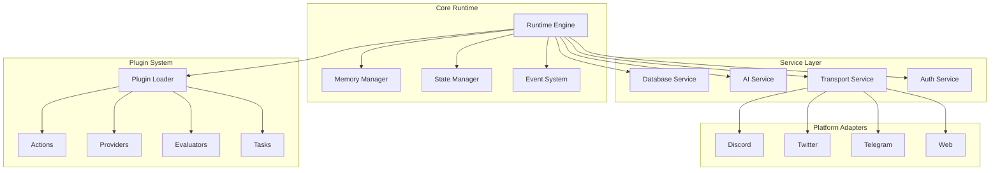
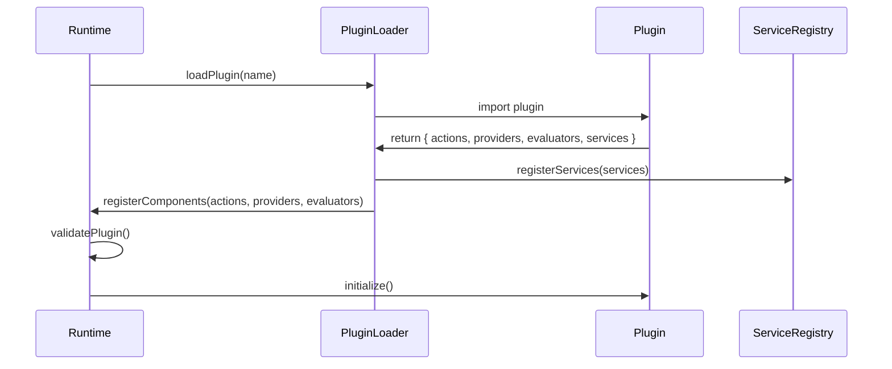
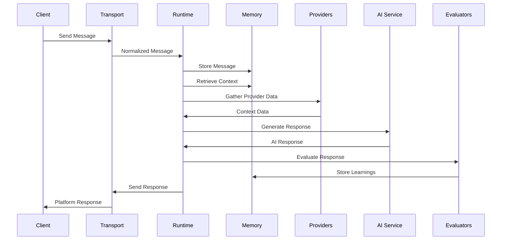
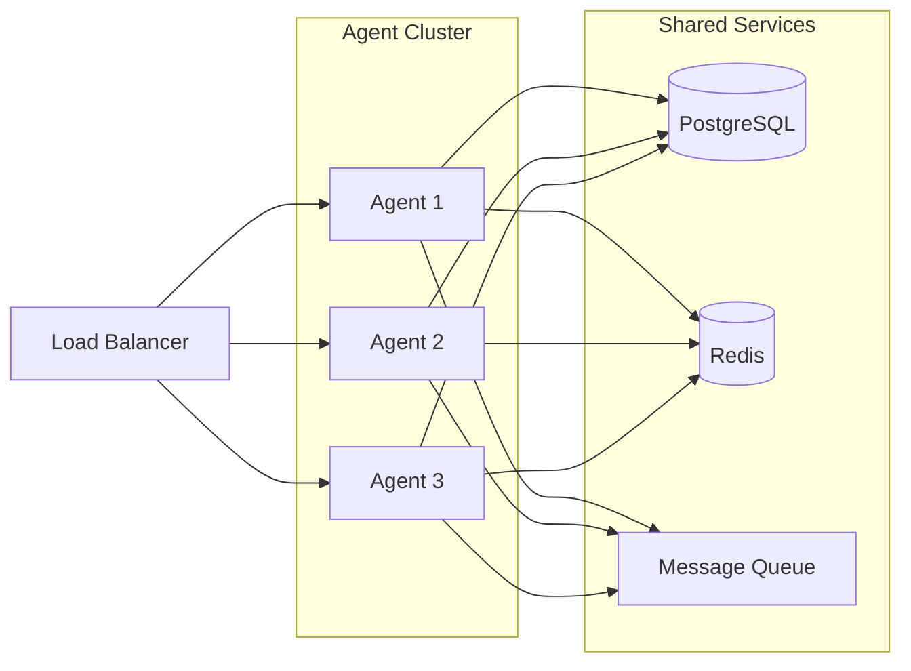

# ElizaOS Architecture Overview

This document provides a comprehensive technical overview of the ElizaOS architecture, designed for developers who want to understand the system's internals and build upon it.

## 🏗️ System Architecture

ElizaOS follows a modular, plugin-based architecture that enables flexible AI agent creation and deployment across multiple platforms.



## 🧩 Core Components

### Runtime Engine (`packages/core/src/runtime.ts`)

The heart of ElizaOS, responsible for:
- **Agent Lifecycle Management**: Starting, stopping, and managing agent instances
- **Message Processing Pipeline**: Routing messages through the plugin system
- **Context Assembly**: Building comprehensive context for AI interactions
- **Response Generation**: Orchestrating AI providers to generate responses

```typescript
class AgentRuntime {
    // Core properties
    agentId: UUID;
    character: Character;
    memory: IMemoryManager;
    state: IStateManager;
    
    // Service registry
    services: Map<string, IService>;
    
    // Plugin components
    actions: Map<string, Action>;
    providers: Map<string, Provider>;
    evaluators: Map<string, Evaluator>;
    
    // Message processing
    async processMessage(message: Message): Promise<Response>;
    async evaluate(message: Message, response: Response): Promise<void>;
}
```

### Memory System (`packages/core/src/memory.ts`)

Sophisticated memory management with multiple storage types:

#### Memory Types
1. **Short-term Memory**: Recent conversation context (last 10-20 messages)
2. **Long-term Memory**: Persistent facts and relationships
3. **Episodic Memory**: Specific conversation events and outcomes
4. **Semantic Memory**: Embeddings for similarity search

```typescript
interface IMemoryManager {
    // Core operations
    createMemory(memory: Memory): Promise<void>;
    searchMemories(query: string, count: number): Promise<Memory[]>;
    getRecentMemories(count: number): Promise<Memory[]>;
    
    // Relationship management
    createRelationship(userA: UUID, userB: UUID, type: string): Promise<void>;
    getRelationships(userId: UUID): Promise<Relationship[]>;
    
    // Embedding operations
    createEmbedding(text: string): Promise<number[]>;
    searchByEmbedding(embedding: number[], threshold: number): Promise<Memory[]>;
}
```

### State Management

ElizaOS uses a hierarchical state system:

```typescript
interface State {
    // Agent state
    agentId: UUID;
    roomId: UUID;
    
    // Conversation state
    recentMessages: Message[];
    conversationContext: string;
    goals: Goal[];
    
    // User state
    userId: UUID;
    userContext: Map<string, any>;
    
    // Plugin state
    pluginStates: Map<string, any>;
}
```

## 🔌 Plugin Architecture

### Plugin Types

1. **Actions**: Discrete behaviors the agent can perform
   ```typescript
   interface Action {
       name: string;
       description: string;
       examples: string[][];
       validate: (context: Context) => Promise<boolean>;
       execute: (context: Context) => Promise<Response>;
   }
   ```

2. **Providers**: Supply contextual information
   ```typescript
   interface Provider {
       name: string;
       get: (context: Context) => Promise<string>;
   }
   ```

3. **Evaluators**: Post-processing and learning
   ```typescript
   interface Evaluator {
       name: string;
       evaluate: (context: Context) => Promise<EvaluationResult>;
   }
   ```

4. **Tasks**: Scheduled or deferred operations
   ```typescript
   interface Task {
       name: string;
       schedule: CronExpression | 'periodic' | 'once';
       execute: (context: Context) => Promise<void>;
   }
   ```

### Plugin Loading



## 🌐 Platform Abstraction

### Room/Channel Abstraction

ElizaOS abstracts platform-specific concepts into a unified model:

```typescript
interface Room {
    id: UUID;          // Platform-agnostic ID
    platformId: string; // Platform-specific ID
    type: 'discord' | 'twitter' | 'telegram' | 'direct';
    members: UUID[];
    metadata: Map<string, any>;
}
```

### Message Normalization

All platform messages are normalized:

```typescript
interface Message {
    id: UUID;
    userId: UUID;
    roomId: UUID;
    content: string;
    attachments: Attachment[];
    platformData: any; // Original platform message
    timestamp: Date;
}
```

## 🔄 Request Flow

### Message Processing Pipeline



## 💾 Database Architecture

### Schema Design

ElizaOS uses a flexible schema that supports multiple database adapters:

```sql
-- Core tables
CREATE TABLE memories (
    id UUID PRIMARY KEY,
    agent_id UUID NOT NULL,
    user_id UUID,
    room_id UUID,
    content TEXT NOT NULL,
    embedding VECTOR(1536),
    type VARCHAR(50),
    created_at TIMESTAMP
);

CREATE TABLE relationships (
    id UUID PRIMARY KEY,
    user_a UUID NOT NULL,
    user_b UUID NOT NULL,
    relationship_type VARCHAR(50),
    strength FLOAT,
    created_at TIMESTAMP
);

CREATE TABLE goals (
    id UUID PRIMARY KEY,
    agent_id UUID NOT NULL,
    name VARCHAR(255),
    status VARCHAR(50),
    objectives JSONB,
    created_at TIMESTAMP
);
```

### Database Adapters

- **PostgreSQL**: Full-featured with vector support
- **SQLite/PGLite**: Lightweight for development
- **In-Memory**: Testing and ephemeral agents

## 🚀 Performance Considerations

### Caching Strategy

```typescript
class CacheManager {
    // Multi-level cache
    l1Cache: LRUCache<string, any>; // In-process cache
    l2Cache: RedisCache;             // Distributed cache
    
    // Cache invalidation
    invalidatePattern(pattern: string): Promise<void>;
    
    // Smart caching
    cacheWithTTL(key: string, value: any, ttl: number): Promise<void>;
}
```

### Concurrency Model

- **Message Processing**: Concurrent per room, sequential per user
- **Memory Operations**: Read-heavy optimization with write batching
- **AI Calls**: Request pooling and rate limiting
- **Plugin Execution**: Isolated execution contexts

## 🔐 Security Architecture

### Authentication & Authorization

```typescript
interface SecurityContext {
    // User authentication
    userId: UUID;
    permissions: Permission[];
    
    // Platform verification
    platformId: string;
    platformVerified: boolean;
    
    // Rate limiting
    rateLimitBucket: string;
    requestCount: number;
}
```

### Plugin Sandboxing

- Plugins run in isolated contexts
- Resource usage limits enforced
- API access controlled by permissions
- No direct database access

## 📊 Monitoring & Observability

### Metrics Collection

```typescript
interface Metrics {
    // Performance metrics
    messageProcessingTime: Histogram;
    aiResponseTime: Histogram;
    memoryOperationTime: Histogram;
    
    // Business metrics
    messagesProcessed: Counter;
    activeUsers: Gauge;
    pluginExecutions: Counter;
    
    // Error tracking
    errors: Counter;
    aiFailures: Counter;
}
```

### Logging Architecture

- Structured logging with correlation IDs
- Log levels: `trace`, `debug`, `info`, `warn`, `error`, `fatal`
- Automatic PII redaction
- Log aggregation support

## 🔄 Deployment Architecture

### Horizontal Scaling



### High Availability

- Stateless agent instances
- Shared state in database/cache
- Automatic failover
- Health checks and self-healing

## 🛠️ Development Patterns

### Service Pattern

```typescript
abstract class BaseService implements IService {
    protected runtime: AgentRuntime;
    
    abstract initialize(): Promise<void>;
    abstract shutdown(): Promise<void>;
    
    // Service discovery
    getService<T extends IService>(name: string): T {
        return this.runtime.getService<T>(name);
    }
}
```

### Event-Driven Architecture

```typescript
// Event emitter pattern
runtime.on('message:received', async (message) => {
    await processMessage(message);
});

runtime.on('memory:created', async (memory) => {
    await indexMemory(memory);
});

runtime.on('goal:completed', async (goal) => {
    await evaluateGoal(goal);
});
```

## 📚 Further Reading

- [Core Concepts Deep Dive](./core-concepts.md)
- [Plugin Development Guide](../development/plugin-development.md)
- [State Management Details](./state-management.md)
- [API Reference](../api-reference/core-api.md)