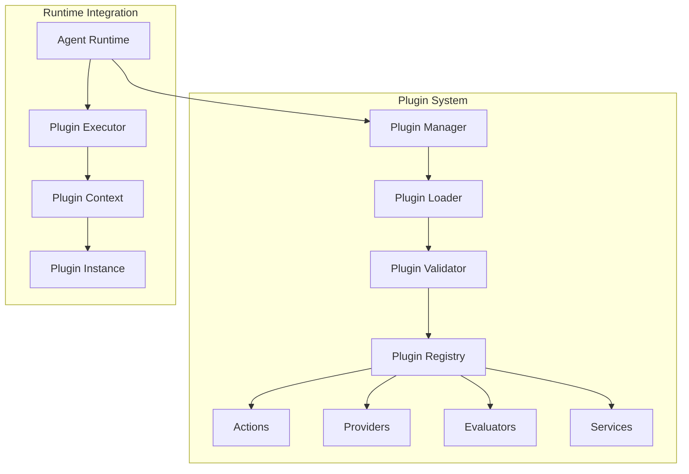

# Plugin System

The ElizaOS plugin system provides a powerful, extensible architecture for adding custom functionality to agents. This guide covers the plugin architecture, development patterns, and best practices.

## Overview

The plugin system enables:

- Modular functionality through standardized interfaces
- Hot-loading and dynamic plugin management
- Dependency resolution and version management
- Isolated plugin contexts for security
- Shared services and state management

## Architecture



## Plugin Structure

### Basic Plugin Definition

```typescript
interface Plugin {
  name: string; // Unique identifier
  version: string; // Semantic version
  description?: string; // Human-readable description
  author?: string; // Plugin author
  license?: string; // License identifier

  // Dependencies
  dependencies?: string[]; // Required plugins
  optionalDependencies?: string[]; // Optional plugins

  // Components
  actions?: Action[]; // Action handlers
  providers?: Provider[]; // Context providers
  evaluators?: Evaluator[]; // Message evaluators
  services?: Service[]; // Background services

  // Lifecycle hooks
  onLoad?: (runtime: IAgentRuntime) => Promise<void>;
  onUnload?: (runtime: IAgentRuntime) => Promise<void>;

  // Configuration
  configSchema?: ConfigSchema; // Configuration validation
  defaultConfig?: any; // Default configuration
}
```

### Complete Plugin Example

```typescript
import { Plugin, IAgentRuntime } from '@elizaos/core';

export const weatherPlugin: Plugin = {
  name: 'weather',
  version: '1.0.0',
  description: 'Weather information and forecasts',
  author: 'ElizaOS Team',
  license: 'MIT',

  dependencies: ['http-client', 'geolocation'],

  actions: [
    {
      name: 'GET_WEATHER',
      description: 'Get current weather for a location',
      examples: [
        { input: "What's the weather in London?", output: 'Getting weather...' },
        { input: 'Is it raining in Tokyo?', output: 'Checking weather...' },
      ],

      validate: async (input: string): Promise<boolean> => {
        const weatherPattern = /weather|temperature|rain|snow|forecast/i;
        return weatherPattern.test(input);
      },

      handler: async ({ input, runtime }) => {
        const location = await extractLocation(input);
        const weather = await runtime.getService('weather').getWeather(location);

        return {
          text: formatWeatherResponse(weather),
          data: weather,
        };
      },
    },
  ],

  providers: [
    {
      name: 'weather-context',
      description: 'Provides weather context for conversations',

      get: async (runtime: IAgentRuntime) => {
        const location = await runtime.getService('geolocation').getCurrentLocation();
        const weather = await runtime.getService('weather').getWeather(location);

        return {
          currentWeather: weather,
          lastUpdated: new Date(),
        };
      },
    },
  ],

  services: [
    {
      name: 'weather',

      async start(runtime: IAgentRuntime) {
        this.apiKey = runtime.config.weatherApiKey;
        this.cache = new Map();

        // Start cache cleanup timer
        this.cleanupTimer = setInterval(
          () => {
            this.cleanupCache();
          },
          60 * 60 * 1000
        ); // Every hour
      },

      async stop() {
        clearInterval(this.cleanupTimer);
        this.cache.clear();
      },

      async getWeather(location: string) {
        // Check cache first
        const cached = this.cache.get(location);
        if (cached && Date.now() - cached.timestamp < 10 * 60 * 1000) {
          return cached.data;
        }

        // Fetch from API
        const weather = await this.fetchWeatherFromAPI(location);

        // Update cache
        this.cache.set(location, {
          data: weather,
          timestamp: Date.now(),
        });

        return weather;
      },
    },
  ],

  configSchema: {
    type: 'object',
    properties: {
      weatherApiKey: {
        type: 'string',
        description: 'API key for weather service',
      },
      units: {
        type: 'string',
        enum: ['metric', 'imperial'],
        default: 'metric',
      },
      cacheDuration: {
        type: 'number',
        description: 'Cache duration in minutes',
        default: 10,
      },
    },
    required: ['weatherApiKey'],
  },

  async onLoad(runtime: IAgentRuntime) {
    console.log('Weather plugin loaded');

    // Validate configuration
    if (!runtime.config.weatherApiKey) {
      throw new Error('Weather API key is required');
    }
  },

  async onUnload(runtime: IAgentRuntime) {
    console.log('Weather plugin unloaded');

    // Cleanup resources
    const weatherService = runtime.getService('weather');
    if (weatherService) {
      await weatherService.stop();
    }
  },
};
```

## Plugin Components

### 1. Actions

Actions define how plugins respond to user input:

```typescript
interface Action {
  name: string;
  description: string;
  examples: Example[];

  // Validation
  validate: (input: string, context: Context) => Promise<boolean>;

  // Handler
  handler: (params: ActionParams) => Promise<ActionResult>;

  // Optional configuration
  config?: {
    priority?: number; // Execution priority
    timeout?: number; // Execution timeout
    rateLimit?: RateLimit; // Rate limiting
    permissions?: string[]; // Required permissions
  };
}

// Advanced action with middleware
export const advancedAction: Action = {
  name: 'ADVANCED_ACTION',
  description: 'Demonstrates advanced action features',

  examples: [
    {
      input: 'Analyze this data',
      output: 'Analysis complete',
      context: { requiresAuth: true },
    },
  ],

  validate: async (input: string, context: Context): Promise<boolean> => {
    // Multi-stage validation
    const checks = [
      () => input.length > 0,
      () => context.user?.authenticated === true,
      async () => await checkUserPermissions(context.user, 'data:analyze'),
    ];

    for (const check of checks) {
      if (!(await check())) return false;
    }

    return true;
  },

  handler: async ({ input, context, runtime }) => {
    // Pre-processing
    const startTime = Date.now();
    runtime.logger.info('Starting advanced action', { input });

    try {
      // Main logic
      const result = await performAnalysis(input);

      // Post-processing
      await runtime.emit('action:completed', {
        action: 'ADVANCED_ACTION',
        duration: Date.now() - startTime,
        success: true,
      });

      return {
        text: `Analysis complete: ${result.summary}`,
        data: result,
        metadata: {
          processingTime: Date.now() - startTime,
          confidence: result.confidence,
        },
      };
    } catch (error) {
      runtime.logger.error('Action failed', { error });

      await runtime.emit('action:failed', {
        action: 'ADVANCED_ACTION',
        error: error.message,
      });

      throw error;
    }
  },

  config: {
    priority: 10,
    timeout: 30000,
    rateLimit: {
      maxRequests: 10,
      windowMs: 60000,
    },
    permissions: ['data:analyze'],
  },
};
```

### 2. Providers

Providers supply dynamic context to the agent:

```typescript
interface Provider {
  name: string;
  description: string;

  // Get current context
  get: (runtime: IAgentRuntime) => Promise<any>;

  // Optional: Subscribe to updates
  subscribe?: (callback: (data: any) => void) => () => void;

  // Optional: Cache configuration
  cacheConfig?: {
    ttl: number; // Time to live in ms
    staleWhileRevalidate?: boolean;
  };
}

// Real-time data provider
export const realtimeProvider: Provider = {
  name: 'market-data',
  description: 'Provides real-time market data',

  get: async (runtime: IAgentRuntime) => {
    const cache = runtime.getService('cache');
    const cacheKey = 'market-data';

    // Try cache first
    const cached = await cache.get(cacheKey);
    if (cached) return cached;

    // Fetch fresh data
    const marketData = await fetchMarketData();

    // Update cache
    await cache.set(cacheKey, marketData, { ttl: 60000 });

    return marketData;
  },

  subscribe: (callback: (data: any) => void) => {
    // Setup WebSocket connection
    const ws = new WebSocket('wss://market-data.example.com');

    ws.on('message', (data) => {
      const parsed = JSON.parse(data);
      callback(parsed);
    });

    // Return unsubscribe function
    return () => {
      ws.close();
    };
  },

  cacheConfig: {
    ttl: 60000,
    staleWhileRevalidate: true,
  },
};
```

### 3. Evaluators

Evaluators analyze and score messages:

```typescript
interface Evaluator {
  name: string;
  description: string;

  // Evaluate message
  evaluate: (params: EvaluatorParams) => Promise<EvaluatorResult>;

  // Optional: Batch evaluation
  evaluateBatch?: (messages: Message[]) => Promise<EvaluatorResult[]>;
}

interface EvaluatorResult {
  score: number; // 0-1 confidence score
  passed: boolean; // Whether evaluation passed
  metadata?: any; // Additional metadata
}

// Sentiment evaluator
export const sentimentEvaluator: Evaluator = {
  name: 'sentiment',
  description: 'Evaluates message sentiment',

  evaluate: async ({ message, context, runtime }) => {
    const sentiment = await analyzeSentiment(message.content);

    // Track sentiment over time
    await runtime.getService('analytics').track('sentiment', {
      userId: message.userId,
      sentiment: sentiment.score,
      timestamp: new Date(),
    });

    return {
      score: Math.abs(sentiment.score),
      passed: sentiment.score > -0.5, // Not too negative
      metadata: {
        sentiment: sentiment.label,
        confidence: sentiment.confidence,
        aspects: sentiment.aspects,
      },
    };
  },

  evaluateBatch: async (messages: Message[]) => {
    // Efficient batch processing
    const texts = messages.map((m) => m.content);
    const sentiments = await analyzeSentimentBatch(texts);

    return sentiments.map((sentiment, i) => ({
      score: Math.abs(sentiment.score),
      passed: sentiment.score > -0.5,
      metadata: {
        messageId: messages[i].id,
        sentiment: sentiment.label,
      },
    }));
  },
};
```

### 4. Services

Services provide shared functionality:

```typescript
interface Service {
  name: string;

  // Lifecycle methods
  start: (runtime: IAgentRuntime) => Promise<void>;
  stop: () => Promise<void>;

  // Service methods (defined by implementation)
  [key: string]: any;
}

// Database service example
export class DatabaseService implements Service {
  name = 'database';
  private pool: ConnectionPool;
  private cache: CacheLayer;

  async start(runtime: IAgentRuntime) {
    // Initialize connection pool
    this.pool = new ConnectionPool({
      host: runtime.config.dbHost,
      port: runtime.config.dbPort,
      database: runtime.config.dbName,
      max: 20,
      idleTimeoutMillis: 30000,
    });

    // Initialize cache layer
    this.cache = new CacheLayer({
      ttl: 5 * 60 * 1000,
      max: 1000,
    });

    // Test connection
    await this.pool.query('SELECT 1');

    runtime.logger.info('Database service started');
  }

  async stop() {
    await this.pool.end();
    this.cache.clear();
  }

  async query(sql: string, params?: any[]): Promise<any> {
    const cacheKey = this.getCacheKey(sql, params);

    // Check cache for SELECT queries
    if (sql.trim().toUpperCase().startsWith('SELECT')) {
      const cached = this.cache.get(cacheKey);
      if (cached) return cached;
    }

    // Execute query
    const result = await this.pool.query(sql, params);

    // Cache SELECT results
    if (sql.trim().toUpperCase().startsWith('SELECT')) {
      this.cache.set(cacheKey, result.rows);
    }

    return result.rows;
  }

  async transaction(callback: (client: any) => Promise<any>): Promise<any> {
    const client = await this.pool.connect();

    try {
      await client.query('BEGIN');
      const result = await callback(client);
      await client.query('COMMIT');
      return result;
    } catch (error) {
      await client.query('ROLLBACK');
      throw error;
    } finally {
      client.release();
    }
  }

  private getCacheKey(sql: string, params?: any[]): string {
    return `${sql}:${JSON.stringify(params || [])}`;
  }
}
```

## Plugin Lifecycle

### 1. Loading Process

```typescript
class PluginLoader {
  async loadPlugin(pluginPath: string): Promise<Plugin> {
    try {
      // 1. Load plugin module
      const module = await import(pluginPath);
      const plugin = module.default || module;

      // 2. Validate plugin structure
      this.validatePlugin(plugin);

      // 3. Check dependencies
      await this.checkDependencies(plugin);

      // 4. Initialize plugin
      if (plugin.onLoad) {
        await plugin.onLoad(this.runtime);
      }

      // 5. Register components
      await this.registerComponents(plugin);

      // 6. Start services
      await this.startServices(plugin);

      return plugin;
    } catch (error) {
      throw new PluginLoadError(`Failed to load plugin ${pluginPath}: ${error.message}`);
    }
  }

  private validatePlugin(plugin: any): void {
    if (!plugin.name || !plugin.version) {
      throw new Error('Plugin must have name and version');
    }

    // Validate version format
    if (!semver.valid(plugin.version)) {
      throw new Error('Invalid plugin version format');
    }

    // Validate component arrays
    const components = ['actions', 'providers', 'evaluators', 'services'];
    for (const component of components) {
      if (plugin[component] && !Array.isArray(plugin[component])) {
        throw new Error(`Plugin ${component} must be an array`);
      }
    }
  }
}
```

### 2. Dependency Resolution

```typescript
class DependencyResolver {
  async resolve(plugins: Plugin[]): Promise<Plugin[]> {
    const graph = this.buildDependencyGraph(plugins);
    const sorted = this.topologicalSort(graph);

    if (sorted === null) {
      throw new Error('Circular dependency detected');
    }

    return sorted;
  }

  private buildDependencyGraph(plugins: Plugin[]): DependencyGraph {
    const graph = new Map<string, Set<string>>();
    const pluginMap = new Map(plugins.map((p) => [p.name, p]));

    for (const plugin of plugins) {
      const deps = new Set<string>();

      // Add required dependencies
      for (const dep of plugin.dependencies || []) {
        if (!pluginMap.has(dep)) {
          throw new Error(`Plugin ${plugin.name} depends on missing plugin ${dep}`);
        }
        deps.add(dep);
      }

      // Add optional dependencies if available
      for (const dep of plugin.optionalDependencies || []) {
        if (pluginMap.has(dep)) {
          deps.add(dep);
        }
      }

      graph.set(plugin.name, deps);
    }

    return graph;
  }
}
```

### 3. Hot Reloading

```typescript
class HotReloader {
  private watchers = new Map<string, FSWatcher>();

  async watchPlugin(pluginPath: string, plugin: Plugin): Promise<void> {
    const watcher = watch(pluginPath, {
      persistent: true,
      ignoreInitial: true,
    });

    watcher.on('change', async () => {
      try {
        runtime.logger.info(`Reloading plugin ${plugin.name}`);

        // Unload current version
        await this.unloadPlugin(plugin);

        // Clear module cache
        delete require.cache[require.resolve(pluginPath)];

        // Load new version
        const newPlugin = await this.loadPlugin(pluginPath);

        // Migrate state if needed
        await this.migrateState(plugin, newPlugin);

        runtime.logger.info(`Plugin ${plugin.name} reloaded successfully`);
      } catch (error) {
        runtime.logger.error(`Failed to reload plugin ${plugin.name}`, error);
      }
    });

    this.watchers.set(plugin.name, watcher);
  }

  async stopWatching(pluginName: string): Promise<void> {
    const watcher = this.watchers.get(pluginName);
    if (watcher) {
      await watcher.close();
      this.watchers.delete(pluginName);
    }
  }
}
```

## Plugin Development

### 1. TypeScript Plugin Template

```typescript
import { Plugin, IAgentRuntime, Action, Provider, Service } from '@elizaos/core';

interface MyPluginConfig {
  apiKey: string;
  endpoint?: string;
  timeout?: number;
}

export default class MyPlugin implements Plugin {
  name = 'my-plugin';
  version = '1.0.0';
  description = 'My custom ElizaOS plugin';

  private config: MyPluginConfig;
  private runtime: IAgentRuntime;

  actions = [this.createMyAction()];

  providers = [this.createMyProvider()];

  services = [this.createMyService()];

  async onLoad(runtime: IAgentRuntime): Promise<void> {
    this.runtime = runtime;
    this.config = this.validateConfig(runtime.config);

    // Initialize plugin
    await this.initialize();
  }

  async onUnload(): Promise<void> {
    // Cleanup resources
    await this.cleanup();
  }

  private createMyAction(): Action {
    return {
      name: 'MY_ACTION',
      description: 'Performs my custom action',
      examples: [{ input: 'Do something', output: 'Something done!' }],

      validate: async (input: string) => {
        return input.toLowerCase().includes('something');
      },

      handler: async ({ input, runtime }) => {
        const result = await this.performAction(input);
        return {
          text: `Action completed: ${result}`,
          data: { result },
        };
      },
    };
  }

  private createMyProvider(): Provider {
    return {
      name: 'my-context',
      description: 'Provides my custom context',

      get: async () => {
        return {
          timestamp: new Date(),
          data: await this.fetchContextData(),
        };
      },
    };
  }

  private createMyService(): Service {
    const service = {
      name: 'my-service',

      async start(runtime: IAgentRuntime) {
        // Initialize service
      },

      async stop() {
        // Cleanup service
      },

      // Custom service methods
      async doSomething(param: string) {
        return `Did something with ${param}`;
      },
    };

    return service;
  }

  private validateConfig(config: any): MyPluginConfig {
    if (!config.myPluginApiKey) {
      throw new Error('myPluginApiKey is required');
    }

    return {
      apiKey: config.myPluginApiKey,
      endpoint: config.myPluginEndpoint || 'https://api.example.com',
      timeout: config.myPluginTimeout || 5000,
    };
  }
}
```

### 2. Plugin Testing

```typescript
import { describe, it, expect, beforeEach, afterEach } from 'bun:test';
import { createMockRuntime } from '@elizaos/testing';
import MyPlugin from './my-plugin';

describe('MyPlugin', () => {
  let runtime: MockRuntime;
  let plugin: MyPlugin;

  beforeEach(async () => {
    runtime = createMockRuntime({
      config: {
        myPluginApiKey: 'test-key',
      },
    });

    plugin = new MyPlugin();
    await plugin.onLoad(runtime);
  });

  afterEach(async () => {
    await plugin.onUnload();
  });

  describe('MY_ACTION', () => {
    const action = plugin.actions[0];

    it('should validate correct input', async () => {
      const valid = await action.validate('Do something please');
      expect(valid).toBe(true);
    });

    it('should reject invalid input', async () => {
      const valid = await action.validate('Do nothing');
      expect(valid).toBe(false);
    });

    it('should handle action correctly', async () => {
      const result = await action.handler({
        input: 'Do something cool',
        runtime,
        context: {},
      });

      expect(result.text).toContain('Action completed');
      expect(result.data).toBeDefined();
    });
  });

  describe('my-service', () => {
    it('should provide service functionality', async () => {
      const service = runtime.getService('my-service');
      const result = await service.doSomething('test');

      expect(result).toBe('Did something with test');
    });
  });
});
```

### 3. Plugin Publishing

```json
// package.json
{
  "name": "@elizaos/plugin-my-plugin",
  "version": "1.0.0",
  "description": "My custom ElizaOS plugin",
  "main": "dist/index.js",
  "types": "dist/index.d.ts",
  "files": ["dist", "README.md", "LICENSE"],
  "scripts": {
    "build": "tsc",
    "test": "bun test",
    "prepublish": "npm run build && npm run test"
  },
  "peerDependencies": {
    "@elizaos/core": "^1.0.0"
  },
  "keywords": ["elizaos", "plugin", "ai", "agent"],
  "author": "Your Name",
  "license": "MIT"
}
```

## Advanced Patterns

### 1. Plugin Composition

```typescript
// Compose multiple plugins into one
export function composePlugins(...plugins: Plugin[]): Plugin {
  return {
    name: 'composed-plugin',
    version: '1.0.0',

    actions: plugins.flatMap((p) => p.actions || []),
    providers: plugins.flatMap((p) => p.providers || []),
    evaluators: plugins.flatMap((p) => p.evaluators || []),
    services: plugins.flatMap((p) => p.services || []),

    async onLoad(runtime: IAgentRuntime) {
      for (const plugin of plugins) {
        if (plugin.onLoad) {
          await plugin.onLoad(runtime);
        }
      }
    },

    async onUnload(runtime: IAgentRuntime) {
      for (const plugin of plugins.reverse()) {
        if (plugin.onUnload) {
          await plugin.onUnload(runtime);
        }
      }
    },
  };
}
```

### 2. Plugin Middleware

```typescript
// Wrap plugin components with middleware
export function withLogging(action: Action): Action {
  return {
    ...action,
    handler: async (params) => {
      const start = Date.now();
      params.runtime.logger.info(`Starting action ${action.name}`);

      try {
        const result = await action.handler(params);

        params.runtime.logger.info(`Action ${action.name} completed`, {
          duration: Date.now() - start,
        });

        return result;
      } catch (error) {
        params.runtime.logger.error(`Action ${action.name} failed`, {
          error: error.message,
          duration: Date.now() - start,
        });

        throw error;
      }
    },
  };
}
```

### 3. Plugin Communication

```typescript
// Inter-plugin communication via events
export class PluginEventBus {
  private listeners = new Map<string, Set<Function>>();

  emit(event: string, data: any): void {
    const handlers = this.listeners.get(event);
    if (handlers) {
      handlers.forEach((handler) => {
        try {
          handler(data);
        } catch (error) {
          console.error(`Event handler error for ${event}:`, error);
        }
      });
    }
  }

  on(event: string, handler: Function): () => void {
    if (!this.listeners.has(event)) {
      this.listeners.set(event, new Set());
    }

    this.listeners.get(event)!.add(handler);

    // Return unsubscribe function
    return () => {
      this.listeners.get(event)?.delete(handler);
    };
  }
}

// Usage in plugins
export const pluginA: Plugin = {
  name: 'plugin-a',

  async onLoad(runtime: IAgentRuntime) {
    // Emit event
    runtime.emit('plugin-a:ready', { version: '1.0.0' });
  },
};

export const pluginB: Plugin = {
  name: 'plugin-b',

  async onLoad(runtime: IAgentRuntime) {
    // Listen for plugin-a events
    runtime.on('plugin-a:ready', (data) => {
      console.log('Plugin A is ready:', data);
    });
  },
};
```

## Security Considerations

### 1. Sandboxing

```typescript
// Run plugins in isolated contexts
class PluginSandbox {
  async runInSandbox(plugin: Plugin, code: string): Promise<any> {
    const vm = new VM({
      timeout: 5000,
      sandbox: {
        // Allowed globals
        console: console,
        setTimeout: setTimeout,
        clearTimeout: clearTimeout,

        // Plugin API
        runtime: this.createSafeRuntime(),

        // Denied
        process: undefined,
        require: undefined,
        __dirname: undefined,
        __filename: undefined,
      },
    });

    return vm.run(code);
  }

  private createSafeRuntime(): any {
    return {
      // Only expose safe methods
      logger: {
        info: (...args) => console.log(...args),
        error: (...args) => console.error(...args),
      },

      config: {
        // Only expose non-sensitive config
        get: (key: string) => {
          if (this.isSafeConfig(key)) {
            return this.runtime.config[key];
          }
          return undefined;
        },
      },
    };
  }
}
```

### 2. Permission System

```typescript
// Define plugin permissions
interface PluginPermissions {
  actions?: string[]; // Allowed action names
  services?: string[]; // Allowed service access
  events?: string[]; // Allowed event emissions
  config?: string[]; // Allowed config keys
  network?: boolean; // Network access
  filesystem?: boolean; // File system access
}

class PermissionManager {
  checkPermission(plugin: Plugin, permission: string, resource?: string): boolean {
    const permissions = this.getPluginPermissions(plugin.name);

    switch (permission) {
      case 'service:access':
        return permissions.services?.includes(resource!) ?? false;

      case 'event:emit':
        return permissions.events?.includes(resource!) ?? false;

      case 'config:read':
        return permissions.config?.includes(resource!) ?? false;

      case 'network:request':
        return permissions.network ?? false;

      default:
        return false;
    }
  }
}
```

## Performance Optimization

### 1. Lazy Loading

```typescript
// Load plugins on demand
class LazyPluginLoader {
  private plugins = new Map<string, () => Promise<Plugin>>();
  private loaded = new Map<string, Plugin>();

  register(name: string, loader: () => Promise<Plugin>): void {
    this.plugins.set(name, loader);
  }

  async get(name: string): Promise<Plugin | null> {
    // Return if already loaded
    if (this.loaded.has(name)) {
      return this.loaded.get(name)!;
    }

    // Load if registered
    const loader = this.plugins.get(name);
    if (loader) {
      const plugin = await loader();
      this.loaded.set(name, plugin);
      return plugin;
    }

    return null;
  }
}
```

### 2. Resource Pooling

```typescript
// Share resources between plugins
class ResourcePool {
  private pools = new Map<string, any>();

  async getConnection(type: string, config: any): Promise<any> {
    const key = `${type}:${JSON.stringify(config)}`;

    if (!this.pools.has(key)) {
      const pool = await this.createPool(type, config);
      this.pools.set(key, pool);
    }

    return this.pools.get(key);
  }

  private async createPool(type: string, config: any): Promise<any> {
    switch (type) {
      case 'database':
        return new DatabasePool(config);
      case 'redis':
        return new RedisPool(config);
      case 'http':
        return new HttpClientPool(config);
      default:
        throw new Error(`Unknown pool type: ${type}`);
    }
  }
}
```

## Best Practices

1. **Single Responsibility**: Each plugin should focus on one feature area
2. **Error Handling**: Always handle errors gracefully with fallbacks
3. **Resource Management**: Clean up resources in onUnload
4. **Configuration Validation**: Validate all configuration at load time
5. **Documentation**: Document all actions, providers, and services
6. **Testing**: Write comprehensive tests for all plugin components
7. **Versioning**: Follow semantic versioning for plugins
8. **Performance**: Consider caching and lazy loading for efficiency

## Related Documentation

- [Core Concepts](./core-concepts.md) - Fundamental ElizaOS concepts
- [State Management](./state-management.md) - Plugin state management
- [Actions API](../api-reference/actions-api.md) - Detailed Actions API
