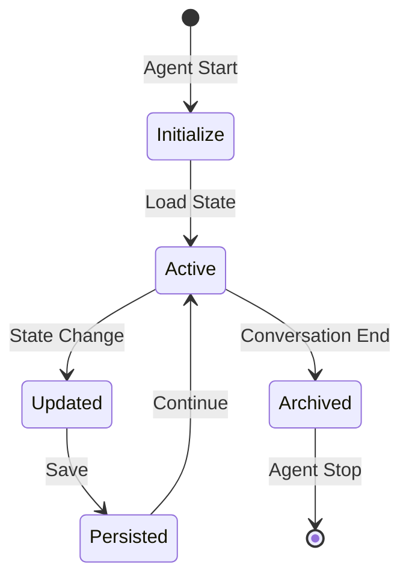

# State Management in ElizaOS

This document provides a comprehensive guide to state management in ElizaOS, covering the hierarchical state system, persistence strategies, and best practices.

## 📊 State Hierarchy

ElizaOS implements a hierarchical state system that mirrors the conceptual organization of agents, rooms, and conversations:

```
Global State
  └── Agent State (per agent instance)
      └── Room State (per communication channel)
          └── Conversation State (per conversation thread)
              └── Message State (per message)
```

### State Scopes

```typescript
interface StateHierarchy {
    // Global state - shared across all agents
    global: {
        systemConfig: SystemConfig;
        sharedResources: Map<string, any>;
        globalMetrics: Metrics;
    };
    
    // Agent state - specific to each agent
    agent: {
        agentId: UUID;
        character: Character;
        goals: Goal[];
        relationships: Map<UUID, Relationship>;
        knowledge: KnowledgeBase;
    };
    
    // Room state - specific to each communication channel
    room: {
        roomId: UUID;
        participants: Set<UUID>;
        context: string;
        history: Message[];
        metadata: RoomMetadata;
    };
    
    // Conversation state - specific to active conversations
    conversation: {
        thread: Message[];
        currentTopic: string;
        sentiment: number;
        activeGoals: Goal[];
    };
}
```

## 🔄 State Flow

### State Lifecycle



### State Transitions

```typescript
class StateManager {
    private transitions: Map<StateTransition, TransitionHandler> = new Map([
        ['message_received', this.handleMessageReceived],
        ['goal_completed', this.handleGoalCompleted],
        ['user_joined', this.handleUserJoined],
        ['context_switch', this.handleContextSwitch],
    ]);
    
    async transition(
        event: StateTransition, 
        payload: any
    ): Promise<State> {
        const handler = this.transitions.get(event);
        if (!handler) {
            throw new Error(`Unknown transition: ${event}`);
        }
        
        const newState = await handler.call(this, payload);
        await this.persist(newState);
        this.emit('state:changed', { event, newState });
        
        return newState;
    }
}
```

## 💾 Persistence Strategies

### Multi-Layer Persistence

ElizaOS uses a multi-layer approach to state persistence:

```typescript
class LayeredStateStore {
    // Layer 1: In-memory cache (fastest, volatile)
    private memoryCache: Map<string, any> = new Map();
    
    // Layer 2: Redis cache (fast, semi-persistent)
    private redisCache: RedisClient;
    
    // Layer 3: Database (persistent, slower)
    private database: IDatabase;
    
    // Layer 4: Disk backup (archival, slowest)
    private diskStorage: IDiskStorage;
    
    async get(key: string): Promise<any> {
        // Check layers in order of speed
        return this.memoryCache.get(key)
            || await this.redisCache.get(key)
            || await this.database.get(key)
            || await this.diskStorage.get(key);
    }
    
    async set(key: string, value: any, options: PersistOptions): Promise<void> {
        // Write to appropriate layers based on options
        if (options.volatile) {
            this.memoryCache.set(key, value);
        }
        
        if (options.ttl) {
            await this.redisCache.setex(key, options.ttl, value);
        }
        
        if (options.persistent) {
            await this.database.set(key, value);
        }
        
        if (options.archive) {
            await this.diskStorage.archive(key, value);
        }
    }
}
```

### State Serialization

```typescript
interface StateSerializer {
    serialize(state: State): string;
    deserialize(data: string): State;
}

class JsonStateSerializer implements StateSerializer {
    serialize(state: State): string {
        return JSON.stringify(state, this.replacer);
    }
    
    deserialize(data: string): State {
        return JSON.parse(data, this.reviver);
    }
    
    private replacer(key: string, value: any): any {
        // Handle special types
        if (value instanceof Map) {
            return { _type: 'Map', data: Array.from(value.entries()) };
        }
        if (value instanceof Set) {
            return { _type: 'Set', data: Array.from(value) };
        }
        return value;
    }
    
    private reviver(key: string, value: any): any {
        // Restore special types
        if (value?._type === 'Map') {
            return new Map(value.data);
        }
        if (value?._type === 'Set') {
            return new Set(value.data);
        }
        return value;
    }
}
```

## 🧩 State Composition

### Composable State Modules

```typescript
// Base state module
abstract class StateModule<T> {
    abstract getInitialState(): T;
    abstract reduce(state: T, action: Action): T;
    abstract serialize(state: T): any;
    abstract deserialize(data: any): T;
}

// Conversation state module
class ConversationStateModule extends StateModule<ConversationState> {
    getInitialState(): ConversationState {
        return {
            messages: [],
            topic: null,
            sentiment: 0,
            participants: new Set()
        };
    }
    
    reduce(state: ConversationState, action: Action): ConversationState {
        switch (action.type) {
            case 'ADD_MESSAGE':
                return {
                    ...state,
                    messages: [...state.messages, action.payload]
                };
            case 'UPDATE_TOPIC':
                return {
                    ...state,
                    topic: action.payload
                };
            default:
                return state;
        }
    }
}

// Compose modules into complete state
class CompositeStateManager {
    private modules: Map<string, StateModule<any>> = new Map();
    
    registerModule(name: string, module: StateModule<any>): void {
        this.modules.set(name, module);
    }
    
    getState(): CompleteState {
        const state: any = {};
        for (const [name, module] of this.modules) {
            state[name] = module.getInitialState();
        }
        return state;
    }
}
```

## 🔍 State Queries

### Efficient State Queries

```typescript
class StateQueryEngine {
    // Indexed state for fast queries
    private indices: Map<string, Map<any, Set<string>>> = new Map();
    
    // Build indices for common queries
    async buildIndex(state: State): Promise<void> {
        // Index by user ID
        this.indexBy('userId', state, (item) => item.userId);
        
        // Index by timestamp
        this.indexBy('timestamp', state, (item) => 
            Math.floor(item.timestamp / 3600000) // Hour buckets
        );
        
        // Index by topic
        this.indexBy('topic', state, (item) => item.topic);
    }
    
    // Query with multiple filters
    async query(filters: QueryFilter[]): Promise<any[]> {
        let results: Set<string> | null = null;
        
        for (const filter of filters) {
            const index = this.indices.get(filter.field);
            if (!index) continue;
            
            const matches = index.get(filter.value) || new Set();
            
            if (results === null) {
                results = new Set(matches);
            } else {
                // Intersection of results
                results = new Set(
                    [...results].filter(x => matches.has(x))
                );
            }
        }
        
        return results ? Array.from(results) : [];
    }
}
```

## 🔒 State Isolation

### Plugin State Isolation

```typescript
class IsolatedPluginState {
    private pluginStates: Map<string, PluginStateContainer> = new Map();
    
    // Each plugin gets its own state container
    getPluginState(pluginName: string): PluginStateContainer {
        if (!this.pluginStates.has(pluginName)) {
            this.pluginStates.set(
                pluginName, 
                new PluginStateContainer(pluginName)
            );
        }
        return this.pluginStates.get(pluginName)!;
    }
}

class PluginStateContainer {
    constructor(private pluginName: string) {}
    
    private state: Map<string, any> = new Map();
    private listeners: Set<StateListener> = new Set();
    
    // Plugins can only access their own state
    get(key: string): any {
        return this.state.get(this.scopedKey(key));
    }
    
    set(key: string, value: any): void {
        const scopedKey = this.scopedKey(key);
        this.state.set(scopedKey, value);
        this.notifyListeners(scopedKey, value);
    }
    
    private scopedKey(key: string): string {
        return `${this.pluginName}:${key}`;
    }
}
```

## 📈 State Metrics

### State Health Monitoring

```typescript
interface StateHealth {
    memoryUsage: number;
    stateSize: number;
    updateFrequency: number;
    lastUpdate: Date;
    errors: StateError[];
}

class StateHealthMonitor {
    async checkHealth(): Promise<StateHealth> {
        const health: StateHealth = {
            memoryUsage: this.calculateMemoryUsage(),
            stateSize: await this.calculateStateSize(),
            updateFrequency: this.getUpdateFrequency(),
            lastUpdate: this.getLastUpdate(),
            errors: await this.detectStateErrors()
        };
        
        // Alert if unhealthy
        if (this.isUnhealthy(health)) {
            this.alertOps(health);
        }
        
        return health;
    }
    
    private detectStateErrors(): Promise<StateError[]> {
        const errors: StateError[] = [];
        
        // Check for state corruption
        if (!this.validateStateIntegrity()) {
            errors.push({
                type: 'corruption',
                message: 'State integrity check failed'
            });
        }
        
        // Check for memory leaks
        if (this.detectMemoryLeak()) {
            errors.push({
                type: 'memory_leak',
                message: 'Possible memory leak detected'
            });
        }
        
        return errors;
    }
}
```

## 🎯 Best Practices

### 1. State Immutability

Always treat state as immutable:

```typescript
// ❌ Bad: Mutating state directly
state.messages.push(newMessage);

// ✅ Good: Creating new state
state = {
    ...state,
    messages: [...state.messages, newMessage]
};
```

### 2. State Normalization

Keep state normalized to avoid duplication:

```typescript
// ❌ Bad: Nested, denormalized state
{
    conversations: [
        {
            id: '1',
            user: { id: 'u1', name: 'Alice', avatar: '...' },
            messages: [...]
        }
    ]
}

// ✅ Good: Normalized state
{
    conversations: {
        '1': { id: '1', userId: 'u1', messageIds: ['m1', 'm2'] }
    },
    users: {
        'u1': { id: 'u1', name: 'Alice', avatar: '...' }
    },
    messages: {
        'm1': { id: 'm1', content: '...', userId: 'u1' },
        'm2': { id: 'm2', content: '...', userId: 'u1' }
    }
}
```

### 3. State Cleanup

Implement automatic cleanup:

```typescript
class StateCleanup {
    async cleanup(): Promise<void> {
        // Remove expired conversations
        await this.removeExpiredConversations();
        
        // Archive old messages
        await this.archiveOldMessages();
        
        // Compact memory indices
        await this.compactIndices();
        
        // Clear orphaned state
        await this.clearOrphanedState();
    }
    
    private async removeExpiredConversations(): Promise<void> {
        const cutoff = Date.now() - (7 * 24 * 60 * 60 * 1000); // 7 days
        const expired = await this.state.query({
            lastActivity: { $lt: cutoff }
        });
        
        for (const conversation of expired) {
            await this.archive(conversation);
            await this.state.remove(conversation.id);
        }
    }
}
```

### 4. State Synchronization

Handle distributed state synchronization:

```typescript
class StateSynchronizer {
    async sync(localState: State, remoteState: State): Promise<State> {
        // Use vector clocks for conflict resolution
        const conflicts = this.detectConflicts(localState, remoteState);
        
        for (const conflict of conflicts) {
            const resolved = await this.resolveConflict(conflict);
            localState = this.applyResolution(localState, resolved);
        }
        
        return localState;
    }
    
    private resolveConflict(conflict: StateConflict): Resolution {
        // Last-write-wins with vector clock
        if (conflict.local.vectorClock > conflict.remote.vectorClock) {
            return { use: 'local', value: conflict.local.value };
        }
        return { use: 'remote', value: conflict.remote.value };
    }
}
```

## 🔧 Debugging State Issues

### State Inspection Tools

```typescript
// State debugger
class StateDebugger {
    // Snapshot state at a point in time
    snapshot(): StateSnapshot {
        return {
            timestamp: Date.now(),
            state: this.deepClone(this.state),
            metadata: this.gatherMetadata()
        };
    }
    
    // Compare states
    diff(state1: State, state2: State): StateDiff {
        return this.deepDiff(state1, state2);
    }
    
    // Time-travel debugging
    async rewind(to: Date): Promise<State> {
        const snapshot = await this.getSnapshotAt(to);
        return this.restoreFromSnapshot(snapshot);
    }
}

// Usage
const debugger = new StateDebugger();
const before = debugger.snapshot();
// ... perform operations ...
const after = debugger.snapshot();
const changes = debugger.diff(before.state, after.state);
console.log('State changes:', changes);
```

## 📚 Further Reading

- [Core Concepts](./core-concepts.md) - Understanding ElizaOS fundamentals
- [Memory System](./memory-system.md) - Deep dive into memory architecture
- [Plugin System](./plugin-system.md) - Plugin state management
- [Performance Guide](../advanced/performance.md) - State optimization techniques