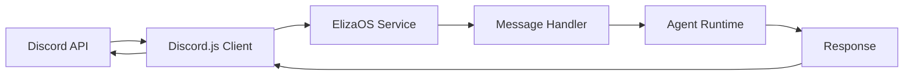

# Discord Technical Integration

Complete technical guide for integrating ElizaOS with Discord, including advanced features, event handling, and custom implementations.

## Architecture Overview

### Discord Service Architecture

```typescript
interface DiscordService extends Service {
  client: Client;
  voiceManager: VoiceManager;
  messageHandler: MessageHandler;
  eventEmitter: EventEmitter;
}
```

### Event Flow



## Implementation Guide

### 1. Service Registration

```typescript
import { DiscordService } from '@elizaos/plugin-discord';

// Register the Discord service
runtime.registerService(
  new DiscordService({
    botToken: process.env.DISCORD_API_TOKEN,
    applicationId: process.env.DISCORD_APPLICATION_ID,
    intents: [
      GatewayIntentBits.Guilds,
      GatewayIntentBits.GuildMessages,
      GatewayIntentBits.MessageContent,
      GatewayIntentBits.GuildVoiceStates,
    ],
  })
);
```

### 2. Custom Event Handlers

```typescript
// Custom message handler
class CustomDiscordHandler extends MessageHandler {
  async handleMessage(message: Message): Promise<void> {
    // Pre-processing
    if (message.author.bot) return;

    // Custom logic
    const context = await this.buildContext(message);
    const response = await this.runtime.process(context);

    // Post-processing
    await this.sendResponse(message, response);
  }

  private async buildContext(message: Message): Promise<Context> {
    return {
      userId: message.author.id,
      roomId: message.channelId,
      worldId: message.guildId,
      content: message.content,
      attachments: message.attachments.map((a) => ({
        url: a.url,
        type: a.contentType,
      })),
    };
  }
}
```

### 3. Voice Integration

```typescript
// Voice connection manager
class VoiceManager {
  private connections: Map<string, VoiceConnection> = new Map();

  async joinChannel(channelId: string): Promise<VoiceConnection> {
    const channel = await this.client.channels.fetch(channelId);
    if (!channel.isVoiceBased()) {
      throw new Error('Not a voice channel');
    }

    const connection = joinVoiceChannel({
      channelId: channel.id,
      guildId: channel.guild.id,
      adapterCreator: channel.guild.voiceAdapterCreator,
    });

    this.connections.set(channelId, connection);
    return connection;
  }

  async playAudio(channelId: string, audioUrl: string): Promise<void> {
    const connection = this.connections.get(channelId);
    if (!connection) throw new Error('Not connected to channel');

    const player = createAudioPlayer();
    const resource = createAudioResource(audioUrl);

    player.play(resource);
    connection.subscribe(player);
  }
}
```

## Advanced Features

### 1. Slash Commands Implementation

```typescript
// Command registration
const commands = [
  {
    name: 'ask',
    description: 'Ask the AI a question',
    options: [
      {
        name: 'question',
        type: ApplicationCommandOptionType.String,
        description: 'Your question',
        required: true,
      },
    ],
  },
  {
    name: 'imagine',
    description: 'Generate an image',
    options: [
      {
        name: 'prompt',
        type: ApplicationCommandOptionType.String,
        description: 'Image description',
        required: true,
      },
    ],
  },
];

// Command handler
client.on('interactionCreate', async (interaction) => {
  if (!interaction.isChatInputCommand()) return;

  switch (interaction.commandName) {
    case 'ask':
      await handleAskCommand(interaction);
      break;
    case 'imagine':
      await handleImagineCommand(interaction);
      break;
  }
});

async function handleAskCommand(interaction: ChatInputCommandInteraction) {
  await interaction.deferReply();

  const question = interaction.options.getString('question');
  const response = await runtime.process({
    content: question,
    userId: interaction.user.id,
    roomId: interaction.channelId,
  });

  await interaction.editReply(response.text);
}
```

### 2. Embed Builders

```typescript
// Rich embed responses
function createRichEmbed(data: any): EmbedBuilder {
  return new EmbedBuilder()
    .setTitle(data.title)
    .setDescription(data.description)
    .setColor(0x0099ff)
    .addFields(
      { name: 'Status', value: data.status, inline: true },
      { name: 'Time', value: new Date().toISOString(), inline: true }
    )
    .setFooter({ text: 'Powered by ElizaOS' })
    .setTimestamp();
}

// Usage in response
const embed = createRichEmbed({
  title: 'Analysis Complete',
  description: 'Here are the results...',
  status: 'Success',
});

await message.channel.send({ embeds: [embed] });
```

### 3. Reaction Handlers

```typescript
// Reaction-based interactions
client.on('messageReactionAdd', async (reaction, user) => {
  if (user.bot) return;

  // Handle specific reactions
  switch (reaction.emoji.name) {
    case '👍':
      await handlePositiveFeedback(reaction.message, user);
      break;
    case '👎':
      await handleNegativeFeedback(reaction.message, user);
      break;
    case '🔄':
      await regenerateResponse(reaction.message, user);
      break;
  }
});

async function regenerateResponse(message: Message, user: User) {
  // Get original context
  const context = await getMessageContext(message.id);

  // Generate new response
  const newResponse = await runtime.process({
    ...context,
    regenerate: true,
  });

  // Update message
  await message.edit(newResponse.text);
}
```

## Permission Management

### 1. Role-Based Access Control

```typescript
// Permission checker
class PermissionManager {
  private roleHierarchy: Map<string, number> = new Map([
    ['admin', 100],
    ['moderator', 50],
    ['member', 10],
    ['guest', 0],
  ]);

  async checkPermission(userId: string, guildId: string, requiredLevel: number): Promise<boolean> {
    const member = await this.getMember(guildId, userId);
    const userLevel = this.getUserLevel(member);

    return userLevel >= requiredLevel;
  }

  private getUserLevel(member: GuildMember): number {
    let maxLevel = 0;

    member.roles.cache.forEach((role) => {
      const level = this.roleHierarchy.get(role.name.toLowerCase());
      if (level && level > maxLevel) {
        maxLevel = level;
      }
    });

    return maxLevel;
  }
}
```

### 2. Command Restrictions

```typescript
// Restricted command example
const restrictedCommands = {
  admin: ['shutdown', 'config', 'reset'],
  moderator: ['mute', 'kick', 'warn'],
  member: ['help', 'info', 'stats'],
};

async function executeCommand(command: string, user: User, guild: Guild): Promise<void> {
  const permission = await permissionManager.getUserRole(user.id, guild.id);

  const allowedCommands = Object.entries(restrictedCommands)
    .filter(([role, _]) => permission.includes(role))
    .flatMap(([_, commands]) => commands);

  if (!allowedCommands.includes(command)) {
    throw new Error('Insufficient permissions');
  }

  // Execute command
}
```

## Performance Optimization

### 1. Message Caching

```typescript
// LRU cache for messages
class MessageCache {
  private cache: LRUCache<string, ProcessedMessage>;

  constructor(maxSize: number = 1000) {
    this.cache = new LRUCache({ max: maxSize });
  }

  async get(messageId: string): Promise<ProcessedMessage | null> {
    return this.cache.get(messageId) || null;
  }

  async set(messageId: string, data: ProcessedMessage): Promise<void> {
    this.cache.set(messageId, data);
  }
}
```

### 2. Rate Limiting

```typescript
// Rate limiter implementation
class RateLimiter {
  private limits: Map<string, number[]> = new Map();

  constructor(
    private maxRequests: number = 5,
    private windowMs: number = 60000
  ) {}

  async checkLimit(userId: string): Promise<boolean> {
    const now = Date.now();
    const userLimits = this.limits.get(userId) || [];

    // Remove old entries
    const recent = userLimits.filter((time) => now - time < this.windowMs);

    if (recent.length >= this.maxRequests) {
      return false;
    }

    recent.push(now);
    this.limits.set(userId, recent);
    return true;
  }
}
```

## Error Handling

### 1. Comprehensive Error Management

```typescript
// Error handler
class DiscordErrorHandler {
  async handle(error: Error, context: ErrorContext): Promise<void> {
    console.error(`Discord Error: ${error.message}`, context);

    // Notify user
    if (context.channel) {
      await context.channel.send({
        content: 'An error occurred. Please try again later.',
        ephemeral: true,
      });
    }

    // Log to monitoring
    await this.logToMonitoring(error, context);

    // Attempt recovery
    if (error.code === 'CONNECTION_LOST') {
      await this.reconnect();
    }
  }

  private async reconnect(): Promise<void> {
    // Implement reconnection logic
  }
}
```

### 2. Graceful Degradation

```typescript
// Fallback mechanisms
async function sendMessage(channel: TextChannel, content: string): Promise<void> {
  try {
    // Try rich embed
    const embed = createRichEmbed(content);
    await channel.send({ embeds: [embed] });
  } catch (embedError) {
    try {
      // Fallback to plain text
      await channel.send(content);
    } catch (textError) {
      // Log failure
      console.error('Failed to send message', textError);
    }
  }
}
```

## Testing Strategies

### 1. Unit Testing

```typescript
// Test Discord service
describe('DiscordService', () => {
  let service: DiscordService;
  let mockClient: jest.Mocked<Client>;

  beforeEach(() => {
    mockClient = createMockClient();
    service = new DiscordService({ client: mockClient });
  });

  test('handles message correctly', async () => {
    const mockMessage = createMockMessage({
      content: 'Hello bot',
      author: { bot: false },
    });

    await service.handleMessage(mockMessage);

    expect(mockClient.channels.send).toHaveBeenCalledWith(
      expect.objectContaining({
        content: expect.stringContaining('Hello'),
      })
    );
  });
});
```

### 2. Integration Testing

```typescript
// Test full flow
describe('Discord Integration', () => {
  test('processes command end-to-end', async () => {
    const response = await sendCommand('/ask What is ElizaOS?');

    expect(response).toMatchObject({
      success: true,
      reply: expect.stringContaining('ElizaOS'),
    });
  });
});
```

## Deployment Considerations

### 1. Environment Configuration

```env
# Required
DISCORD_APPLICATION_ID=123456789012345678
DISCORD_API_TOKEN=Bot.Token.Here
DISCORD_PUBLIC_KEY=public_key_for_interactions

# Optional
DISCORD_GUILD_ID=specific_guild_id
DISCORD_LOG_CHANNEL=logs_channel_id
DISCORD_ERROR_WEBHOOK=webhook_url
```

### 2. Scaling Strategies

```typescript
// Sharding for large bots
const manager = new ShardingManager('./bot.js', {
  token: process.env.DISCORD_API_TOKEN,
  totalShards: 'auto',
});

manager.on('shardCreate', (shard) => {
  console.log(`Launched shard ${shard.id}`);
});

manager.spawn();
```

## Best Practices

### 1. Security

- Never expose bot tokens
- Validate all user inputs
- Implement proper rate limiting
- Use environment variables

### 2. Performance

- Cache frequently accessed data
- Use bulk operations when possible
- Implement connection pooling
- Monitor memory usage

### 3. User Experience

- Provide clear error messages
- Use typing indicators for long operations
- Implement command help system
- Support multiple languages

## Resources

- [Discord.js Documentation](https://discord.js.org/)
- [Discord Developer Portal](https://discord.com/developers)
- [ElizaOS Discord Plugin Source](https://github.com/elizaOS/eliza/tree/main/packages/plugin-discord)

---

**Next:** [Telegram Technical Integration →](./telegram-technical)
