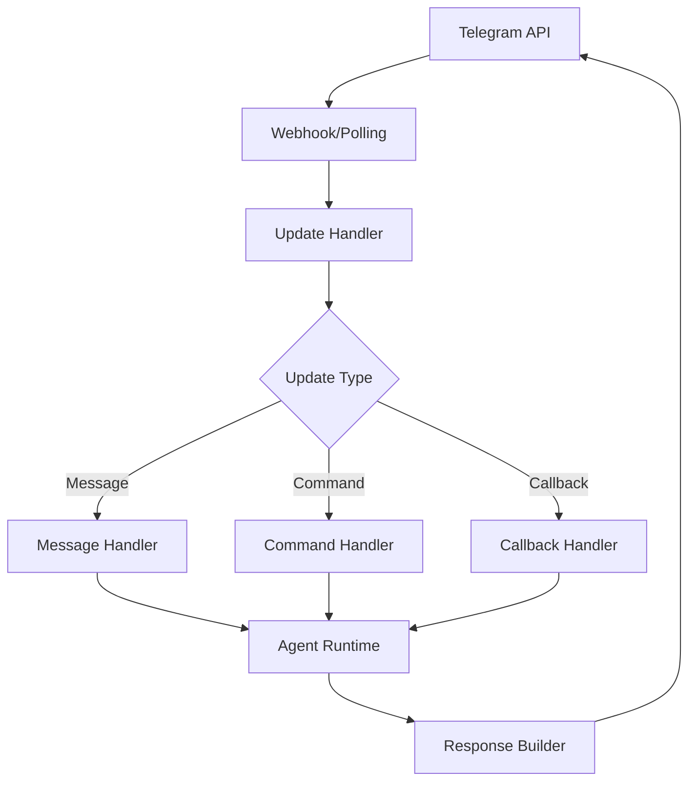

# Telegram Technical Integration

Comprehensive technical guide for integrating ElizaOS with Telegram, including bot development, advanced features, and production deployment.

## Architecture Overview

### Telegram Service Architecture

```typescript
interface TelegramService extends Service {
  bot: TelegramBot;
  updateHandler: UpdateHandler;
  commandRegistry: CommandRegistry;
  sessionManager: SessionManager;
}
```

### Message Flow Architecture



## Implementation Guide

### 1. Service Initialization

```typescript
import { TelegramService } from '@elizaos/plugin-telegram';
import { Telegraf } from 'telegraf';

// Initialize Telegram service
const telegramService = new TelegramService({
  token: process.env.TELEGRAM_BOT_TOKEN,
  webhookUrl: process.env.WEBHOOK_URL, // Optional
  polling: !process.env.WEBHOOK_URL,
  rateLimit: {
    window: 1000,
    limit: 30,
  },
});

// Register with runtime
runtime.registerService(telegramService);
```

### 2. Custom Update Handlers

```typescript
// Custom update handler implementation
class CustomUpdateHandler extends UpdateHandler {
  constructor(
    private bot: Telegraf,
    private runtime: IAgentRuntime
  ) {
    super();
    this.registerHandlers();
  }

  private registerHandlers(): void {
    // Text messages
    this.bot.on('text', this.handleTextMessage.bind(this));

    // Voice messages
    this.bot.on('voice', this.handleVoiceMessage.bind(this));

    // Documents
    this.bot.on('document', this.handleDocument.bind(this));

    // Inline queries
    this.bot.on('inline_query', this.handleInlineQuery.bind(this));

    // Callback queries
    this.bot.on('callback_query', this.handleCallbackQuery.bind(this));
  }

  private async handleTextMessage(ctx: Context): Promise<void> {
    const message = ctx.message;
    const userId = message.from.id.toString();
    const chatId = message.chat.id.toString();

    // Build context
    const context = {
      userId,
      roomId: chatId,
      content: message.text,
      platform: 'telegram',
      metadata: {
        username: message.from.username,
        firstName: message.from.first_name,
        messageId: message.message_id,
        chatType: message.chat.type,
      },
    };

    // Process with runtime
    const response = await this.runtime.process(context);

    // Send response
    await this.sendResponse(ctx, response);
  }

  private async handleVoiceMessage(ctx: Context): Promise<void> {
    const voice = ctx.message.voice;

    // Download voice file
    const fileLink = await ctx.telegram.getFileLink(voice.file_id);
    const audioBuffer = await downloadFile(fileLink.toString());

    // Transcribe audio
    const transcription = await this.transcribeAudio(audioBuffer);

    // Process as text
    await this.handleTextMessage({
      ...ctx,
      message: {
        ...ctx.message,
        text: transcription,
      },
    });
  }
}
```

### 3. Command System Implementation

```typescript
// Command registry
class CommandRegistry {
  private commands: Map<string, CommandHandler> = new Map();

  register(command: string, handler: CommandHandler): void {
    this.commands.set(command, handler);
  }

  async execute(command: string, ctx: Context): Promise<void> {
    const handler = this.commands.get(command);
    if (!handler) {
      await ctx.reply('Unknown command. Type /help for available commands.');
      return;
    }

    try {
      await handler.execute(ctx);
    } catch (error) {
      await ctx.reply('An error occurred processing your command.');
      console.error(`Command error: ${command}`, error);
    }
  }
}

// Command handler interface
interface CommandHandler {
  description: string;
  usage: string;
  execute(ctx: Context): Promise<void>;
}

// Example command implementation
class HelpCommand implements CommandHandler {
  description = 'Show available commands';
  usage = '/help';

  async execute(ctx: Context): Promise<void> {
    const commands = [
      '/start - Start conversation',
      '/help - Show this message',
      '/settings - Configure preferences',
      '/stats - View your statistics',
      '/clear - Clear conversation history',
    ];

    await ctx.reply(`🤖 *Available Commands*\n\n${commands.join('\n')}`, {
      parse_mode: 'Markdown',
    });
  }
}
```

## Advanced Features

### 1. Inline Keyboards & Buttons

```typescript
// Interactive keyboard builder
class KeyboardBuilder {
  static mainMenu(): InlineKeyboardMarkup {
    return {
      inline_keyboard: [
        [
          { text: '💬 Chat', callback_data: 'action:chat' },
          { text: '⚙️ Settings', callback_data: 'action:settings' },
        ],
        [
          { text: '📊 Stats', callback_data: 'action:stats' },
          { text: '❓ Help', callback_data: 'action:help' },
        ],
      ],
    };
  }

  static settings(): InlineKeyboardMarkup {
    return {
      inline_keyboard: [
        [
          { text: '🌐 Language', callback_data: 'settings:language' },
          { text: '🔔 Notifications', callback_data: 'settings:notifications' },
        ],
        [
          { text: '🎨 Theme', callback_data: 'settings:theme' },
          { text: '👤 Profile', callback_data: 'settings:profile' },
        ],
        [{ text: '⬅️ Back', callback_data: 'action:back' }],
      ],
    };
  }

  static confirmation(action: string): InlineKeyboardMarkup {
    return {
      inline_keyboard: [
        [
          { text: '✅ Yes', callback_data: `confirm:${action}:yes` },
          { text: '❌ No', callback_data: `confirm:${action}:no` },
        ],
      ],
    };
  }
}

// Callback query handler
bot.on('callback_query', async (ctx) => {
  const data = ctx.callbackQuery.data;
  const [type, action, ...params] = data.split(':');

  switch (type) {
    case 'action':
      await handleAction(ctx, action);
      break;
    case 'settings':
      await handleSettings(ctx, action);
      break;
    case 'confirm':
      await handleConfirmation(ctx, action, params[0]);
      break;
  }

  // Answer callback query
  await ctx.answerCbQuery();
});
```

### 2. Rich Media Handling

```typescript
// Media message builder
class MediaMessageBuilder {
  static async photo(ctx: Context, photoUrl: string, caption?: string): Promise<void> {
    await ctx.replyWithPhoto(photoUrl, {
      caption,
      parse_mode: 'HTML',
      reply_markup: KeyboardBuilder.mainMenu(),
    });
  }

  static async document(ctx: Context, document: Buffer | string, filename: string): Promise<void> {
    await ctx.replyWithDocument(
      {
        source: document,
        filename,
      },
      {
        caption: `📎 ${filename}`,
        parse_mode: 'Markdown',
      }
    );
  }

  static async voice(ctx: Context, audioBuffer: Buffer): Promise<void> {
    await ctx.replyWithVoice({
      source: audioBuffer,
    });
  }

  static async mediaGroup(ctx: Context, media: InputMedia[]): Promise<void> {
    await ctx.replyWithMediaGroup(media);
  }
}

// Process image with vision
async function processImage(ctx: Context): Promise<void> {
  const photo = ctx.message.photo.pop(); // Highest resolution
  const file = await ctx.telegram.getFile(photo.file_id);
  const imageUrl = `https://api.telegram.org/file/bot${BOT_TOKEN}/${file.file_path}`;

  // Process with vision model
  const analysis = await runtime.process({
    content: 'Analyze this image',
    images: [imageUrl],
    userId: ctx.from.id.toString(),
  });

  await ctx.reply(analysis.text);
}
```

### 3. Session Management

```typescript
// Session manager for conversation state
class SessionManager {
  private sessions: Map<string, UserSession> = new Map();
  private readonly SESSION_TIMEOUT = 30 * 60 * 1000; // 30 minutes

  async getSession(userId: string): Promise<UserSession> {
    let session = this.sessions.get(userId);

    if (!session || this.isExpired(session)) {
      session = await this.createSession(userId);
      this.sessions.set(userId, session);
    }

    session.lastActivity = Date.now();
    return session;
  }

  private async createSession(userId: string): Promise<UserSession> {
    // Load user data from database
    const userData = await this.loadUserData(userId);

    return {
      userId,
      conversationHistory: [],
      preferences: userData?.preferences || defaultPreferences,
      metadata: {},
      createdAt: Date.now(),
      lastActivity: Date.now(),
    };
  }

  private isExpired(session: UserSession): boolean {
    return Date.now() - session.lastActivity > this.SESSION_TIMEOUT;
  }

  // Middleware for session management
  middleware() {
    return async (ctx: Context, next: () => Promise<void>) => {
      if (ctx.from) {
        ctx.session = await this.getSession(ctx.from.id.toString());
      }
      await next();
    };
  }
}

// Use session in handlers
bot.use(sessionManager.middleware());

bot.on('text', async (ctx) => {
  const session = ctx.session;

  // Add to conversation history
  session.conversationHistory.push({
    role: 'user',
    content: ctx.message.text,
    timestamp: Date.now(),
  });

  // Process with context
  const response = await runtime.process({
    content: ctx.message.text,
    conversationHistory: session.conversationHistory,
    preferences: session.preferences,
  });

  // Update history
  session.conversationHistory.push({
    role: 'assistant',
    content: response.text,
    timestamp: Date.now(),
  });
});
```

## Webhook vs Polling

### 1. Webhook Configuration

```typescript
// Webhook setup
class WebhookManager {
  private app: Express;
  private bot: Telegraf;

  constructor(bot: Telegraf, webhookUrl: string) {
    this.bot = bot;
    this.app = express();
    this.setupWebhook(webhookUrl);
  }

  private setupWebhook(webhookUrl: string): void {
    const webhookPath = `/telegram/${this.bot.secretPathComponent()}`;

    // Set webhook
    this.bot.telegram.setWebhook(`${webhookUrl}${webhookPath}`);

    // Setup express middleware
    this.app.use(express.json());

    // Webhook endpoint
    this.app.post(webhookPath, (req, res) => {
      this.bot.handleUpdate(req.body);
      res.sendStatus(200);
    });

    // Health check
    this.app.get('/health', (req, res) => {
      res.json({ status: 'ok', service: 'telegram-bot' });
    });
  }

  start(port: number): void {
    this.app.listen(port, () => {
      console.log(`Webhook server listening on port ${port}`);
    });
  }
}
```

### 2. Polling Configuration

```typescript
// Enhanced polling with error handling
class PollingManager {
  private bot: Telegraf;
  private pollingOptions: Telegraf.LaunchOptions;

  constructor(bot: Telegraf) {
    this.bot = bot;
    this.pollingOptions = {
      allowedUpdates: [
        'message',
        'edited_message',
        'callback_query',
        'inline_query',
        'chosen_inline_result',
        'channel_post',
        'edited_channel_post',
      ],
      dropPendingUpdates: true,
      pollingTimeout: 30,
    };
  }

  async start(): Promise<void> {
    try {
      await this.bot.launch(this.pollingOptions);
      console.log('Bot started with long polling');
    } catch (error) {
      console.error('Failed to start bot:', error);
      // Retry logic
      setTimeout(() => this.start(), 5000);
    }
  }

  stop(): void {
    this.bot.stop('SIGTERM');
  }
}
```

## Rate Limiting & Throttling

```typescript
// Rate limiter implementation
class TelegramRateLimiter {
  private limits: Map<string, RateLimit> = new Map();

  constructor(
    private config: {
      messagesPerMinute: number;
      burstSize: number;
      globalLimit: number;
    }
  ) {}

  async checkLimit(userId: string): Promise<boolean> {
    const userLimit = this.limits.get(userId) || this.createLimit();
    const now = Date.now();

    // Refill tokens
    const elapsed = now - userLimit.lastRefill;
    const tokensToAdd = Math.floor((elapsed / 60000) * this.config.messagesPerMinute);

    userLimit.tokens = Math.min(userLimit.tokens + tokensToAdd, this.config.burstSize);
    userLimit.lastRefill = now;

    // Check if user has tokens
    if (userLimit.tokens > 0) {
      userLimit.tokens--;
      this.limits.set(userId, userLimit);
      return true;
    }

    return false;
  }

  middleware() {
    return async (ctx: Context, next: () => Promise<void>) => {
      if (!ctx.from) {
        await next();
        return;
      }

      const allowed = await this.checkLimit(ctx.from.id.toString());

      if (!allowed) {
        await ctx.reply(
          '⏳ Rate limit exceeded. Please wait a moment before sending more messages.',
          { reply_to_message_id: ctx.message?.message_id }
        );
        return;
      }

      await next();
    };
  }
}
```

## Group Chat Management

```typescript
// Group chat handler
class GroupChatHandler {
  private groupSettings: Map<string, GroupSettings> = new Map();

  async handleGroupMessage(ctx: Context): Promise<void> {
    const chatId = ctx.chat.id.toString();
    const settings = await this.getGroupSettings(chatId);

    // Check if bot was mentioned
    const botUsername = ctx.botInfo.username;
    const wasMentioned = ctx.message.text?.includes(`@${botUsername}`);
    const wasRepliedTo = ctx.message.reply_to_message?.from?.id === ctx.botInfo.id;

    // Only respond if configured to or mentioned
    if (!settings.alwaysRespond && !wasMentioned && !wasRepliedTo) {
      return;
    }

    // Process message
    await this.processGroupMessage(ctx, settings);
  }

  private async processGroupMessage(ctx: Context, settings: GroupSettings): Promise<void> {
    // Clean mention from text
    const text = ctx.message.text.replace(/@\w+/g, '').trim();

    const response = await runtime.process({
      content: text,
      roomId: ctx.chat.id.toString(),
      userId: ctx.from.id.toString(),
      isGroupChat: true,
      groupSettings: settings,
    });

    // Send response with reply
    await ctx.reply(response.text, {
      reply_to_message_id: ctx.message.message_id,
      allow_sending_without_reply: true,
    });
  }
}

// Group administration commands
bot.command('config', adminOnly(), async (ctx) => {
  const keyboard = {
    inline_keyboard: [
      [{ text: '🔊 Always Respond', callback_data: 'group:toggle:always_respond' }],
      [{ text: '🚫 Ignore List', callback_data: 'group:ignore_list' }],
      [{ text: '⏰ Quiet Hours', callback_data: 'group:quiet_hours' }],
    ],
  };

  await ctx.reply('Group Configuration:', { reply_markup: keyboard });
});
```

## Error Handling & Recovery

```typescript
// Comprehensive error handler
class TelegramErrorHandler {
  private errorCounts: Map<string, number> = new Map();
  private readonly MAX_RETRIES = 3;

  async handle(error: any, ctx: Context): Promise<void> {
    const errorKey = this.getErrorKey(error);
    const count = (this.errorCounts.get(errorKey) || 0) + 1;
    this.errorCounts.set(errorKey, count);

    console.error('Telegram error:', error);

    // Handle specific errors
    if (error.code === 429) {
      // Rate limit
      const retryAfter = error.parameters?.retry_after || 60;
      await this.handleRateLimit(ctx, retryAfter);
    } else if (error.code === 'ETELEGRAM') {
      // Telegram API error
      await this.handleApiError(ctx, error);
    } else if (count < this.MAX_RETRIES) {
      // Retry
      await this.retry(ctx, error);
    } else {
      // Final failure
      await this.handleFinalFailure(ctx, error);
    }
  }

  private async handleRateLimit(ctx: Context, retryAfter: number): Promise<void> {
    console.log(`Rate limited. Retry after ${retryAfter} seconds`);

    setTimeout(async () => {
      try {
        await ctx.reply('Sorry for the delay. Processing your request now...');
      } catch (e) {
        console.error('Failed to send delayed message:', e);
      }
    }, retryAfter * 1000);
  }

  private async retry(ctx: Context, error: any): Promise<void> {
    const delay = Math.pow(2, this.errorCounts.get(this.getErrorKey(error)) || 1) * 1000;

    setTimeout(async () => {
      try {
        // Retry the operation
        await ctx.scene.reenter();
      } catch (e) {
        await this.handle(e, ctx);
      }
    }, delay);
  }
}
```

## Testing Strategies

### 1. Unit Testing

```typescript
// Test Telegram handlers
describe('TelegramService', () => {
  let service: TelegramService;
  let mockBot: jest.Mocked<Telegraf>;
  let mockRuntime: jest.Mocked<IAgentRuntime>;

  beforeEach(() => {
    mockBot = createMockBot();
    mockRuntime = createMockRuntime();
    service = new TelegramService({ bot: mockBot });
  });

  test('handles text message', async () => {
    const ctx = createMockContext({
      message: { text: 'Hello bot' },
      from: { id: 123, username: 'testuser' },
    });

    await service.handleMessage(ctx);

    expect(mockRuntime.process).toHaveBeenCalledWith({
      content: 'Hello bot',
      userId: '123',
      platform: 'telegram',
    });

    expect(ctx.reply).toHaveBeenCalled();
  });
});
```

### 2. Integration Testing

```typescript
// Test bot flow
describe('Telegram Bot Flow', () => {
  let bot: Telegraf;

  beforeAll(async () => {
    bot = new Telegraf(process.env.TEST_BOT_TOKEN);
    await bot.launch();
  });

  afterAll(() => {
    bot.stop();
  });

  test('command flow', async () => {
    const response = await sendCommand('/start');
    expect(response.text).toContain('Welcome');

    const helpResponse = await sendCommand('/help');
    expect(helpResponse.text).toContain('Available commands');
  });
});
```

## Performance Optimization

### 1. Message Queue

```typescript
// Queue for handling high volume
class MessageQueue {
  private queue: Queue<QueuedMessage>;
  private processing = false;

  constructor(private concurrency: number = 5) {
    this.queue = new Queue('telegram-messages', {
      connection: redis,
    });

    this.queue.process(this.concurrency, async (job) => {
      await this.processMessage(job.data);
    });
  }

  async add(message: QueuedMessage): Promise<void> {
    await this.queue.add(message, {
      attempts: 3,
      backoff: {
        type: 'exponential',
        delay: 2000,
      },
    });
  }

  private async processMessage(message: QueuedMessage): Promise<void> {
    const response = await runtime.process(message.context);
    await this.sendResponse(message.chatId, response);
  }
}
```

### 2. Caching Strategy

```typescript
// Response cache
class ResponseCache {
  private cache: Redis;
  private readonly TTL = 300; // 5 minutes

  async get(key: string): Promise<string | null> {
    return await this.cache.get(key);
  }

  async set(key: string, value: string): Promise<void> {
    await this.cache.setex(key, this.TTL, value);
  }

  generateKey(message: string, userId: string): string {
    return `telegram:response:${createHash('md5').update(`${message}:${userId}`).digest('hex')}`;
  }
}
```

## Security Best Practices

### 1. Input Validation

```typescript
// Validate and sanitize input
class InputValidator {
  static validateCommand(input: string): boolean {
    const commandRegex = /^\/[a-zA-Z0-9_]{1,32}(\s.*)?$/;
    return commandRegex.test(input);
  }

  static sanitizeText(text: string): string {
    return text
      .replace(/[<>]/g, '') // Remove potential HTML
      .substring(0, 4096); // Telegram message limit
  }

  static validateCallbackData(data: string): boolean {
    return data.length <= 64; // Telegram limit
  }
}
```

### 2. Authentication Middleware

```typescript
// User authentication
const authenticate = () => {
  return async (ctx: Context, next: () => Promise<void>) => {
    const userId = ctx.from?.id;

    if (!userId) {
      await ctx.reply('Authentication required.');
      return;
    }

    const user = await userService.authenticate(userId.toString());

    if (!user) {
      await ctx.reply('Please register first using /start');
      return;
    }

    ctx.state.user = user;
    await next();
  };
};
```

## Production Deployment

### 1. Environment Configuration

```env
# Required
TELEGRAM_BOT_TOKEN=your_bot_token

# Webhook (production)
WEBHOOK_URL=https://your-domain.com
WEBHOOK_PORT=8443
WEBHOOK_SECRET=random_secret_string

# Database
POSTGRES_URL=postgresql://...
REDIS_URL=redis://...

# Monitoring
SENTRY_DSN=your_sentry_dsn
LOG_LEVEL=info

# Features
ENABLE_VOICE=true
ENABLE_GROUPS=true
MAX_MESSAGE_LENGTH=4096
```

### 2. Docker Configuration

```dockerfile
FROM node:18-alpine

WORKDIR /app

COPY package*.json ./
RUN bun install --production

COPY . .

# Health check
HEALTHCHECK --interval=30s --timeout=3s --start-period=5s --retries=3 \
  CMD node healthcheck.js

EXPOSE 8443

CMD ["node", "dist/index.js"]
```

## Monitoring & Analytics

```typescript
// Analytics tracker
class TelegramAnalytics {
  async trackEvent(event: string, properties: any): Promise<void> {
    await analytics.track({
      event,
      properties: {
        ...properties,
        platform: 'telegram',
        timestamp: new Date(),
      },
    });
  }

  async trackMessage(ctx: Context): Promise<void> {
    await this.trackEvent('message_received', {
      userId: ctx.from?.id,
      chatType: ctx.chat?.type,
      messageType: ctx.message?.text ? 'text' : 'other',
      hasCommand: ctx.message?.text?.startsWith('/'),
    });
  }
}
```

## Resources

- [Telegram Bot API Documentation](https://core.telegram.org/bots/api)
- [Telegraf Documentation](https://telegraf.js.org/)
- [ElizaOS Telegram Plugin Source](https://github.com/elizaOS/eliza/tree/main/packages/plugin-telegram)

---

**Next:** [Slack Technical Integration →](./slack-technical)
