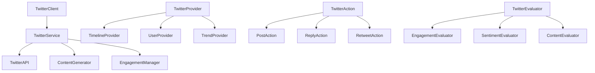

# Twitter Technical Integration Guide

This guide covers the technical implementation details of Twitter integration in ElizaOS, including API implementation, architecture patterns, and advanced development techniques.

## Architecture Overview

### Twitter Plugin Architecture

The ElizaOS Twitter integration follows a modular plugin architecture:

```typescript
interface TwitterPlugin {
  name: string;
  description: string;
  clients: TwitterClient[];
  providers: TwitterProvider[];
  actions: TwitterAction[];
  evaluators: TwitterEvaluator[];
  services: TwitterService[];
}
```

### Core Components



## Twitter Client Implementation

### Basic Client Structure

```typescript
import { TwitterApi } from 'twitter-api-v2';
import { Client, IAgentRuntime } from '@elizaos/core';

export class TwitterClient extends Client {
  private twitter: TwitterApi;
  private runtime: IAgentRuntime;

  constructor(runtime: IAgentRuntime) {
    super();
    this.runtime = runtime;
    this.initializeTwitterApi();
  }

  private initializeTwitterApi(): void {
    this.twitter = new TwitterApi({
      appKey: process.env.TWITTER_API_KEY!,
      appSecret: process.env.TWITTER_API_SECRET!,
      accessToken: process.env.TWITTER_ACCESS_TOKEN!,
      accessSecret: process.env.TWITTER_ACCESS_TOKEN_SECRET!,
    });
  }

  async start(): Promise<void> {
    console.log('Starting Twitter client...');

    // Start monitoring mentions and DMs
    await this.startMentionMonitoring();
    await this.startDirectMessageMonitoring();

    // Start periodic posting if enabled
    if (this.shouldStartPeriodicPosting()) {
      await this.startPeriodicPosting();
    }
  }

  async stop(): Promise<void> {
    console.log('Stopping Twitter client...');
    // Cleanup and stop monitoring
  }
}
```

### Authentication Implementation

```typescript
interface TwitterAuthConfig {
  apiKey: string;
  apiSecret: string;
  accessToken: string;
  accessTokenSecret: string;
  bearerToken?: string;
  clientId?: string;
  clientSecret?: string;
}

class TwitterAuth {
  private config: TwitterAuthConfig;

  constructor(config: TwitterAuthConfig) {
    this.config = config;
  }

  // OAuth 1.0a implementation
  async authenticateOAuth1(): Promise<TwitterApi> {
    return new TwitterApi({
      appKey: this.config.apiKey,
      appSecret: this.config.apiSecret,
      accessToken: this.config.accessToken,
      accessSecret: this.config.accessTokenSecret,
    });
  }

  // OAuth 2.0 implementation for newer features
  async authenticateOAuth2(): Promise<TwitterApi> {
    return new TwitterApi({
      clientId: this.config.clientId!,
      clientSecret: this.config.clientSecret!,
    });
  }

  // Bearer token for read-only operations
  async authenticateBearerToken(): Promise<TwitterApi> {
    return new TwitterApi(this.config.bearerToken!);
  }
}
```

## Content Generation System

### Dynamic Content Pipeline

```typescript
interface ContentGenerationContext {
  character: Character;
  recentTweets: Tweet[];
  mentions: Mention[];
  trends: Trend[];
  sentiment: SentimentAnalysis;
  timeContext: TimeContext;
}

class TwitterContentGenerator {
  private runtime: IAgentRuntime;

  constructor(runtime: IAgentRuntime) {
    this.runtime = runtime;
  }

  async generateTweet(context: ContentGenerationContext): Promise<string> {
    // Build comprehensive context for AI generation
    const prompt = this.buildContentPrompt(context);

    // Generate content using AI model
    const response = await this.runtime.model.generate({
      prompt,
      context: this.buildModelContext(context),
      temperature: 0.8,
      maxTokens: 100, // Twitter character limit consideration
    });

    // Post-process and validate content
    return this.postProcessContent(response.text, context);
  }

  private buildContentPrompt(context: ContentGenerationContext): string {
    return `
      Generate a Twitter post for ${context.character.name} with the following context:
      
      Character Personality:
      ${JSON.stringify(context.character.personality, null, 2)}
      
      Recent Activity:
      ${context.recentTweets.map((t) => `- ${t.text}`).join('\n')}
      
      Current Trends:
      ${context.trends.map((t) => `- ${t.name}`).join('\n')}
      
      Time Context: ${context.timeContext.timeOfDay} on ${context.timeContext.dayOfWeek}
      
      Requirements:
      - Stay in character
      - Be engaging and authentic
      - Include relevant hashtags (2-3 max)
      - Stay under 280 characters
      - Avoid repetition of recent posts
    `;
  }

  private postProcessContent(content: string, context: ContentGenerationContext): string {
    // Remove unwanted characters
    content = content.replace(/[^\w\s@#.,!?'"-]/g, '');

    // Ensure character limit
    if (content.length > 280) {
      content = content.substring(0, 277) + '...';
    }

    // Add context-appropriate hashtags
    content = this.addRelevantHashtags(content, context);

    return content.trim();
  }

  private addRelevantHashtags(content: string, context: ContentGenerationContext): string {
    const character = context.character;
    const hashtagsToAdd: string[] = [];

    // Add character-specific hashtags
    if (character.topics) {
      const relevantTopics = character.topics.slice(0, 2);
      hashtagsToAdd.push(...relevantTopics.map((topic) => `#${topic.replace(/\s+/g, '')}`));
    }

    // Add trending hashtags if relevant
    const relevantTrends = context.trends
      .filter((trend) =>
        character.topics?.some((topic) => trend.name.toLowerCase().includes(topic.toLowerCase()))
      )
      .slice(0, 1);

    hashtagsToAdd.push(...relevantTrends.map((trend) => trend.name));

    // Append hashtags if they fit within character limit
    let finalContent = content;
    for (const hashtag of hashtagsToAdd) {
      const testContent = `${finalContent} ${hashtag}`;
      if (testContent.length <= 280) {
        finalContent = testContent;
      } else {
        break;
      }
    }

    return finalContent;
  }
}
```

## Engagement Management

### Intelligent Response System

```typescript
interface EngagementContext {
  mention: Mention;
  userHistory: UserInteraction[];
  conversationThread: Tweet[];
  userProfile: TwitterUser;
  sentiment: SentimentScore;
}

class TwitterEngagementManager {
  private runtime: IAgentRuntime;
  private responseStrategies: Map<string, ResponseStrategy>;

  constructor(runtime: IAgentRuntime) {
    this.runtime = runtime;
    this.initializeResponseStrategies();
  }

  async handleMention(mention: Mention): Promise<void> {
    // Analyze engagement context
    const context = await this.buildEngagementContext(mention);

    // Determine if response is appropriate
    if (!(await this.shouldRespond(context))) {
      return;
    }

    // Generate contextual response
    const response = await this.generateResponse(context);

    // Post response with rate limiting
    await this.postResponse(mention, response);
  }

  private async shouldRespond(context: EngagementContext): Promise<boolean> {
    // Check sentiment
    if (context.sentiment.score < -0.5) {
      console.log('Skipping negative sentiment mention');
      return false;
    }

    // Check for spam indicators
    if (this.isSpamLikely(context.mention)) {
      return false;
    }

    // Check rate limiting
    if (await this.isRateLimited(context.userProfile.id)) {
      return false;
    }

    // Check if we can add value to the conversation
    return this.canAddValue(context);
  }

  private async generateResponse(context: EngagementContext): Promise<string> {
    const strategy = this.getResponseStrategy(context);

    const prompt = `
      Respond to this Twitter mention as ${this.runtime.character.name}:
      
      Original Tweet: "${context.mention.text}"
      User: @${context.mention.user.username}
      User Profile: ${context.userProfile.description}
      Conversation Context: ${context.conversationThread.map((t) => t.text).join(' -> ')}
      
      Response Strategy: ${strategy.name}
      Character Personality: ${JSON.stringify(this.runtime.character.personality)}
      
      Requirements:
      - Stay in character
      - Be helpful and engaging
      - Keep response under 280 characters
      - Match the tone of the conversation
      - Add value to the discussion
    `;

    const response = await this.runtime.model.generate({
      prompt,
      temperature: 0.7,
      maxTokens: 80,
    });

    return this.validateResponse(response.text, context);
  }

  private getResponseStrategy(context: EngagementContext): ResponseStrategy {
    // Determine strategy based on context
    if (context.mention.text.includes('?')) {
      return this.responseStrategies.get('question')!;
    }

    if (context.sentiment.score > 0.7) {
      return this.responseStrategies.get('positive')!;
    }

    if (context.userHistory.length > 5) {
      return this.responseStrategies.get('familiar')!;
    }

    return this.responseStrategies.get('default')!;
  }
}
```

## Data Models and Storage

### Twitter Data Models

```typescript
interface TwitterUser {
  id: string;
  username: string;
  displayName: string;
  description: string;
  followersCount: number;
  followingCount: number;
  tweetCount: number;
  verified: boolean;
  createdAt: Date;
}

interface Tweet {
  id: string;
  text: string;
  authorId: string;
  createdAt: Date;
  replyToTweetId?: string;
  quoteTweetId?: string;
  retweetCount: number;
  likeCount: number;
  replyCount: number;
  hashtags: string[];
  mentions: string[];
  urls: string[];
  media?: MediaAttachment[];
}

interface Mention extends Tweet {
  mentionedUserId: string;
  isReply: boolean;
  isQuoteTweet: boolean;
  conversationId: string;
}

interface UserInteraction {
  userId: string;
  interactionType: 'mention' | 'reply' | 'retweet' | 'like';
  tweetId: string;
  timestamp: Date;
  sentiment: SentimentScore;
  responseGenerated: boolean;
  responseId?: string;
}
```

### Database Schema

```sql
-- Twitter users table
CREATE TABLE twitter_users (
  id VARCHAR(255) PRIMARY KEY,
  username VARCHAR(255) UNIQUE NOT NULL,
  display_name VARCHAR(255),
  description TEXT,
  followers_count INTEGER DEFAULT 0,
  following_count INTEGER DEFAULT 0,
  tweet_count INTEGER DEFAULT 0,
  verified BOOLEAN DEFAULT FALSE,
  created_at TIMESTAMP,
  updated_at TIMESTAMP DEFAULT CURRENT_TIMESTAMP
);

-- Tweets table
CREATE TABLE tweets (
  id VARCHAR(255) PRIMARY KEY,
  text TEXT NOT NULL,
  author_id VARCHAR(255) REFERENCES twitter_users(id),
  created_at TIMESTAMP,
  reply_to_tweet_id VARCHAR(255),
  quote_tweet_id VARCHAR(255),
  retweet_count INTEGER DEFAULT 0,
  like_count INTEGER DEFAULT 0,
  reply_count INTEGER DEFAULT 0,
  hashtags JSON,
  mentions JSON,
  urls JSON,
  media JSON,
  INDEX idx_author_created (author_id, created_at),
  INDEX idx_mentions (mentions),
  INDEX idx_created_at (created_at)
);

-- User interactions table
CREATE TABLE user_interactions (
  id UUID PRIMARY KEY DEFAULT gen_random_uuid(),
  user_id VARCHAR(255) REFERENCES twitter_users(id),
  interaction_type VARCHAR(50) NOT NULL,
  tweet_id VARCHAR(255) REFERENCES tweets(id),
  timestamp TIMESTAMP DEFAULT CURRENT_TIMESTAMP,
  sentiment_score DECIMAL(3,2),
  response_generated BOOLEAN DEFAULT FALSE,
  response_id VARCHAR(255),
  INDEX idx_user_timestamp (user_id, timestamp),
  INDEX idx_interaction_type (interaction_type),
  INDEX idx_timestamp (timestamp)
);

-- Content generation history
CREATE TABLE content_generation_history (
  id UUID PRIMARY KEY DEFAULT gen_random_uuid(),
  agent_id VARCHAR(255) NOT NULL,
  content_type VARCHAR(50) NOT NULL,
  generated_content TEXT NOT NULL,
  context_data JSON,
  generation_timestamp TIMESTAMP DEFAULT CURRENT_TIMESTAMP,
  posted_tweet_id VARCHAR(255),
  engagement_metrics JSON,
  INDEX idx_agent_timestamp (agent_id, generation_timestamp),
  INDEX idx_content_type (content_type)
);
```

## Advanced Features Implementation

### Trend Analysis and Topic Detection

```typescript
class TwitterTrendAnalyzer {
  private runtime: IAgentRuntime;
  private trendCache: Map<string, TrendData[]>;

  constructor(runtime: IAgentRuntime) {
    this.runtime = runtime;
    this.trendCache = new Map();
  }

  async analyzeTrends(location: string = 'worldwide'): Promise<TrendData[]> {
    // Check cache first
    const cached = this.trendCache.get(location);
    if (cached && this.isCacheValid(cached)) {
      return cached;
    }

    // Fetch trends from Twitter API
    const trends = await this.fetchTrendsFromAPI(location);

    // Analyze trend relevance to character
    const relevantTrends = await this.filterRelevantTrends(trends);

    // Cache results
    this.trendCache.set(location, relevantTrends);

    return relevantTrends;
  }

  private async filterRelevantTrends(trends: RawTrend[]): Promise<TrendData[]> {
    const character = this.runtime.character;
    const relevantTrends: TrendData[] = [];

    for (const trend of trends) {
      const relevanceScore = await this.calculateTrendRelevance(trend, character);

      if (relevanceScore > 0.3) {
        relevantTrends.push({
          ...trend,
          relevanceScore,
          suggestedHashtags: this.generateHashtagSuggestions(trend),
          contentOpportunities: await this.identifyContentOpportunities(trend, character),
        });
      }
    }

    return relevantTrends.sort((a, b) => b.relevanceScore - a.relevanceScore);
  }

  private async calculateTrendRelevance(trend: RawTrend, character: Character): Promise<number> {
    // Use AI to calculate relevance score
    const prompt = `
      Rate the relevance of this trending topic to the character on a scale of 0-1:
      
      Trending Topic: ${trend.name}
      Topic Description: ${trend.description || 'No description'}
      
      Character Interests: ${character.topics?.join(', ') || 'General'}
      Character Bio: ${character.bio?.join(' ') || 'No bio'}
      Character Personality: ${JSON.stringify(character.personality)}
      
      Return only a number between 0 and 1.
    `;

    const response = await this.runtime.model.generate({
      prompt,
      temperature: 0.1,
      maxTokens: 5,
    });

    return Math.min(1, Math.max(0, parseFloat(response.text) || 0));
  }
}
```

### Sentiment Analysis Integration

```typescript
interface SentimentAnalysisResult {
  score: number; // -1 to 1
  magnitude: number; // 0 to 1
  emotions: {
    joy: number;
    anger: number;
    fear: number;
    sadness: number;
    surprise: number;
  };
  confidence: number;
}

class TwitterSentimentAnalyzer {
  private sentimentAPI: SentimentAPI;

  constructor() {
    this.sentimentAPI = new SentimentAPI();
  }

  async analyzeTweet(tweet: string): Promise<SentimentAnalysisResult> {
    // Clean tweet text
    const cleanText = this.cleanTweetForAnalysis(tweet);

    // Analyze sentiment using multiple methods
    const [basicSentiment, emotionAnalysis, contextualSentiment] = await Promise.all([
      this.basicSentimentAnalysis(cleanText),
      this.emotionAnalysis(cleanText),
      this.contextualSentimentAnalysis(cleanText),
    ]);

    // Combine results
    return this.combineSentimentResults(basicSentiment, emotionAnalysis, contextualSentiment);
  }

  private cleanTweetForAnalysis(tweet: string): string {
    return tweet
      .replace(/https?:\/\/[^\s]+/g, '') // Remove URLs
      .replace(/@\w+/g, '') // Remove mentions
      .replace(/#\w+/g, '') // Remove hashtags
      .replace(/[^\w\s.,!?]/g, '') // Remove special characters
      .trim();
  }

  private async basicSentimentAnalysis(text: string): Promise<SentimentScore> {
    // Implement basic sentiment analysis
    const response = await this.sentimentAPI.analyze(text);
    return {
      score: response.compound,
      positive: response.pos,
      negative: response.neg,
      neutral: response.neu,
    };
  }

  private async emotionAnalysis(text: string): Promise<EmotionScores> {
    // Implement emotion detection
    const emotions = await this.sentimentAPI.analyzeEmotions(text);
    return emotions;
  }
}
```

## Performance Optimization

### Rate Limiting and Request Management

```typescript
class TwitterRateLimiter {
  private endpoints: Map<string, RateLimitInfo>;
  private requestQueue: RequestQueue;

  constructor() {
    this.endpoints = new Map();
    this.requestQueue = new RequestQueue();
    this.initializeRateLimits();
  }

  async makeRequest<T>(endpoint: string, requestFn: () => Promise<T>): Promise<T> {
    // Check rate limit
    await this.checkRateLimit(endpoint);

    // Add to queue
    return this.requestQueue.add(async () => {
      try {
        const result = await requestFn();
        this.updateRateLimitInfo(endpoint);
        return result;
      } catch (error) {
        if (this.isRateLimitError(error)) {
          await this.handleRateLimitError(endpoint, error);
          throw error;
        }
        throw error;
      }
    });
  }

  private async checkRateLimit(endpoint: string): Promise<void> {
    const rateLimitInfo = this.endpoints.get(endpoint);

    if (!rateLimitInfo) {
      return; // No rate limit info, proceed
    }

    const now = Date.now();
    const timeSinceReset = now - rateLimitInfo.resetTime;

    if (timeSinceReset < 0 && rateLimitInfo.remaining <= 0) {
      // Wait until reset time
      const waitTime = -timeSinceReset;
      console.log(`Rate limit reached for ${endpoint}, waiting ${waitTime}ms`);
      await this.sleep(waitTime);
    }
  }

  private updateRateLimitInfo(endpoint: string): void {
    const info = this.endpoints.get(endpoint);
    if (info) {
      info.remaining = Math.max(0, info.remaining - 1);
    }
  }

  private async handleRateLimitError(endpoint: string, error: any): Promise<void> {
    // Extract rate limit info from error headers
    const resetTime = parseInt(error.headers?.['x-rate-limit-reset']) * 1000;
    const remaining = parseInt(error.headers?.['x-rate-limit-remaining']) || 0;

    this.endpoints.set(endpoint, {
      limit: parseInt(error.headers?.['x-rate-limit-limit']) || 300,
      remaining,
      resetTime,
    });

    // Wait until reset if needed
    const waitTime = resetTime - Date.now();
    if (waitTime > 0) {
      await this.sleep(waitTime);
    }
  }
}
```

### Caching Strategy

```typescript
class TwitterCacheManager {
  private cache: Map<string, CacheEntry>;
  private readonly defaultTTL = 5 * 60 * 1000; // 5 minutes

  constructor() {
    this.cache = new Map();
    this.startCleanupInterval();
  }

  async get<T>(key: string, fetcher: () => Promise<T>, ttl?: number): Promise<T> {
    const cached = this.cache.get(key);

    if (cached && !this.isExpired(cached)) {
      return cached.data as T;
    }

    // Fetch fresh data
    const data = await fetcher();

    // Cache the result
    this.set(key, data, ttl);

    return data;
  }

  set<T>(key: string, data: T, ttl?: number): void {
    const expiresAt = Date.now() + (ttl || this.defaultTTL);

    this.cache.set(key, {
      data,
      expiresAt,
      createdAt: Date.now(),
    });
  }

  private isExpired(entry: CacheEntry): boolean {
    return Date.now() > entry.expiresAt;
  }

  private startCleanupInterval(): void {
    setInterval(() => {
      const now = Date.now();
      for (const [key, entry] of this.cache.entries()) {
        if (now > entry.expiresAt) {
          this.cache.delete(key);
        }
      }
    }, 60000); // Cleanup every minute
  }

  // Cache strategies for different data types
  async getUserProfile(userId: string): Promise<TwitterUser> {
    return this.get(
      `user:${userId}`,
      () => this.fetchUserProfile(userId),
      30 * 60 * 1000 // 30 minutes TTL for user profiles
    );
  }

  async getTrends(location: string): Promise<TrendData[]> {
    return this.get(
      `trends:${location}`,
      () => this.fetchTrends(location),
      15 * 60 * 1000 // 15 minutes TTL for trends
    );
  }

  async getConversationHistory(tweetId: string): Promise<Tweet[]> {
    return this.get(
      `conversation:${tweetId}`,
      () => this.fetchConversationHistory(tweetId),
      10 * 60 * 1000 // 10 minutes TTL for conversations
    );
  }
}
```

## Testing and Quality Assurance

### Unit Testing Framework

```typescript
describe('TwitterClient', () => {
  let client: TwitterClient;
  let mockRuntime: jest.Mocked<IAgentRuntime>;
  let mockTwitterApi: jest.Mocked<TwitterApi>;

  beforeEach(() => {
    mockRuntime = createMockRuntime();
    mockTwitterApi = createMockTwitterApi();
    client = new TwitterClient(mockRuntime);
  });

  describe('Content Generation', () => {
    it('should generate tweet within character limit', async () => {
      const context = createTestContext();
      const tweet = await client.generateTweet(context);

      expect(tweet.length).toBeLessThanOrEqual(280);
      expect(tweet).toContain('#');
      expect(tweet).not.toContain('undefined');
    });

    it('should maintain character personality', async () => {
      const context = createTestContext({
        character: { personality: 'professional and helpful' },
      });

      const tweet = await client.generateTweet(context);

      // Use AI to verify personality consistency
      const personalityScore = await analyzePersonality(tweet, context.character);
      expect(personalityScore).toBeGreaterThan(0.7);
    });
  });

  describe('Engagement Management', () => {
    it('should respond to appropriate mentions', async () => {
      const mention = createTestMention({ sentiment: 0.8 });

      await client.handleMention(mention);

      expect(mockTwitterApi.v2.reply).toHaveBeenCalledWith(expect.stringMatching(/.+/), mention.id);
    });

    it('should ignore negative sentiment mentions', async () => {
      const mention = createTestMention({ sentiment: -0.8 });

      await client.handleMention(mention);

      expect(mockTwitterApi.v2.reply).not.toHaveBeenCalled();
    });
  });

  describe('Rate Limiting', () => {
    it('should respect rate limits', async () => {
      // Simulate rate limit reached
      mockTwitterApi.v2.tweet.mockRejectedValueOnce(new Error('Rate limit exceeded'));

      const postPromise = client.postTweet('Test tweet');

      // Should wait and retry
      await expect(postPromise).resolves.not.toThrow();
    });
  });
});
```

### Integration Testing

```typescript
describe('Twitter Integration', () => {
  let testAgent: TestAgent;
  let twitterClient: TwitterClient;

  beforeAll(async () => {
    testAgent = await createTestAgent({
      character: loadTestCharacter('twitter-test-character.json'),
      clients: ['twitter'],
    });

    twitterClient = testAgent.getClient('twitter') as TwitterClient;
  });

  afterAll(async () => {
    await testAgent.cleanup();
  });

  it('should handle full tweet lifecycle', async () => {
    // 1. Generate and post tweet
    const tweet = await twitterClient.generateAndPostTweet();
    expect(tweet.id).toBeDefined();

    // 2. Monitor for engagement
    const mention = await simulateMention(tweet.id);

    // 3. Generate response
    await waitForResponse(mention.id);

    // 4. Verify response was posted
    const responses = await twitterClient.getResponses(mention.id);
    expect(responses).toHaveLength(1);
    expect(responses[0].text).toMatch(/^@/); // Should start with mention
  });

  it('should maintain conversation context', async () => {
    const conversation = await simulateConversation([
      { text: '@testagent what do you think about AI?', user: 'testuser' },
      { text: '@testagent can you elaborate?', user: 'testuser' },
    ]);

    const responses = await twitterClient.getConversationResponses(conversation.id);

    expect(responses).toHaveLength(2);
    expect(responses[1].text).toContain(conversation.context);
  });
});
```

## Deployment and Monitoring

### Production Configuration

```typescript
// Production configuration example
const productionConfig: TwitterConfig = {
  authentication: {
    apiKey: process.env.TWITTER_API_KEY!,
    apiSecret: process.env.TWITTER_API_SECRET!,
    accessToken: process.env.TWITTER_ACCESS_TOKEN!,
    accessTokenSecret: process.env.TWITTER_ACCESS_TOKEN_SECRET!,
  },

  rateLimit: {
    tweetsPerHour: 20,
    repliesPerHour: 50,
    requestsPerMinute: 300,
  },

  monitoring: {
    enableMetrics: true,
    enableLogging: true,
    logLevel: 'info',
    metricsEndpoint: '/metrics',
  },

  safety: {
    contentFiltering: true,
    sentimentThreshold: -0.5,
    spamDetection: true,
    rateLimitProtection: true,
  },

  performance: {
    cacheEnabled: true,
    cacheTTL: 300000, // 5 minutes
    maxConcurrentRequests: 5,
    requestTimeout: 30000, // 30 seconds
  },
};
```

### Monitoring and Alerting

```typescript
class TwitterMonitoring {
  private metrics: MetricsCollector;
  private alerts: AlertManager;

  constructor() {
    this.metrics = new MetricsCollector();
    this.alerts = new AlertManager();
    this.setupMetrics();
  }

  private setupMetrics(): void {
    // Tweet metrics
    this.metrics.createCounter('tweets_posted_total');
    this.metrics.createCounter('tweets_failed_total');
    this.metrics.createHistogram('tweet_generation_duration');

    // Engagement metrics
    this.metrics.createCounter('mentions_received_total');
    this.metrics.createCounter('replies_sent_total');
    this.metrics.createGauge('engagement_rate');

    // Performance metrics
    this.metrics.createHistogram('api_request_duration');
    this.metrics.createCounter('rate_limit_hits_total');
    this.metrics.createGauge('cache_hit_rate');
  }

  trackTweetPosted(tweet: Tweet, duration: number): void {
    this.metrics.incrementCounter('tweets_posted_total');
    this.metrics.recordHistogram('tweet_generation_duration', duration);
  }

  trackTweetFailed(error: Error): void {
    this.metrics.incrementCounter('tweets_failed_total', { error: error.name });

    // Alert on high failure rate
    if (this.getTweetFailureRate() > 0.1) {
      this.alerts.send({
        severity: 'warning',
        message: 'High tweet failure rate detected',
        metadata: { error: error.message },
      });
    }
  }

  trackEngagement(mention: Mention, responseGenerated: boolean): void {
    this.metrics.incrementCounter('mentions_received_total');

    if (responseGenerated) {
      this.metrics.incrementCounter('replies_sent_total');
    }

    this.updateEngagementRate();
  }

  private updateEngagementRate(): void {
    const totalMentions = this.metrics.getCounterValue('mentions_received_total');
    const totalReplies = this.metrics.getCounterValue('replies_sent_total');
    const engagementRate = totalReplies / totalMentions;

    this.metrics.setGauge('engagement_rate', engagementRate);
  }

  private getTweetFailureRate(): number {
    const failed = this.metrics.getCounterValue('tweets_failed_total');
    const total = this.metrics.getCounterValue('tweets_posted_total') + failed;
    return total > 0 ? failed / total : 0;
  }
}
```

## Security Considerations

### API Key Management

```typescript
class TwitterSecurityManager {
  private keyRotationInterval: number = 30 * 24 * 60 * 60 * 1000; // 30 days
  private encryptionService: EncryptionService;

  constructor() {
    this.encryptionService = new EncryptionService();
    this.setupKeyRotation();
  }

  encryptCredentials(credentials: TwitterCredentials): EncryptedCredentials {
    return {
      apiKey: this.encryptionService.encrypt(credentials.apiKey),
      apiSecret: this.encryptionService.encrypt(credentials.apiSecret),
      accessToken: this.encryptionService.encrypt(credentials.accessToken),
      accessTokenSecret: this.encryptionService.encrypt(credentials.accessTokenSecret),
      encryptedAt: Date.now(),
    };
  }

  decryptCredentials(encryptedCreds: EncryptedCredentials): TwitterCredentials {
    return {
      apiKey: this.encryptionService.decrypt(encryptedCreds.apiKey),
      apiSecret: this.encryptionService.decrypt(encryptedCreds.apiSecret),
      accessToken: this.encryptionService.decrypt(encryptedCreds.accessToken),
      accessTokenSecret: this.encryptionService.decrypt(encryptedCreds.accessTokenSecret),
    };
  }

  private setupKeyRotation(): void {
    setInterval(
      async () => {
        await this.rotateKeysIfNeeded();
      },
      24 * 60 * 60 * 1000
    ); // Check daily
  }

  private async rotateKeysIfNeeded(): Promise<void> {
    const credentials = await this.getStoredCredentials();

    if (this.shouldRotateKeys(credentials)) {
      console.log('Rotating Twitter API keys...');
      await this.rotateApiKeys();
    }
  }
}
```

### Content Safety

```typescript
class TwitterContentSafety {
  private contentFilter: ContentFilter;
  private sentimentAnalyzer: SentimentAnalyzer;

  constructor() {
    this.contentFilter = new ContentFilter();
    this.sentimentAnalyzer = new SentimentAnalyzer();
  }

  async validateContent(content: string): Promise<ContentValidationResult> {
    const validations = await Promise.all([
      this.checkProfanity(content),
      this.checkToxicity(content),
      this.checkSentiment(content),
      this.checkComplianceRules(content),
    ]);

    return {
      isValid: validations.every((v) => v.passed),
      violations: validations.filter((v) => !v.passed),
      riskScore: this.calculateRiskScore(validations),
    };
  }

  private async checkProfanity(content: string): Promise<ValidationCheck> {
    const hasProfanity = await this.contentFilter.containsProfanity(content);
    return {
      type: 'profanity',
      passed: !hasProfanity,
      severity: hasProfanity ? 'high' : 'none',
    };
  }

  private async checkToxicity(content: string): Promise<ValidationCheck> {
    const toxicityScore = await this.contentFilter.analyzeToxicity(content);
    return {
      type: 'toxicity',
      passed: toxicityScore < 0.3,
      severity: toxicityScore > 0.7 ? 'high' : toxicityScore > 0.3 ? 'medium' : 'none',
      score: toxicityScore,
    };
  }

  private async checkSentiment(content: string): Promise<ValidationCheck> {
    const sentiment = await this.sentimentAnalyzer.analyze(content);
    return {
      type: 'sentiment',
      passed: sentiment.score > -0.8, // Allow slightly negative content
      severity: sentiment.score < -0.8 ? 'medium' : 'none',
      score: sentiment.score,
    };
  }
}
```

## Troubleshooting and Debugging

### Debug Logging

```typescript
class TwitterDebugger {
  private logger: Logger;
  private debugMode: boolean;

  constructor(debugMode: boolean = false) {
    this.debugMode = debugMode;
    this.logger = new Logger('TwitterClient');
  }

  logApiRequest(endpoint: string, params: any): void {
    if (this.debugMode) {
      this.logger.debug('API Request', {
        endpoint,
        params: this.sanitizeParams(params),
        timestamp: new Date().toISOString(),
      });
    }
  }

  logContentGeneration(context: ContentGenerationContext, result: string): void {
    if (this.debugMode) {
      this.logger.debug('Content Generated', {
        characterName: context.character.name,
        contentLength: result.length,
        hashtags: this.extractHashtags(result),
        mentions: this.extractMentions(result),
        timestamp: new Date().toISOString(),
      });
    }
  }

  logEngagement(mention: Mention, response?: string): void {
    this.logger.info('Engagement Event', {
      mentionId: mention.id,
      userId: mention.authorId,
      hasResponse: !!response,
      responseLength: response?.length || 0,
      timestamp: new Date().toISOString(),
    });
  }

  logError(error: Error, context?: any): void {
    this.logger.error('Twitter Error', {
      error: error.message,
      stack: error.stack,
      context: this.sanitizeContext(context),
      timestamp: new Date().toISOString(),
    });
  }

  private sanitizeParams(params: any): any {
    // Remove sensitive information from logs
    const sanitized = { ...params };
    delete sanitized.accessToken;
    delete sanitized.accessSecret;
    delete sanitized.apiKey;
    delete sanitized.apiSecret;
    return sanitized;
  }

  private sanitizeContext(context: any): any {
    if (!context) return context;

    const sanitized = { ...context };
    // Remove sensitive user data
    if (sanitized.user) {
      delete sanitized.user.email;
      delete sanitized.user.phone;
    }
    return sanitized;
  }
}
```

This comprehensive technical guide covers all aspects of Twitter integration in ElizaOS, from basic implementation to advanced features, security, monitoring, and troubleshooting. It provides developers with the technical depth needed to effectively implement, customize, and maintain Twitter functionality in their ElizaOS agents.
