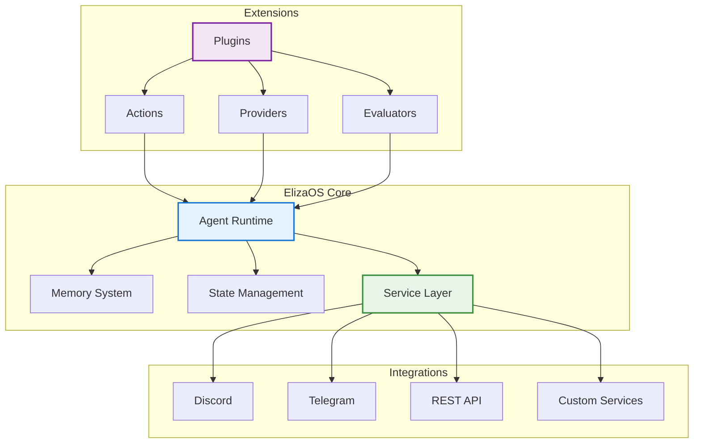

## 🔧 Welcome to the Technical Track

Welcome to the comprehensive developer documentation for ElizaOS! This track provides in-depth technical knowledge for building sophisticated, production-ready AI agents.

## What You'll Master

In this technical track, you'll learn to:

- **Architect scalable agent systems** with proper state management
- **Build custom plugins** to extend agent capabilities
- **Integrate with any platform** using our flexible service architecture
- **Optimize performance** for high-throughput scenarios
- **Implement advanced features** like memory persistence and multi-modal interactions
- **Deploy at scale** with proper monitoring and observability
- **Test thoroughly** with our comprehensive testing framework
- **Contribute to core** and shape the future of ElizaOS

## Who This Track Is For

This track is designed for:

- 👨‍💻 **Full-stack developers** building agent-powered applications
- 🏗️ **System architects** designing scalable AI solutions
- 🔌 **Plugin developers** extending ElizaOS capabilities
- 🚀 **DevOps engineers** deploying agents in production
- 🔬 **Researchers** exploring agent architectures
- 💡 **Technical innovators** pushing AI boundaries

## Prerequisites

To get the most from this track, you should have:

- ✅ **TypeScript/JavaScript** proficiency
- ✅ **Node.js ecosystem** understanding
- ✅ **Async programming** experience
- ✅ **Git and GitHub** familiarity
- ✅ **Basic AI/LLM** concepts
- ✅ **REST API** knowledge

## 🏗️ Architecture Overview



## 📚 Track Contents

### 1. Architecture Deep Dive

- [System Overview](/docs/technical/architecture/overview) - Complete architectural guide
- [Core Concepts](/docs/technical/architecture/core-concepts) - Fundamental building blocks
- [Memory System](/docs/technical/architecture/memory-system) - How agents remember
- [Plugin System](/docs/technical/architecture/plugin-system) - Extensibility architecture
- [State Management](/docs/technical/architecture/state-management) - Managing agent state

### 2. Development Guides

- [Plugin Development](/docs/technical/development/plugin-development) - Build custom plugins
- **Testing Strategies** (Coming Soon) - Unit, integration, and E2E testing
- **Debugging Techniques** (Coming Soon) - Advanced troubleshooting
- **Contributing Guide** (Coming Soon) - Contribute to ElizaOS core

### 3. API Reference

- [Core API](/docs/technical/api-reference/core-api) - Core interfaces and types
- [Actions API](/docs/technical/api-reference/actions-api) - Building agent actions
- **REST API** (Coming Soon) - Complete endpoint documentation
- **WebSocket Events** (Coming Soon) - Real-time communication

### 4. Platform Integrations

- [Twitter Technical](/docs/technical/integrations/twitter-technical) - Deep dive into Twitter
- **Discord Advanced** (Coming Soon) - Advanced Discord features
- **Telegram Advanced** (Coming Soon) - Telegram bot capabilities
- **Custom Services** (Coming Soon) - Build your own integrations

### 5. Advanced Topics

- [Performance Optimization](/docs/technical/advanced/performance) - Scale to millions
- [Best Practices](/docs/technical/advanced/best-practices) - Production guidelines
- **Security Hardening** (Coming Soon) - Protect your agents
- **Deployment Strategies** (Coming Soon) - K8s, Docker, serverless

### 6. [Technical FAQ](/docs/technical/faq)

In-depth answers to complex technical questions

## 🛠️ Development Workflow


## 🚀 Quick Start for Developers

### Using the CLI (Recommended)

```bash
# Install ElizaOS CLI globally
bun install -g @elizaos/cli

# Create a new project
elizaos create my-agent-project

# Navigate to project
cd my-agent-project

# Start development
elizaos dev
```

### From Source (Advanced)

```bash
# Clone the repository
git clone https://github.com/elizaos/eliza.git
cd eliza

# Install dependencies
bun install

# Build the project
bun run build

# Run tests
bun test

# Start development
bun run dev
```

## 📖 Essential Reading Order

1. **Start Here**: [System Overview](/docs/technical/architecture/overview)
2. **Understand Concepts**: [Core Concepts](/docs/technical/architecture/core-concepts)
3. **Build Something**: [Plugin Development](/docs/technical/development/plugin-development)
4. **Go Deeper**: [Memory System](/docs/technical/architecture/memory-system)
5. **Optimize**: [Performance Guide](/docs/technical/advanced/performance)

## 🔗 Key Resources

- **[TypeScript API Docs](/api)** - Complete API reference
- **[GitHub Repository](https://github.com/elizaos/eliza)** - Source code
- **[Plugin Examples](https://github.com/elizaos/eliza/tree/main/packages)** - Reference implementations
- **[Architecture Overview](/docs/technical/architecture/overview)** - Visual architecture guides
- **[RFC Process](https://github.com/elizaos/eliza/discussions)** - Propose changes

## 💡 Developer Tips

1. **Use TypeScript** - The entire codebase is TypeScript-first
2. **Follow patterns** - Study existing plugins before building
3. **Test everything** - Comprehensive tests prevent regressions
4. **Profile performance** - Measure before optimizing
5. **Join discussions** - Participate in architecture decisions
6. **Document well** - Help others understand your code

## 🎯 Next Steps

Ready to dive deep? Start with our comprehensive [System Overview](/docs/technical/architecture/overview).

---

## Next Steps

- [📐 Explore Architecture](/docs/technical/architecture/overview)
- [🔌 Build a Plugin](/docs/technical/development/plugin-development)

Full source code • Active community • MIT licensed
