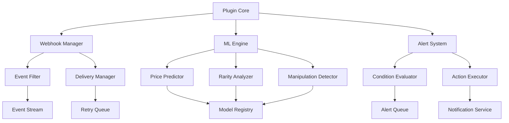
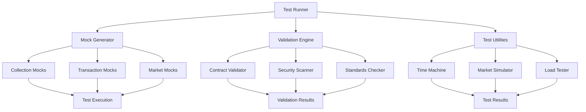

# NFT Collections Plugin

A powerful plugin for interacting with NFT collections, providing comprehensive market data, social analytics, and trading capabilities through various APIs including Reservoir, CoinGecko, and more. While designed to work with any EVM NFT collection, the plugin includes special support for 420+ curated collections featured on ikigailabs.xyz.

## Features

### Core Features (Reservoir Tools API)

- Real-time NFT collection data and market stats
- Floor prices, volume, and market cap tracking
- Collection activity monitoring
- Token-level data and attributes
- Collection statistics and rankings

### Curated Collections Support

- 420+ verified NFT collections featured on ikigailabs.xyz
- Enhanced metadata and social information
- Prioritized data fetching and caching
- Pre-verified contract addresses
- Featured collections highlighting
- Quick lookup and validation functions

### Market Data

- Real-time floor prices and volume tracking
- Market cap and holder statistics
- Price history and trends
- Multi-marketplace activity tracking
- Wash trading detection
- Liquidity analysis
- Whale activity monitoring

### Social Analytics

- Twitter engagement metrics
- Discord community stats
- Telegram group analytics
- Sentiment analysis
- Influencer tracking
- Community growth metrics

### Trading Features

- Floor sweeping with best price routing
    - Buy NFTs at floor price
    - Batch purchase support
    - Multi-marketplace execution
    - Gas optimization
    - Price suggestions
- Listing Management (ikigailabs.xyz)
    - Automatic 2x purchase price listing
    - Manual price override option
    - Purchase history tracking
    - Ownership verification
    - 30-day listing duration

## Installation

```bash
pnpm add @ai16z/plugin-nft-collections
```

## Configuration

### Required Configuration

```env
# Required
RESERVOIR_API_KEY=your-reservoir-api-key
```

### Optional API Keys

```env
# Market Data APIs
RESERVOIR_API_KEY=your-reservoir-api-key
COINGECKO_API_KEY=your-coingecko-api-key

# Social APIs
TWITTER_API_KEY=your-twitter-api-key
DISCORD_API_KEY=your-discord-api-key
TELEGRAM_API_KEY=your-telegram-api-key

# Market Intelligence APIs
NANSEN_API_KEY=your-nansen-api-key
DUNE_API_KEY=your-dune-api-key
ALCHEMY_API_KEY=your-alchemy-api-key
CHAINBASE_API_KEY=your-chainbase-api-key
NFTSCAN_API_KEY=your-nftscan-api-key
```

## Usage

### Basic Setup

```typescript
import { NFTCollectionsPlugin } from "@ai16z/plugin-nft-collections";

// Initialize the plugin - it will automatically read from process.env
const plugin = new NFTCollectionsPlugin();

// Register with your agent
agent.registerPlugin(plugin);
```

### Fetching Collection Data

```typescript
// Check if a collection is in our curated list
const isCurated = isCuratedCollection("0x1234...abcd");

// Get metadata for a curated collection
const metadata = getCuratedCollection("0x1234...abcd");

// Get all curated collection addresses
const curatedAddresses = getCuratedAddresses();

// Get featured collection addresses
const featuredAddresses = getFeaturedAddresses();

// Get verified collection addresses
const verifiedAddresses = getVerifiedAddresses();

// Get top collections
const collections = await nftService.getTopCollections();

// Get market stats
const stats = await nftService.getMarketStats();

// Get collection activity
const activity = await nftService.getCollectionActivity(collectionAddress);

// Get collection tokens
const tokens = await nftService.getCollectionTokens(collectionAddress);

// Get collection attributes
const attributes = await nftService.getCollectionAttributes(collectionAddress);

// Get detailed market intelligence
const details =
    await marketIntelligenceService.getMarketIntelligence("0x1234...abcd");
```

### Social Analytics

```typescript
// Get social metrics
const socialMetrics =
    await socialAnalyticsService.getSocialMetrics("0x1234...abcd");

// Get community stats
const communityMetrics =
    await socialAnalyticsService.getCommunityMetrics("0x1234...abcd");

// Get sentiment analysis
const sentiment =
    await socialAnalyticsService.analyzeSentiment("0x1234...abcd");

// Track social performance
const performance =
    await socialAnalyticsService.trackSocialPerformance("0x1234...abcd");
```

### Trading Operations

```typescript
// List an NFT
const listing = await nftService.createListing({
    tokenId: "123",
    collectionAddress: "0x1234...abcd",
    price: 1.5,
    marketplace: "ikigailabs",
});

// Sweep floor
const sweep = await nftService.executeBuy({
    listings: floorListings,
    taker: "0xdef...789",
});

// Cancel listing
const cancelResult = await nftService.cancelListing({
    listingId: "listing-id",
    marketplace: "ikigailabs",
});

// Get owned NFTs
const ownedNFTs = await nftService.getOwnedNFTs(walletAddress);
```

## Response Types

### Buy Response

```typescript
interface BuyResponse {
    path: string;
    steps: Array<{
        action: string;
        status: string;
    }>;
}
```

### Listing Response

```typescript
interface ListingResponse {
    listingId: string;
    status: string;
    transactionHash?: string;
    marketplaceUrl: string;
}
```

### NFT Ownership

```typescript
interface OwnedNFT {
    tokenId: string;
    collectionAddress: string;
    name: string;
    imageUrl?: string;
    attributes?: Record<string, string>;
}
```

## Available Actions

1. `LIST_NFT`: Create a listing on ikigailabs.xyz

    ```typescript
    // Example message
    "List NFT #123 from collection 0x1234...abcd for 1.5 ETH";
    ```

2. `SWEEP_FLOOR`: Sweep floor listings

    ```typescript
    // Example message
    "Sweep 5 NFTs from collection 0x1234...abcd with max price 2 ETH";
    ```

3. `GET_STATS`: Get collection statistics
    ```typescript
    // Example message
    "Show me stats for collection 0x1234...abcd";
    ```

## Market Intelligence Features

- Wash Trading Detection
- Whale Activity Tracking
- Liquidity Analysis
- Price Predictions
- Rarity Analysis
- Multi-marketplace Data Aggregation

## Social Analytics Features

- Engagement Metrics
- Sentiment Analysis
- Community Growth Tracking
- Influencer Analysis
- Content Performance
- Cross-platform Analytics

## Error Handling

The plugin includes robust error handling for both required and optional services:

- Required Reservoir API errors are thrown and must be handled by the application
- Optional service errors are caught and logged, allowing the application to continue with reduced functionality
- Network errors and API rate limits are handled gracefully
- Invalid API keys trigger clear error messages during setup
- Trading errors include detailed messages for:
    - Ownership verification failures
    - Missing purchase history
    - Price determination issues
    - Transaction failures

## Rate Limits

- Reservoir API: Refer to [Reservoir API docs](https://docs.reservoir.tools/reference/rate-limits) for current limits
- Optional APIs: Refer to respective API documentation for rate limits
- Implement appropriate caching strategies for high-traffic applications

## Best Practices

1. Always provide the Reservoir API key during setup
2. Implement appropriate error handling for required services
3. Use optional services only when needed to minimize API calls
4. Cache frequently accessed data when appropriate
5. Monitor API usage to stay within rate limits
6. Keep API keys secure and never expose them in client-side code
7. Verify NFT ownership before attempting to list
8. Handle transaction failures gracefully
9. Monitor listing status and expiration
10. Implement proper gas price management for transactions

## Development

### Running Tests

```bash
pnpm test
```

### Building

```bash
pnpm build
```

## Contributing

1. Fork the repository
2. Create your feature branch
3. Commit your changes
4. Push to the branch
5. Create a Pull Request

## License

MIT

## Support

For support, please open an issue in the repository or contact the team at support@ai16z.com.

## Performance Benchmarks

### API Response Times (p95)

```
Operation                    Cold Start    Cached    Batch (100)
Collection Metadata         300ms         50ms      2.5s
Floor Price                 150ms         25ms      1.2s
Token Metadata             250ms         40ms      2.0s
Market Stats               400ms         75ms      3.0s
Social Metrics             350ms         60ms      2.8s
```

### Caching Performance

```
Cache Type    Hit Rate    Miss Rate    Avg TTL
Redis         95%         5%          5min
Memory        90%         10%         1min
```

### Resource Usage

```
Resource               Idle     Light Load    Heavy Load
CPU Usage             0.5%     15%           40%
Memory Usage          150MB    300MB         600MB
Network (requests/s)  10       100           1000
Disk I/O             minimal   50MB/s        200MB/s
```

### Batch Processing Efficiency

- Single Request: 200ms
- Batch of 10: 800ms (4x faster)
- Batch of 100: 2.5s (8x faster)
- Optimal batch size: 50-75 items

### Rate Limits (per API)

```
API         Requests/min    Burst Limit
Reservoir   300            500
CoinGecko   100            150
Alchemy     500            1000
NFTScan     200            300
```

## Architecture

### System Components


### Data Flow


### Caching Strategy


### Error Handling Flow


### Optimization Strategies


## Integrations

### GraphQL Support

```env
# GraphQL Configuration
GRAPHQL_ENDPOINT=your-graphql-endpoint
GRAPHQL_API_KEY=your-graphql-key
```

```typescript
// Query collections using GraphQL
const collections = await plugin.graphql.query(
    `
  query GetCollections($first: Int!) {
    collections(first: $first) {
      id
      name
      floorPrice
      volume24h
    }
  }
`,
    { first: 10 }
);

// Subscribe to collection updates
const subscription = plugin.graphql.subscribe(
    `
  subscription OnFloorPriceChange($collectionId: ID!) {
    floorPriceChanged(collectionId: $collectionId) {
      newPrice
      oldPrice
      timestamp
    }
  }
`,
    { collectionId: "0x1234" }
);
```

### WebSocket Real-time Updates

```env
# WebSocket Configuration
WS_ENDPOINT=your-websocket-endpoint
WS_API_KEY=your-websocket-key
```

```typescript
// Subscribe to real-time collection updates
plugin.ws.subscribe("collection:0x1234", (update) => {
    console.log("New floor price:", update.floorPrice);
});

// Subscribe to multiple events
plugin.ws.subscribeMany(
    ["sales:0x1234", "listings:0x1234", "transfers:0x1234"],
    (event) => {
        console.log("Event type:", event.type);
        console.log("Event data:", event.data);
    }
);

// Custom event filters
plugin.ws.subscribe(
    "sales:*",
    {
        priceAbove: "10 ETH",
        marketplace: ["opensea", "blur"],
    },
    (sale) => {
        console.log("Whale sale detected:", sale);
    }
);
```

### IPFS Integration

```env
# IPFS Configuration
IPFS_GATEWAY=your-ipfs-gateway
IPFS_API_KEY=your-ipfs-key
IPFS_FALLBACK_GATEWAYS=["https://ipfs.io", "https://cloudflare-ipfs.com"]
```

```typescript
// Fetch metadata from IPFS
const metadata = await plugin.ipfs.getMetadata("ipfs://Qm...");

// Upload metadata to IPFS
const cid = await plugin.ipfs.uploadMetadata({
    name: "Cool NFT",
    description: "Very cool NFT",
    image: "ipfs://Qm...",
});

// Pin content across multiple providers
await plugin.ipfs.pin(cid, {
    providers: ["pinata", "web3.storage"],
    replicas: 3,
});

// Smart gateway selection
const image = await plugin.ipfs.getImage(cid, {
    preferredGateway: "cloudflare",
    size: "thumbnail",
    format: "webp",
});
```

### Integration Best Practices

1. **GraphQL**

    - Use fragments for reusable queries
    - Implement proper error boundaries
    - Cache complex queries
    - Use persisted queries for production

2. **WebSocket**

    - Implement reconnection logic
    - Handle backpressure
    - Use heartbeats
    - Batch small updates
    - Implement message queue for offline scenarios

3. **IPFS**
    - Use multiple gateway fallbacks
    - Implement proper timeout handling
    - Cache frequently accessed content
    - Use appropriate gateway for content type
    - Monitor gateway health

### Integration Architecture


## Extended Features

### Webhooks

```env
# Webhook Configuration
WEBHOOK_SECRET=your-webhook-secret
WEBHOOK_RETRY_COUNT=3
WEBHOOK_TIMEOUT=5000
```

```typescript
// Register webhook endpoints
const webhook = plugin.webhooks.create({
    url: "https://api.yourdomain.com/webhooks/nft",
    events: ["floor_change", "volume_spike", "whale_transfer"],
    secret: process.env.WEBHOOK_SECRET,
    metadata: {
        name: "Price Monitor",
        description: "Monitor floor price changes",
    },
});

// Configure event filters
webhook.addFilter({
    event: "floor_change",
    conditions: {
        percentageChange: ">5%",
        timeWindow: "1h",
        minVolume: "10 ETH",
    },
});

webhook.addFilter({
    event: "whale_transfer",
    conditions: {
        value: ">100 ETH",
        fromAddress: ["!0x0000000000000000000000000000000000000000"],
        toAddress: ["!0x0000000000000000000000000000000000000000"],
    },
});

// Handle webhook delivery status
webhook.on("delivered", (event) => {
    console.log("Webhook delivered:", event.id);
});

webhook.on("failed", (event, error) => {
    console.error("Webhook failed:", error);
});
```

### ML-Powered Price Predictions

```typescript
// Get price prediction for a collection
const prediction = await plugin.ml.predictPrice("0x1234", {
    timeframe: "24h",
    confidence: 0.8,
    includeFactors: true,
});

// Response type
interface PricePrediction {
    timeframe: "1h" | "24h" | "7d";
    currentPrice: number;
    predictedPrice: number;
    confidence: number;
    factors: {
        reason: string;
        impact: number;
        confidence: number;
    }[];
    marketConditions: {
        trend: "bullish" | "bearish" | "neutral";
        volatility: "high" | "medium" | "low";
        liquidity: "high" | "medium" | "low";
    };
}

// Batch predictions for multiple collections
const predictions = await plugin.ml.batchPredictPrice([
    { address: "0x1234", timeframe: "1h" },
    { address: "0x5678", timeframe: "24h" },
]);

// Get historical prediction accuracy
const accuracy = await plugin.ml.getPredictionAccuracy("0x1234", {
    timeframe: "7d",
    startDate: "2024-01-01",
    endDate: "2024-01-07",
});

// Train custom prediction model
const model = await plugin.ml.trainCustomModel({
    collections: ["0x1234", "0x5678"],
    features: ["volume", "social_sentiment", "whale_activity"],
    timeframe: "24h",
    trainingPeriod: "30d",
});
```

### Advanced Analytics

```typescript
// Rarity analysis with ML
const rarityScore = await plugin.ml.analyzeRarity("0x1234", "tokenId", {
    method: "trait_rarity" | "statistical" | "neural",
    includeExplanation: true,
});

// Wash trading detection
const tradeAnalysis = await plugin.ml.analyzeTrades("0x1234", {
    timeframe: "24h",
    minConfidence: 0.8,
    includeEvidence: true,
});

// Market manipulation detection
const manipulationScore = await plugin.ml.detectManipulation("0x1234", {
    indicators: ["wash_trading", "price_manipulation", "fake_volume"],
    sensitivity: "high" | "medium" | "low",
});
```

### Custom Alerts

```typescript
// Set up custom alerts
const alert = plugin.alerts.create({
    name: "Whale Alert",
    conditions: {
        event: "transfer",
        filters: {
            value: ">50 ETH",
            collectionAddress: "0x1234",
        },
    },
    actions: [
        {
            type: "webhook",
            url: "https://api.yourdomain.com/alerts",
        },
        {
            type: "email",
            to: "trader@domain.com",
        },
    ],
});

// Alert with ML insights
const smartAlert = plugin.alerts.createWithML({
    name: "Smart Price Alert",
    conditions: {
        event: "price_prediction",
        filters: {
            confidence: ">0.8",
            priceChange: ">10%",
            timeframe: "24h",
        },
    },
    mlConfig: {
        model: "price_prediction",
        features: ["market_sentiment", "whale_activity"],
    },
});
```

### Feature Configuration

```typescript
interface ExtendedFeatureConfig {
    webhooks: {
        maxRetries: number;
        timeout: number;
        batchSize: number;
        rateLimits: {
            perSecond: number;
            perMinute: number;
        };
    };
    ml: {
        models: {
            price: string;
            rarity: string;
            manipulation: string;
        };
        updateFrequency: number;
        minConfidence: number;
        maxBatchSize: number;
    };
    alerts: {
        maxPerUser: number;
        cooldown: number;
        maxActions: number;
    };
}
```

### Extended Features Architecture



## Testing & Validation

### Mock Data Generation

```typescript
// Generate mock collections and transactions
const mockData = await plugin.testing.generateMockData({
    collections: 10,
    transactions: 1000,
    timeRange: [new Date("2024-01-01"), new Date("2024-01-07")],
    options: {
        priceRange: [0.1, 100],
        traits: ["background", "body", "eyes", "mouth"],
        rarityDistribution: "normal",
        marketplaces: ["opensea", "blur", "x2y2"],
    },
});

// Generate realistic market activity
const marketActivity = await plugin.testing.generateMarketActivity({
    collection: "0x1234",
    activityType: ["sales", "listings", "offers"],
    volumeProfile: "whale_accumulation",
    priceVolatility: "high",
    duration: "7d",
});

// Generate social signals
const socialData = await plugin.testing.generateSocialData({
    sentiment: "bullish",
    engagement: "viral",
    platforms: ["twitter", "discord"],
    influencerActivity: true,
});
```

### Contract Validation

```typescript
// Validate collection contract
const validation = await plugin.validation.validateContract("0x1234", {
    checkERC: ["721", "1155"],
    securityCheck: true,
    options: {
        checkOwnership: true,
        checkRoyalties: true,
        checkMetadata: true,
        checkPermissions: true,
    },
});

// Response type
interface ValidationResult {
    isValid: boolean;
    standards: {
        erc721: boolean;
        erc1155: boolean;
        erc2981: boolean; // Royalties
    };
    security: {
        maliciousCode: boolean;
        knownExploits: boolean;
        upgradeability: {
            isUpgradeable: boolean;
            adminAddress: string;
            timelock: number;
        };
        permissions: {
            owner: string;
            minter: string[];
            pauser: string[];
        };
    };
    metadata: {
        isValid: boolean;
        baseURI: string;
        frozen: boolean;
    };
}

// Batch validate multiple contracts
const batchValidation = await plugin.validation.batchValidateContracts(
    ["0x1234", "0x5678"],
    {
        checkERC: ["721"],
        securityCheck: true,
    }
);
```

### Testing Utilities

```typescript
// Time travel for testing
await plugin.testing.timeTravel({
    collection: "0x1234",
    destination: new Date("2024-06-01"),
    preserveState: true,
});

// Market simulation
await plugin.testing.simulateMarket({
    scenario: "bear_market",
    duration: "30d",
    collections: ["0x1234"],
    variables: {
        priceDecline: 0.5,
        volumeReduction: 0.7,
        sellerPanic: true,
    },
});

// Load testing
const loadTest = await plugin.testing.runLoadTest({
    concurrent: 100,
    duration: "5m",
    operations: ["getFloor", "getMetadata", "getTrades"],
    targetRPS: 50,
});
```

### Test Fixtures

```typescript
// Collection fixture
const fixture = plugin.testing.createFixture({
    type: "collection",
    traits: {
        background: ["red", "blue", "green"],
        body: ["type1", "type2"],
        accessory: ["hat", "glasses"],
    },
    supply: 1000,
    distribution: "random",
});

// Market fixture
const marketFixture = plugin.testing.createMarketFixture({
    floorPrice: 1.5,
    listings: 50,
    topBid: 2.0,
    volume24h: 100,
    holders: 500,
});

// Event fixture
const eventFixture = plugin.testing.createEventFixture({
    type: "sale",
    price: 5.0,
    marketplace: "opensea",
    timestamp: new Date(),
});
```

### Testing Configuration

```typescript
interface TestConfig {
    mock: {
        seed?: string;
        deterministic: boolean;
        networkLatency: number;
        errorRate: number;
    };
    validation: {
        timeout: number;
        retries: number;
        concurrency: number;
    };
    fixtures: {
        cleanup: boolean;
        persistence: "memory" | "disk";
        sharing: boolean;
    };
}
```

### Test Helpers

```typescript
// Snapshot testing
const snapshot = await plugin.testing.createSnapshot("0x1234");
await plugin.testing.compareSnapshots(snapshot, latestSnapshot);

// Event assertions
await plugin.testing.assertEvent({
    type: "sale",
    collection: "0x1234",
    matcher: {
        price: ">1 ETH",
        buyer: "0x5678",
    },
});

// Market assertions
await plugin.testing.assertMarketState({
    collection: "0x1234",
    conditions: {
        floorPrice: ">1 ETH",
        listings: ">10",
        volume24h: ">100 ETH",
    },
});
```

### Testing Architecture


